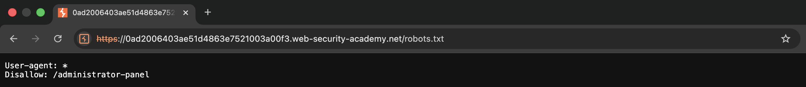
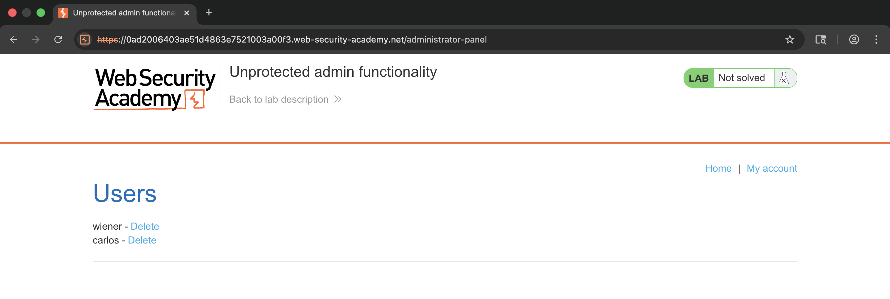
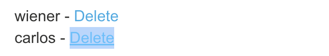
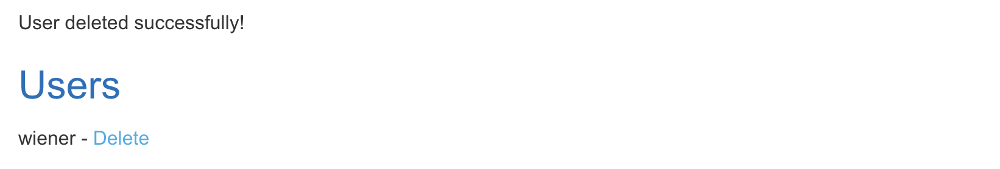
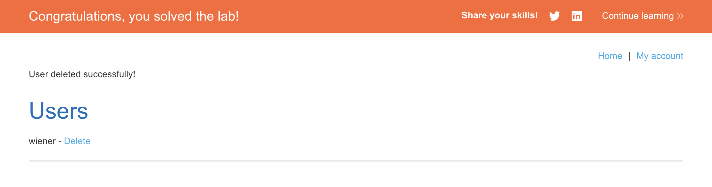

# WEB APPLICATION PENETRATION TEST REPORT: BROKEN ACCESS CONTROL (ROBOTS.TXT)

## 1. Document Control

| Detail | Value |
| :--- | :--- |
| **Report Date** | 18 March 2026 |
| **Report Version** | 1.0 |
| **Classification** | CONFIDENTIAL |
| **Prepared By** | Ramil V. Deocariza Jr. |

---

## 2. Executive Summary
This report details a High-severity Access Control vulnerability. An unprotected administrative dashboard was discovered via sensitive path disclosure, allowing unauthenticated users to execute administrative actions.

### 2.1 Overall Risk Rating
**Rating: HIGH**

### 2.2 Risk Summary
| Critical | High | Medium | Low | Info | Total Findings |
| :---: | :---: | :---: | :---: | :---: | :---: |
| 0 | 1 | 0 | 0 | 0 | 1 |

---

## 3. Detailed Findings

### VULN-001 — Unprotected Admin Functionality via Path Disclosure

| Attribute | Detail |
| :--- | :--- |
| **Severity** | High |
| **Finding ID** | VULN-001 |
| **Affected URL** | `/administrator-panel` |
| **CWE** | CWE-425: Direct Request ('Forced Browsing') |
| **CVSSv3 Score** | 7.5 (High) |
| **OWASP Category**| A01:2021 – Broken Access Control |
| **Status** | Open |

#### 3.1 Description
The application attempts to conceal its administrative panel by excluding it from the main UI. However, it explicitly lists the directory in the `/robots.txt` file. Because the panel itself lacks server-side authentication and authorization checks, any user who discovers the URL can access full administrative privileges.

#### 3.2 Proof of Concept (PoC)

**1. Information Gathering (Robots.txt)**
Discovered the hidden `/administrator-panel` path inadvertently disclosed to search crawlers.

  
  
<i><b>Figure 1:</b> Discovering the hidden '/administrator-panel' path in robots.txt.</i>

**2. Bypassing Obscurity**
Manually navigated to the disclosed path, gaining direct access to the dashboard.

  
  
<i><b>Figure 2:</b> Accessing the unprotected administrative interface.</i>

**3. Execution & Verification**
Located the target user `carlos` and executed the administrative delete action successfully.

  
  
<i><b>Figure 3:</b> Identifying the user deletion functionality.</i>

  
  
<i><b>Figure 4:</b> Successfully executing the administrative command.</i>

  
  
<i><b>Figure 5:</b> Final confirmation of lab completion.</i>

#### 3.3 Business Impact
Unauthenticated access to administrative panels leads to total system compromise, including unauthorized data modification, account deletion, and complete loss of confidentiality.

#### 3.4 Remediation
Do not rely on "Security through Obscurity." Implement proper access control lists (ACLs) and require a valid, verified administrator session for any requests routed to the `/administrator-panel` endpoint.

#### 3.5 References
* **CWE-425:** https://cwe.mitre.org/data/definitions/425.html
* **OWASP Access Control:** https://cheatsheetseries.owasp.org/cheatsheets/Access_Control_Cheat_Sheet.html