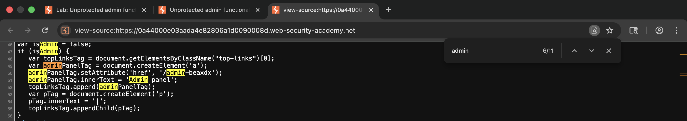
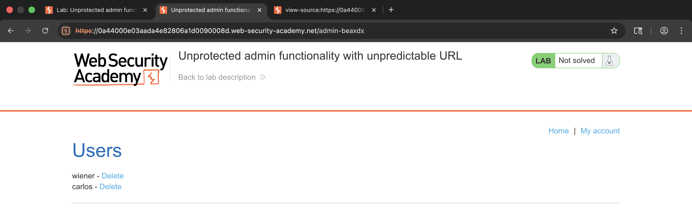
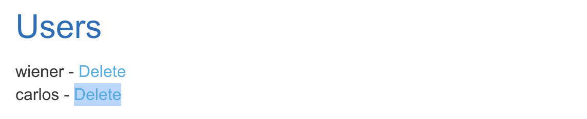
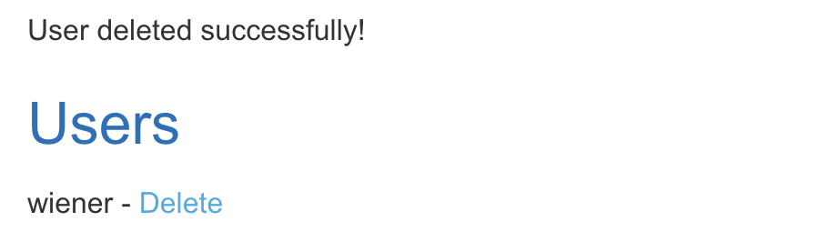
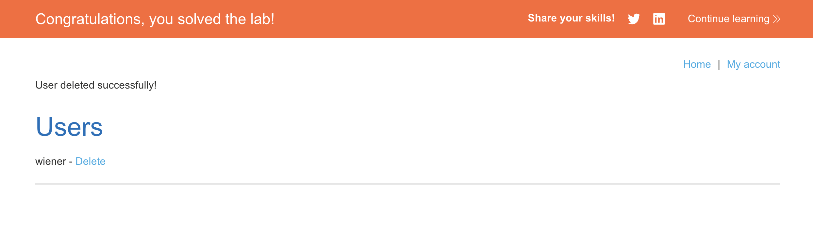

# 🛡️ Lab: Unprotected admin functionality with unpredictable URL

> **Category:** `Access Control`  
> **Difficulty:** `Apprentice`  
> **Status:** `Completed` ✅

---

### 🎯 Objective
The objective of this lab is to find an administrative interface hidden behind an unpredictable URL and use it to delete the user `carlos`.

### 🛠️ Exploit Strategy
* **Vulnerability Point:** Information disclosure in client-side JavaScript.
* **Payload Type:** Broken Access Control / Leaking Sensitive Information.
* **Technical Logic:** The developer attempted to secure the admin panel by giving it a complex, non-guessable URL. However, the application’s home page contains JavaScript that references this URL to enable certain UI functions. By inspecting the page source, I was able to "unmask" the hidden path and access the interface directly.

---

### 📑 Technical Walkthrough

#### 1. Source Code Analysis
I inspected the HTML source of the landing page. Within a `<script>` block, I discovered a variable that explicitly defined the path to the administrative interface.

  
  
<i><b>Figure 1:</b> Discovering the unpredictable admin URL hidden in the client-side script.</i>

#### 2. Accessing the Hidden Interface
By navigating to the discovered URL, I confirmed that the administrative panel was entirely unprotected and did not require a privileged login session.

  
  
<i><b>Figure 2:</b> Bypassing "Security through Obscurity" to access the admin dashboard.</i>

#### 3. Targeted User Discovery
I located the user management section within the dashboard to find the entry for `carlos`.

  
  
<i><b>Figure 3:</b> Locating the delete functionality for the target user.</i>

#### 4. Execution of Privileged Action
I triggered the deletion request. The backend processed the request without verifying if the user (me) had the appropriate RBAC (Role-Based Access Control) permissions.

  
  
<i><b>Figure 4:</b> Successfully removing 'carlos' via the unprotected endpoint.</i>

#### 5. Final Confirmation
The lab was marked as completed once the administrative action was finalized.

  
  
<i><b>Figure 5:</b> Final confirmation of lab completion.</i>

---

### 🧠 Key Takeaway
Client-side code is never a safe place to store secrets or sensitive paths. If the browser can see it, the user can see it.

**Remediation:** Administrative panels should be protected by server-side authorization checks. Sensitive URLs should not be disclosed in the source code of pages accessible to unauthenticated or low-privileged users.
---