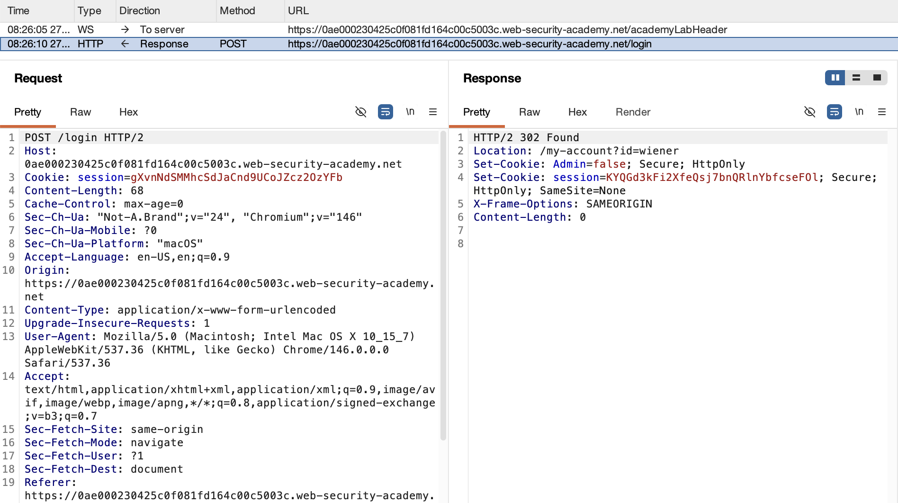
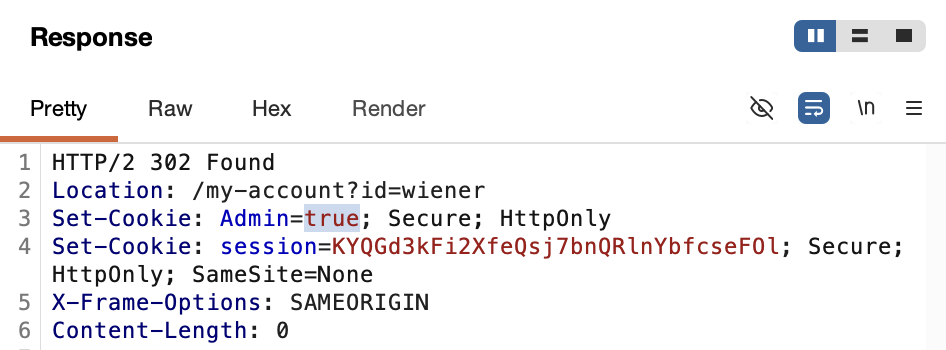
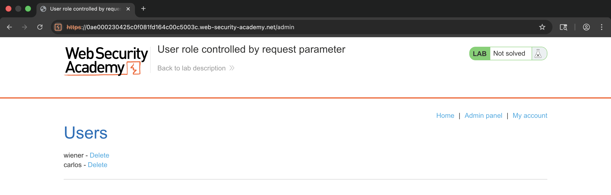
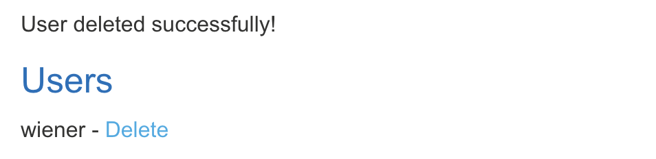
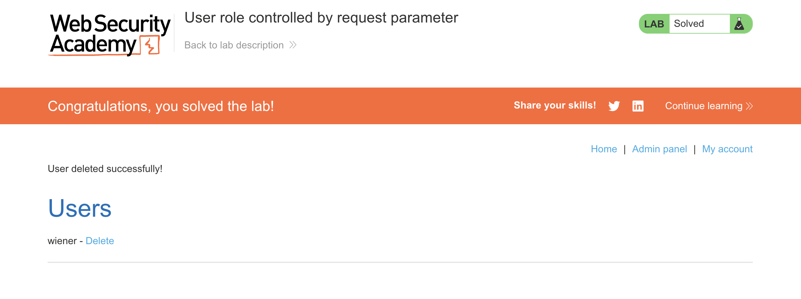

# WEB APPLICATION PENETRATION TEST REPORT: PRIVILEGE ESCALATION (COOKIE FORGERY)

## 1. Document Control

| Detail | Value |
| :--- | :--- |
| **Report Date** | 18 March 2026 |
| **Report Version** | 1.0 |
| **Classification** | CONFIDENTIAL |
| **Prepared By** | Ramil V. Deocariza Jr. |

---

## 2. Executive Summary
This report documents a High-severity authorization bypass. The application securely authenticates users but insecurely delegates role-based authorization to a client-modifiable cookie, allowing trivial privilege escalation.

### 2.1 Overall Risk Rating
**Rating: HIGH**

### 2.2 Risk Summary
| Critical | High | Medium | Low | Info | Total Findings |
| :---: | :---: | :---: | :---: | :---: | :---: |
| 0 | 1 | 0 | 0 | 0 | 1 |

---

## 3. Detailed Findings

### VULN-001 — Privilege Escalation via Insecure Cookie Manipulation

| Attribute | Detail |
| :--- | :--- |
| **Severity** | High |
| **Finding ID** | VULN-001 |
| **Affected Component** | `Admin` Session Cookie |
| **CWE** | CWE-565: Reliance on Cookies without Validation and Integrity Checking |
| **CVSSv3 Score** | 8.8 (High) |
| **OWASP Category**| A01:2021 – Broken Access Control |
| **Status** | Open |

#### 3.1 Description
The application relies on an unsigned, client-side cookie (`Admin=false`) to determine a user's administrative rights. By intercepting the session and modifying the cookie value to `true`, an attacker can forge administrative privileges and access restricted backend endpoints.

#### 3.2 Proof of Concept (PoC)

**1. Identification of the Role Marker**
Identified a clear Boolean flag in the login response cookies defining the user role.

  
  
<i><b>Figure 1:</b> The server setting the 'Admin=false' cookie upon login.</i>

**2. Forging Administrative Privileges**
Intercepted the traffic and manually changed the `Admin` cookie value to `true`.

  
  
<i><b>Figure 2:</b> Modifying the cookie to escalate privileges.</i>

**3. Execution & Verification**
Accessed the restricted `/admin` endpoint and executed an unauthorized user deletion.

  
  
<i><b>Figure 3:</b> Accessing the administrative interface with the forged identity.</i>

  
  
<i><b>Figure 4:</b> Deleting the target user via the escalated session.</i>

  
  
<i><b>Figure 5:</b> Final confirmation of lab completion.</i>

#### 3.3 Business Impact
Client-side trust models allow standard users to effortlessly elevate their privileges to administrators, resulting in full application compromise and unauthorized data destruction.

#### 3.4 Remediation
Never trust user-supplied data for authorization decisions. Store user roles securely in the backend database linked to a randomized session ID, or utilize cryptographically signed tokens (like HMAC or JWT) to ensure integrity.

#### 3.5 References
* **CWE-565:** https://cwe.mitre.org/data/definitions/565.html
* **OWASP Session Management:** https://cheatsheetseries.owasp.org/cheatsheets/Session_Management_Cheat_Sheet.html