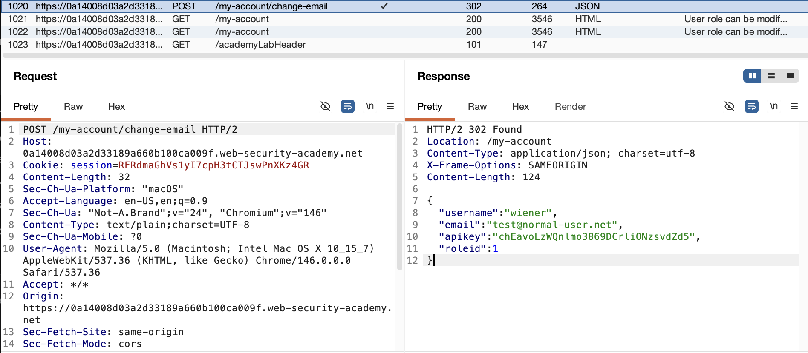
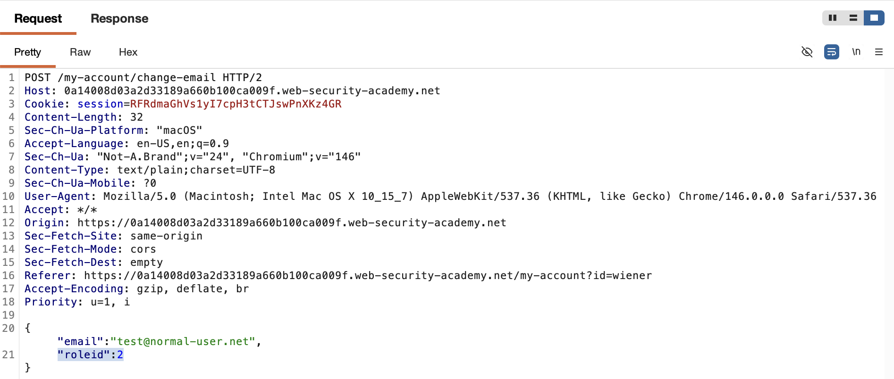
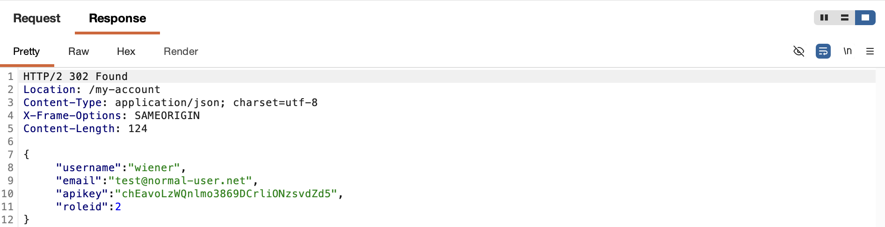
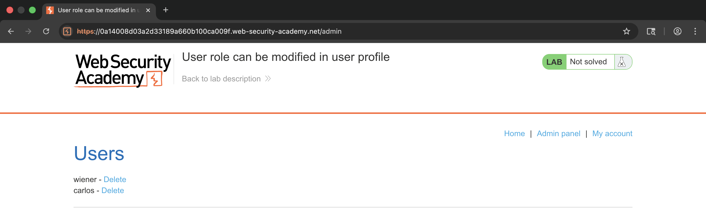
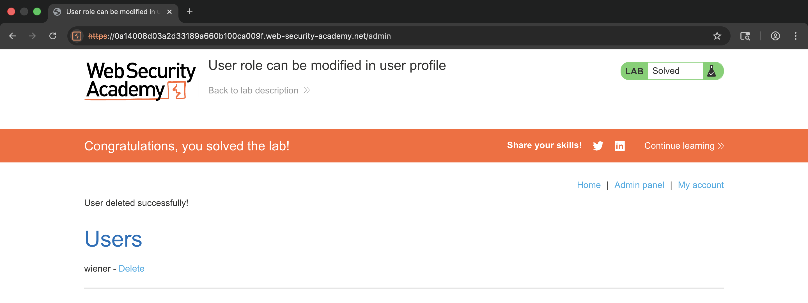

# WEB APPLICATION PENETRATION TEST REPORT: MASS ASSIGNMENT

## 1. Document Control

| Detail | Value |
| :--- | :--- |
| **Report Date** | 18 March 2026 |
| **Report Version** | 1.0 |
| **Classification** | CONFIDENTIAL |
| **Prepared By** | Ramil V. Deocariza Jr. |

---

## 2. Executive Summary
This report identifies a Mass Assignment vulnerability resulting in Privilege Escalation. The application fails to whitelist updatable JSON attributes, allowing users to inject internal role identifiers and promote their own accounts.

### 2.1 Overall Risk Rating
**Rating: HIGH**

### 2.2 Risk Summary
| Critical | High | Medium | Low | Info | Total Findings |
| :---: | :---: | :---: | :---: | :---: | :---: |
| 0 | 1 | 0 | 0 | 0 | 1 |

---

## 3. Detailed Findings

### VULN-001 — Privilege Escalation via Mass Assignment (JSON Injection)

| Attribute | Detail |
| :--- | :--- |
| **Severity** | High |
| **Finding ID** | VULN-001 |
| **Affected Endpoint** | Profile update JSON payload |
| **CWE** | CWE-915: Improperly Controlled Modification of Dynamically-Determined Object Attributes |
| **CVSSv3 Score** | 8.8 (High) |
| **OWASP Category**| A01:2021 – Broken Access Control |
| **Status** | Open |

#### 3.1 Description
The application utilizes a JSON object to transfer user data between the client and server. The server implicitly binds incoming JSON fields to the backend database record without an allow-list. By injecting the hidden `"roleid": 2` parameter into a standard email update request, an attacker can overwrite their role assignment.

#### 3.2 Proof of Concept (PoC)

**1. Discovering Hidden Parameters**
Analyzed the server's profile response, discovering the internal `roleid` parameter disclosure.

  
  
<i><b>Figure 1:</b> Identifying the 'roleid' parameter in the JSON response.</i>

**2. Executing Mass Assignment**
Appended the administrative `roleid` to the JSON payload in Burp Repeater.

  
  
<i><b>Figure 2:</b> Injecting the 'roleid': 2 parameter into the profile update request.</i>

**3. Execution & Verification**
The server successfully processed the role update, granting access to the `/admin` panel to delete the target user.

  
  
<i><b>Figure 3:</b> Server response confirming the unauthorized role change.</i>

  
  
<i><b>Figure 4:</b> Using the escalated privileges to remove the target user.</i>

  
  
<i><b>Figure 5:</b> Final confirmation of lab completion.</i>

#### 3.3 Business Impact
Mass assignment bypasses intended business logic, allowing attackers to manipulate unexposed model properties, leading to vertical privilege escalation and unauthorized access.

#### 3.4 Remediation
Use Data Transfer Objects (DTOs) to strictly define which fields are permitted to be updated by a client. Implement an explicit allow-list on the backend controller to ignore unauthorized or sensitive parameters in incoming requests.

#### 3.5 References
* **CWE-915:** https://cwe.mitre.org/data/definitions/915.html
* **OWASP API Security Top 10:** API6:2019 Mass Assignment