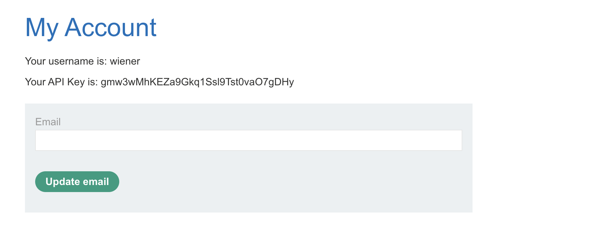
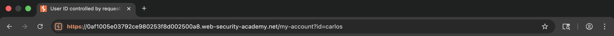
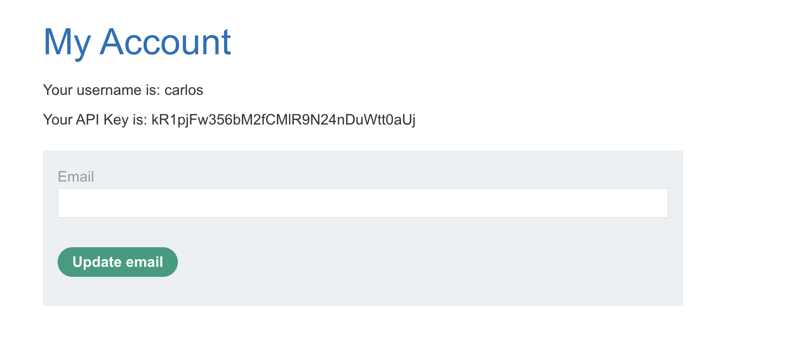
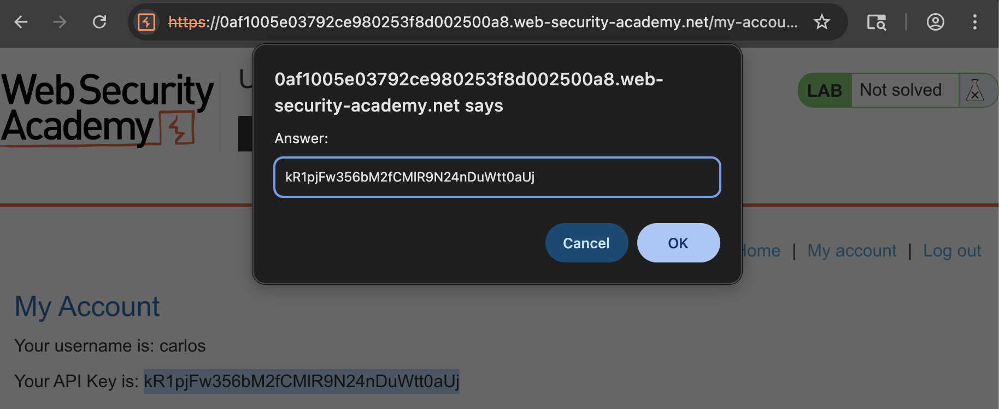
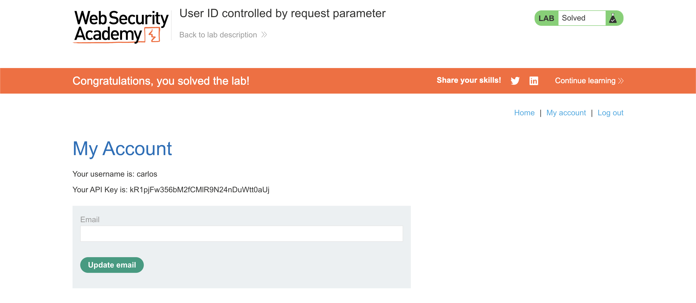

# 🛡️ Lab: User ID controlled by request parameter

> **Category:** `Access Control`  
> **Difficulty:** `Apprentice`  
> **Status:** `Completed` ✅

---

### 🎯 Objective
The objective of this lab is to exploit a horizontal privilege escalation vulnerability to access another user's account page and retrieve their private API key.

### 🛠️ Exploit Strategy
* **Vulnerability Point:** `id` query parameter in the `/my-account` URL.
* **Payload Type:** Insecure Direct Object Reference (IDOR).
* **Technical Logic:** The application uses a predictable identifier (the username) in the URL to determine which user's data to display. Because the backend fails to verify if the currently logged-in user has permission to view the requested ID, I was able to swap my own username for `carlos` to view his private account information.

---

### 📑 Technical Walkthrough

#### 1. Baseline Observation
I logged in as `wiener` and observed that the account page identifies the user via a GET parameter in the URL. My own API key was visible on this page.

  
  
<i><b>Figure 1:</b> Identifying the 'id' parameter used for account data retrieval.</i>

#### 2. Executing IDOR
I manually modified the URL parameter, changing `id=wiener` to `id=carlos`. This tests whether the server performs an authorization check between the session and the requested resource.

  
  
<i><b>Figure 2:</b> Modifying the request to target the account of user 'carlos'.</i>

#### 3. Unauthorized Data Access
The server processed the request and returned the full account page for `carlos`. This confirmed the lack of horizontal access controls.

  
  
<i><b>Figure 3:</b> Successfully exfiltrating the API key for user 'carlos'.</i>

#### 4. Verification
I retrieved the sensitive API key to provide as proof of the exploit.

  
  
<i><b>Figure 4:</b> Preparing the exfiltrated key for solution submission.</i>

#### 5. Final Confirmation
The lab was solved upon submitting the correct API key.

  
  
<i><b>Figure 5:</b> Final confirmation of lab completion.</i>

---

### 🧠 Key Takeaway
Predictable resource identifiers (like usernames or sequential IDs) are a massive risk if not paired with strict authorization checks. Never assume that a user will only click the links provided in the UI.

**Remediation:** Implement a check on the server side to ensure that the `id` requested in the parameter matches the `id` associated with the active session. Alternatively, use non-guessable identifiers like UUIDs.
---