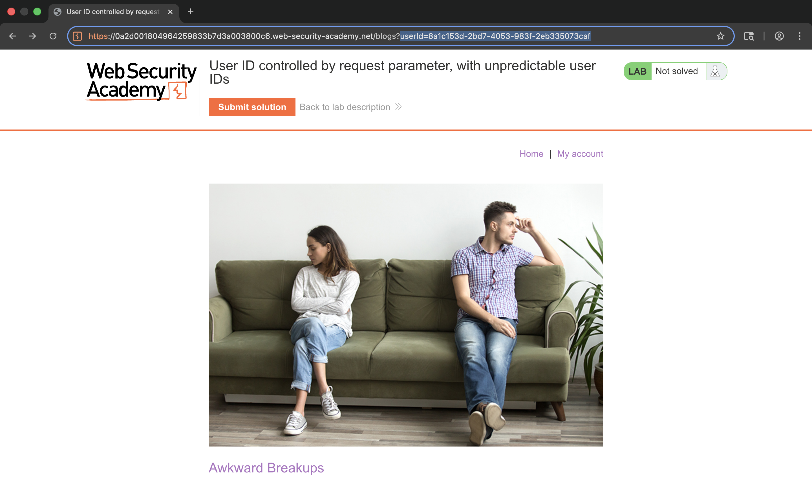
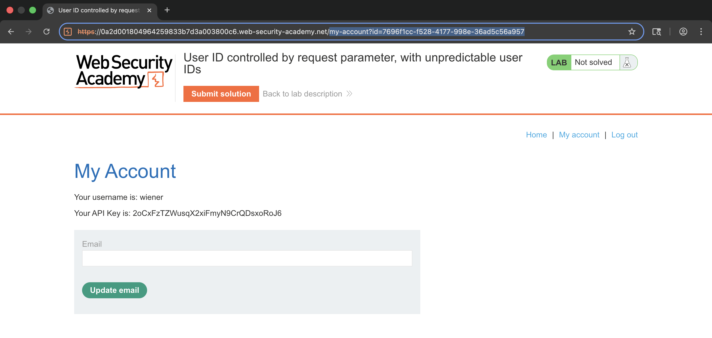
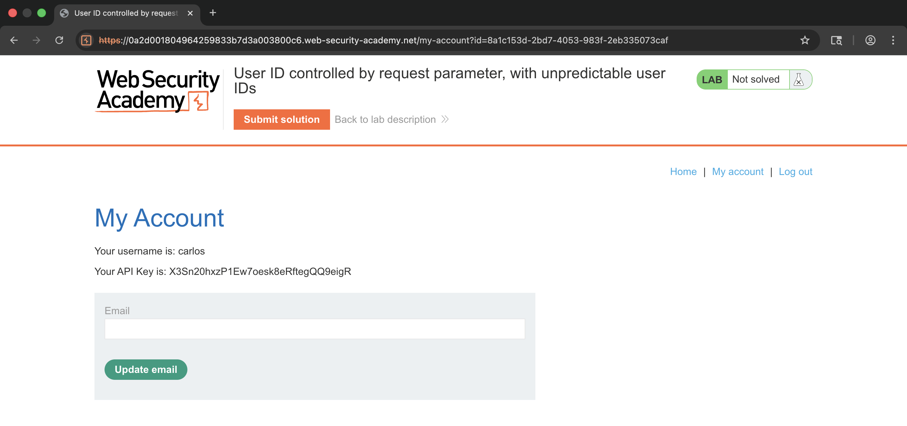
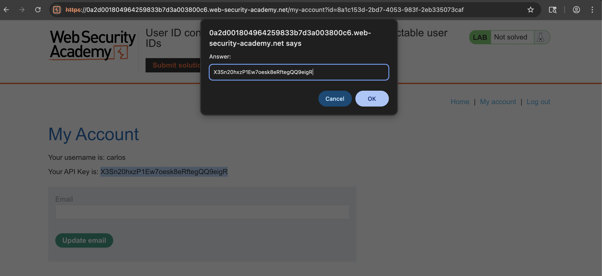
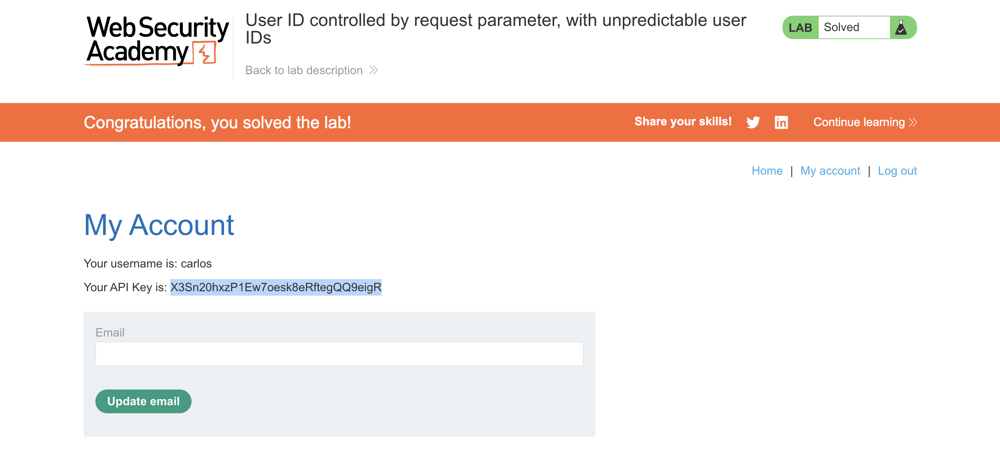

# WEB APPLICATION PENETRATION TEST REPORT: IDOR WITH DATA LEAKAGE

## 1. Document Control

| Detail | Value |
| :--- | :--- |
| **Report Date** | 18 March 2026 |
| **Report Version** | 1.0 |
| **Classification** | CONFIDENTIAL |
| **Prepared By** | Ramil V. Deocariza Jr. |

---

## 2. Executive Summary
This report demonstrates a failure in "Security through Obscurity." The application relies on unpredictable GUIDs for access control but leaks them publicly, resulting in an exploitable Insecure Direct Object Reference (IDOR) vulnerability.

### 2.1 Overall Risk Rating
**Rating: HIGH**

### 2.2 Risk Summary
| Critical | High | Medium | Low | Info | Total Findings |
| :---: | :---: | :---: | :---: | :---: | :---: |
| 0 | 1 | 0 | 0 | 0 | 1 |

---

## 3. Detailed Findings

### VULN-001 — IDOR Exploitation via GUID Disclosure

| Attribute | Detail |
| :--- | :--- |
| **Severity** | High |
| **Finding ID** | VULN-001 |
| **Affected URL** | `/my-account?id=[GUID]` |
| **CWE** | CWE-639 / CWE-200 |
| **CVSSv3 Score** | 7.5 (High) |
| **OWASP Category**| A01:2021 – Broken Access Control |
| **Status** | Open |

#### 3.1 Description
The application attempts to prevent IDOR by using long, non-sequential GUIDs instead of standard usernames. However, it leaks these internal identifiers on public blog author profiles. Because the backend lacks true session-based authorization checks, obtaining a user's GUID allows for direct access to their private account data.

#### 3.2 Proof of Concept (PoC)

**1. Information Disclosure Discovery**
Discovered the application leaks the "unpredictable" GUID in public profile URLs.

  
  
<i><b>Figure 1:</b> Discovering Carlos's internal GUID via a public-facing profile page.</i>

**2. Executing Horizontal Escalation**
Replaced the authenticated session's GUID with the target's leaked GUID in the `/my-account` URL parameter.

  
  
<i><b>Figure 2:</b> Observing the standard session behavior and GUID format.</i>

**3. Data Exfiltration & Verification**
Successfully bypassed intended boundaries to retrieve the target's private API key.

  
  
<i><b>Figure 3:</b> Gaining unauthorized access to Carlos's private API key.</i>

  
  
<i><b>Figure 4:</b> Preparing the exfiltrated data for the final submission.</i>

  
  
<i><b>Figure 5:</b> Final confirmation of lab completion.</i>

#### 3.3 Business Impact
Exposes supposedly protected resources to unauthorized viewing and extraction. Obscurity does not equal security.

#### 3.4 Remediation
Implement strict server-side authorization checks evaluating if the user requesting the GUID matches the session owner. Stop exposing internal primary keys or sensitive GUIDs on public-facing pages.

#### 3.5 References
* **CWE-639:** https://cwe.mitre.org/data/definitions/639.html
* **OWASP IDOR Prevention:** https://cheatsheetseries.owasp.org/cheatsheets/Insecure_Direct_Object_Reference_Prevention_Cheat_Sheet.html