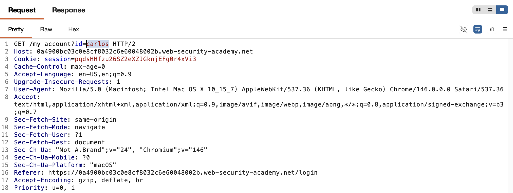
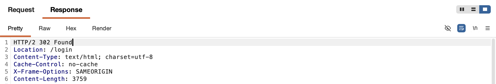
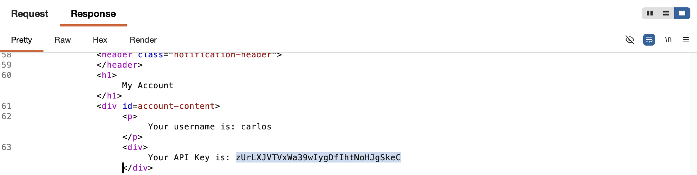
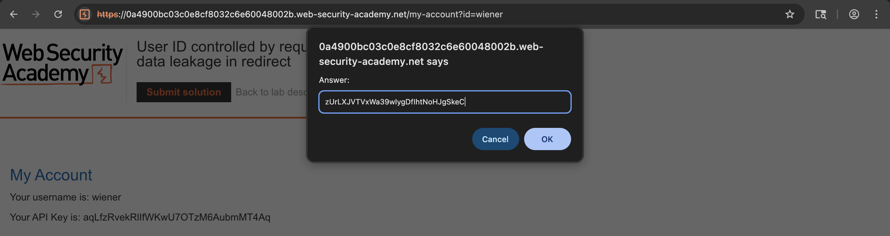
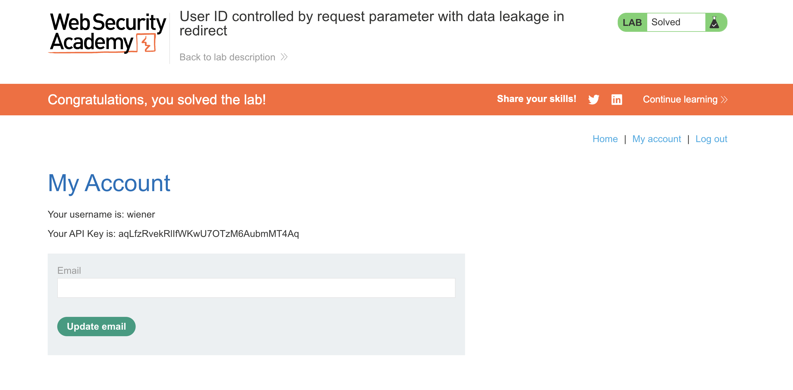

# 🛡️ Lab: User ID controlled by request parameter with data leakage in redirect

> **Category:** `Access Control`  
> **Difficulty:** `Apprentice`  
> **Status:** `Completed` ✅

---

### 🎯 Objective
The objective of this lab is to exploit an "Execution After Redirect" (EAR) vulnerability to exfiltrate a target user's API key from the body of an unauthorized redirect response.

### 🛠️ Exploit Strategy
* **Vulnerability Point:** `/my-account` endpoint logic.
* **Payload Type:** Information Leakage via HTTP 302 Response.
* **Technical Logic:** The server identifies that the current session does not match the requested `id=carlos` and issues a `302 Found` redirect to the home page. However, the backend script continues to execute and render the requested account page in the response body. While standard browsers follow the redirect and ignore the body, an attacker using a proxy can read the sensitive data rendered before the redirect is followed.

---

### 📑 Technical Walkthrough

#### 1. Identification
I logged into my account and identified the account retrieval request. I moved this to Burp Repeater to observe how the server handles unauthorized ID requests.

  
  
<i><b>Figure 1:</b> Targeting the Carlos account ID in Burp Repeater.</i>

#### 2. Analyzing the Redirect
The server responded with a 302 redirect. To a standard user, this appears as an access denial, as the browser immediately navigates away from the page.

  
  
<i><b>Figure 2:</b> Receiving the 302 Found status and Location header.</i>

#### 3. Discovering the Leaked Data
By inspecting the raw response body in Repeater, I discovered that the server still rendered the full HTML of the account page for `carlos` despite the redirect.

  
  
<i><b>Figure 3:</b> Exfiltrating Carlos's API key from the 302 response body.</i>

#### 4. Verification
I retrieved the API key to use as the solution to the lab.

  
  
<i><b>Figure 4:</b> Validating the exfiltrated key.</i>

#### 5. Final Confirmation
The lab was successfully solved, proving that redirects alone are not a secure method of access control if the script continues to run.

  
  
<i><b>Figure 5:</b> Final confirmation of lab completion.</i>

---

### 🧠 Key Takeaway
A redirect is a hint to the browser, not a security barrier. If the server-side code does not explicitly terminate the execution (e.g., using `die()`, `exit()`, or `return`) after sending a redirect header, the rest of the sensitive data will still be sent to the client.

**Remediation:** Always ensure that execution is terminated immediately after an unauthorized redirect is issued.
---