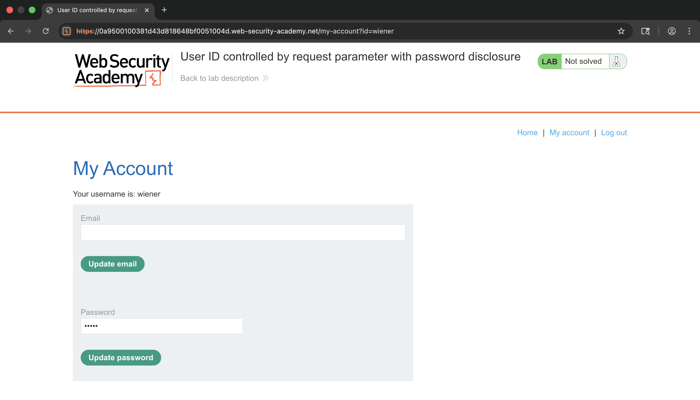
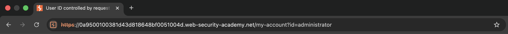
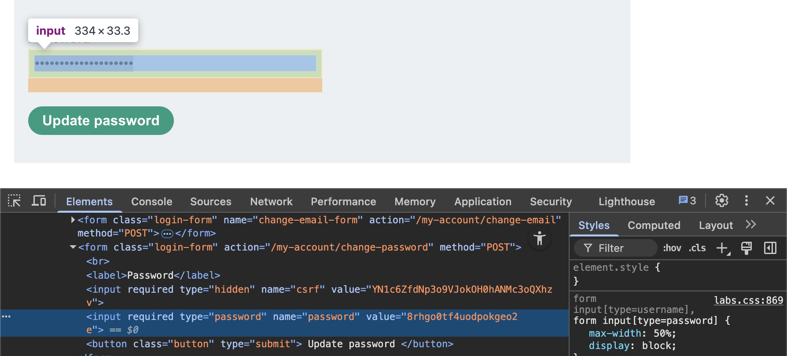
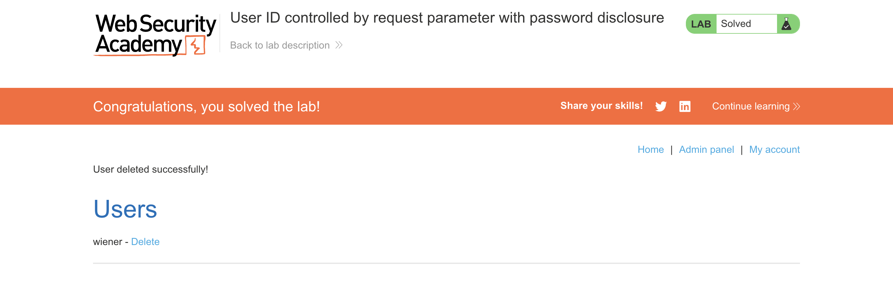

# 🛡️ Lab: User ID controlled by request parameter with password disclosure

> **Category:** `Access Control`  
> **Difficulty:** `Apprentice`  
> **Status:** `Completed` ✅

---

### 🎯 Objective
The objective of this lab is to exploit an IDOR vulnerability to access the administrator's account page, retrieve their plaintext password from the HTML source, and use it to delete the user `carlos`.

### 🛠️ Exploit Strategy
* **Vulnerability Point:** `id` query parameter in the `/my-account` page.
* **Payload Type:** IDOR / Information Disclosure.
* **Technical Logic:** The application pre-fills the "Change password" input field with the user's current password for convenience. While the browser masks this input (`type="password"`), the plaintext value is still present in the HTML `value` attribute. By changing the user ID to `administrator`, I can force the server to render the administrator's account page and disclose their credentials.

---

### 📑 Technical Walkthrough

#### 1. Identification of the Disclosure Point
I logged into my account and noticed that the password field was pre-populated. I identified that the account rendered is determined by the `id` parameter in the URL.

  
  
<i><b>Figure 1:</b> Identifying the masked password field and the 'id' parameter.</i>

#### 2. Accessing the Admin Account
I modified the URL parameter to `id=administrator`. The server rendered the administrator's account page without verifying my session's authorization level for that specific ID.

  
  
<i><b>Figure 2:</b> Navigating to the administrator's account page via IDOR.</i>

#### 3. Exfiltrating the Plaintext Password
I inspected the HTML source code for the administrator's account page. I located the password input field and extracted the plaintext password from the `value` attribute.

  
  
<i><b>Figure 3:</b> Viewing the administrator's password in the browser inspector.</i>

#### 4. Verification of Administrative Access
Using the stolen credentials, I logged in as the administrator and accessed the management panel to delete the target user.

  
  
<i><b>Figure 4:</b> Successfully executing administrative actions as the 'administrator' user.</i>

#### 5. Final Confirmation
The lab was successfully solved after the unauthorized account deletion was processed.

  
  
<i><b>Figure 5:</b> Final confirmation of lab completion.</i>

---

### 🧠 Key Takeaway
Masking a password in the UI is a cosmetic feature, not a security one. Sensitive data should never be sent to a user unless they are fully authorized to see it in its rawest form.

**Remediation:** Never pre-fill password fields with existing passwords. If the user needs to change their password, the field should be empty, and the current password should be verified as a separate, one-way hash comparison.
---