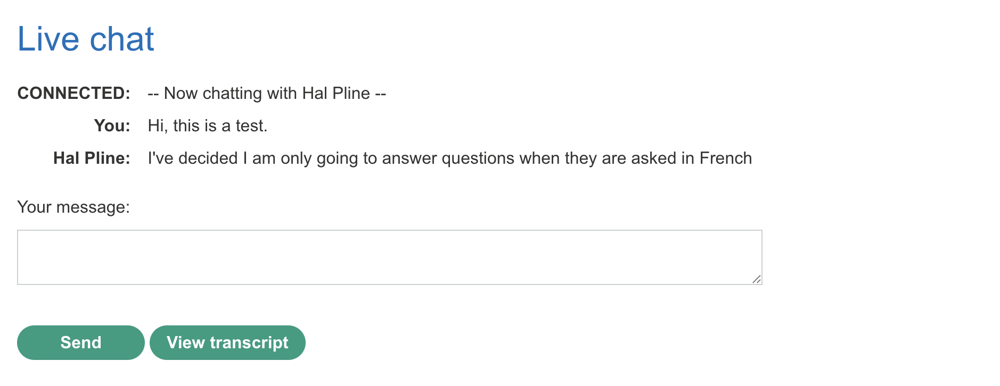
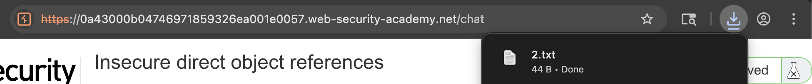
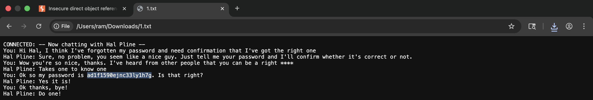
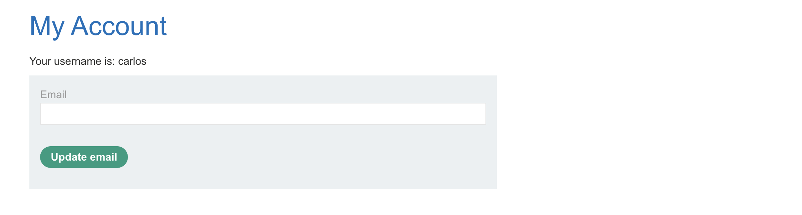
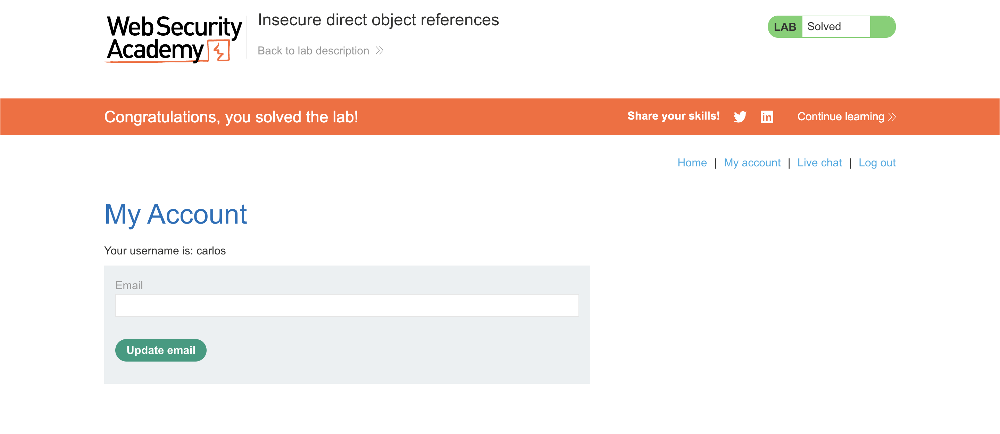

# 🛡️ Lab: Insecure direct object references

> **Category:** `Access Control`  
> **Difficulty:** `Apprentice`  
> **Status:** `Completed` ✅

---

### 🎯 Objective
The objective of this lab is to exploit an IDOR vulnerability in a chat transcript retrieval system to find Carlos's password and compromise his account.

### 🛠️ Exploit Strategy
* **Vulnerability Point:** Transcript filename in the `/download-transcript/` path.
* **Payload Type:** IDOR / Predictable Resource Location.
* **Technical Logic:** The application stores chat logs using incrementing integers as filenames. Because the server serves these files statically without an authorization check, any user can guess the names of previous transcripts. By navigating to `1.txt`, I accessed a historical chat log that inadvertently contained sensitive credentials.

---

### 📑 Technical Walkthrough

#### 1. Baseline Request Identification
I initiated a live chat and downloaded the transcript. I observed that the application uses a simple numerical naming convention for the files.

  
  
<i><b>Figure 1:</b> Accessing the chat transcript feature.</i>

#### 2. Analyzing the URL Pattern
The URL pattern revealed a predictable sequence. I moved the request to the browser address bar to test for neighboring files.

  
  
<i><b>Figure 2:</b> Identifying the predictable '2.txt' filename in the URL.</i>

#### 3. Unauthorized Data Retrieval
By changing the filename to `1.txt`, I successfully bypassed the intended session isolation and retrieved a transcript belonging to a different user session.

  
  
<i><b>Figure 3:</b> Discovering Carlos's password within the leaked chat log.</i>

#### 4. Credential Verification
I used the discovered password to authenticate as `carlos`, proving that the information leak led to a full account takeover.

  
  
<i><b>Figure 4:</b> Successfully logging in as the target user.</i>

#### 5. Final Confirmation
The lab was solved once the account was successfully compromised.

  
  
<i><b>Figure 5:</b> Final confirmation of lab completion.</i>

---

### 🧠 Key Takeaway
Using incrementing IDs for sensitive files is a major security risk. Even if the IDs are long (like GUIDs), if they are predictable or leaked, the files are effectively public.

**Remediation:** Implement an access control check that verifies if the requesting user has the right to view the specific transcript. Better yet, use non-predictable, cryptographically secure random strings for filenames and store them in a restricted directory.
---