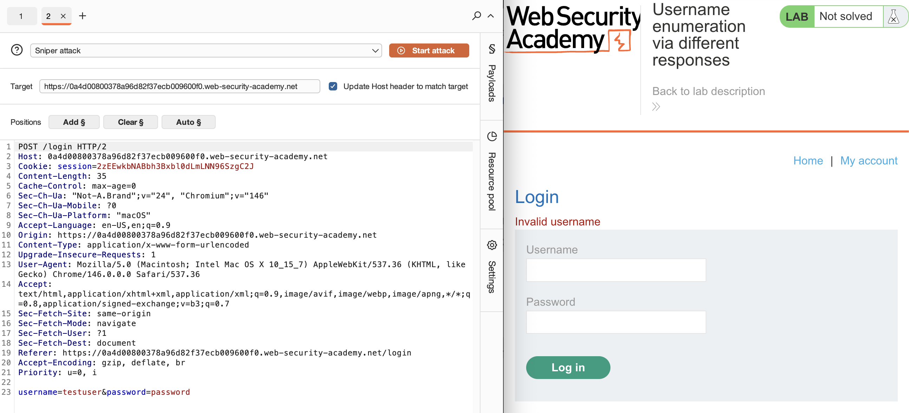
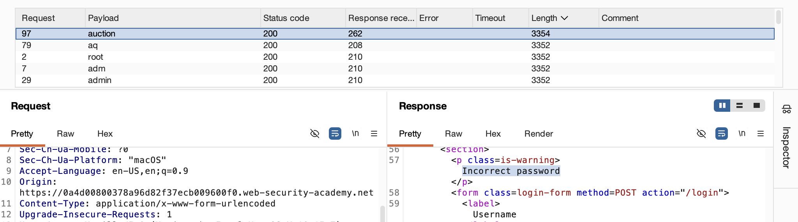
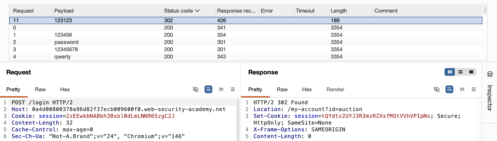
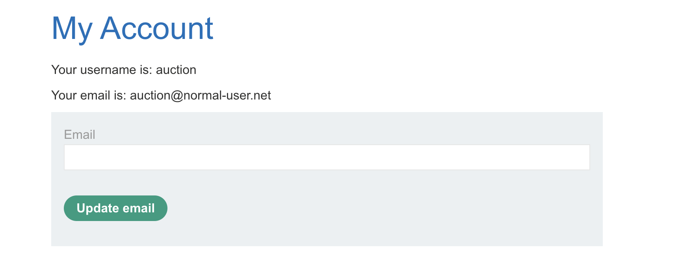
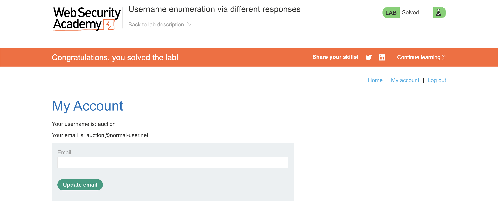

# 🛡️ Lab: Username enumeration via different responses

> **Category:** `Authentication`  
> **Difficulty:** `Apprentice`  
> **Status:** `Completed` ✅

---

### 🎯 Objective
The objective of this lab is to enumerate a valid username based on subtle differences in the server's error messages and then brute-force that user's password to gain unauthorized access.

### 🛠️ Exploit Strategy
* **Vulnerability Point:** Login error message logic.
* **Payload Type:** Username Enumeration & Password Brute-forcing (Intruder Sniper).
* **Technical Logic:** The application returns different error messages depending on whether the username exists ("Invalid username" vs. "Incorrect password"). This information leak allows an attacker to verify a username first. Once the username is confirmed, a second brute-force attack on the password field becomes significantly faster and more likely to succeed.

---

### 📑 Technical Walkthrough

#### 1. Identification
I captured a failed login attempt in Burp Suite to identify the parameters used for authentication. I then transferred this request to Burp Intruder for automated probing.

  
  
<i><b>Figure 1:</b> Setting up the username enumeration positions in Burp Intruder.</i>

#### 2. Username Enumeration
I performed a Sniper attack using a wordlist of common usernames. By analyzing the response lengths, I identified a specific username that triggered an "Incorrect password" message, confirming its existence in the database.

  
  
<i><b>Figure 2:</b> Discovering the valid username via response length differentiation.</i>

#### 3. Password Brute-forcing
With the valid username identified, I reset the attack positions to target the password field. I ran a second Sniper attack using a password wordlist.

  
  
<i><b>Figure 3:</b> Identifying the correct password through a 302 Found redirect status.</i>

#### 4. Credential Verification
I successfully authenticated using the discovered credentials, granting me full access to the target user's account page.

  
  
<i><b>Figure 4:</b> Verifying access to the compromised user's profile.</i>

#### 5. Final Confirmation
The lab was solved once the administrative boundary was crossed using the brute-forced credentials.

  
  
<i><b>Figure 5:</b> Final confirmation of lab completion.</i>

---

### 🧠 Key Takeaway
Detailed error messages are a gift to attackers. Authentication systems should return generic messages like "Invalid username or password" to prevent enumeration.

**Remediation:** Implement generic error messaging for all authentication failures and enforce account lockout policies or rate-limiting (throttling) to prevent brute-force attacks.
---