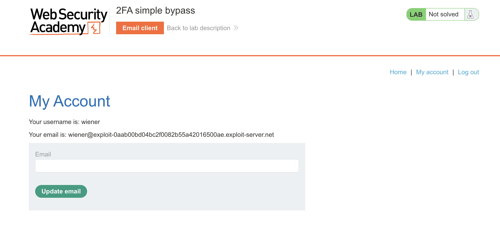
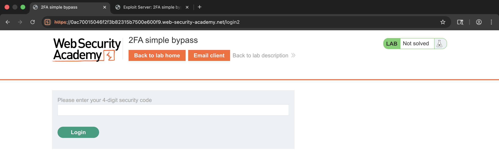
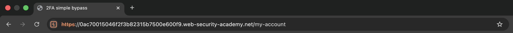
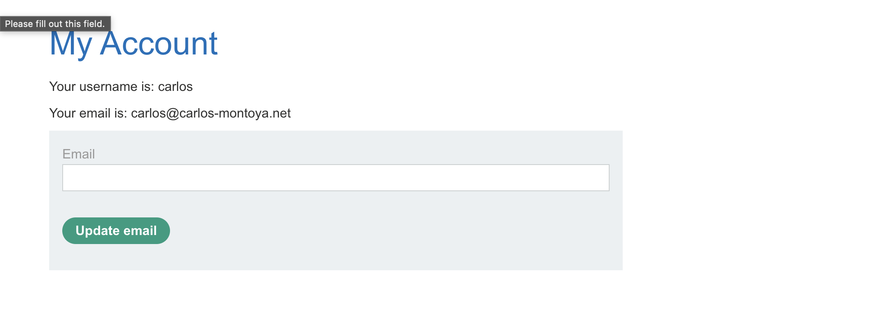
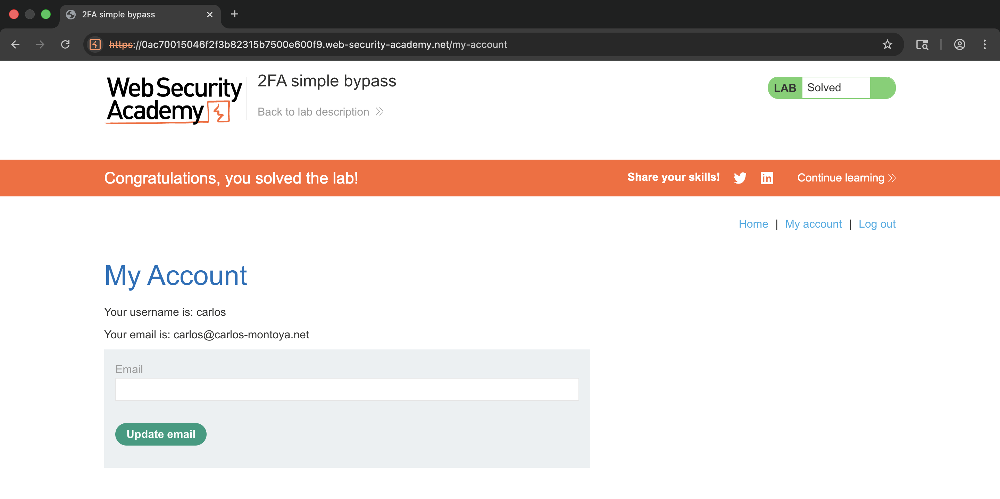

# WEB APPLICATION PENETRATION TEST REPORT: 2FA SIMPLE BYPASS

## 1. Document Control

| Detail | Value |
| :--- | :--- |
| **Report Date** | 19 March 2026 |
| **Report Version** | 1.0 |
| **Classification** | CONFIDENTIAL |
| **Prepared By** | Ramil V. Deocariza Jr. |

---

## 2. Executive Summary
This report presents the findings of an assessment identifying a High-severity authentication flaw. The application's Multi-Factor Authentication (MFA) implementation can be trivially bypassed via forced browsing, leading to unauthorized account access.

### 2.1 Overall Risk Rating
**Rating: HIGH**

### 2.2 Risk Summary
| Critical | High | Medium | Low | Info | Total Findings |
| :---: | :---: | :---: | :---: | :---: | :---: |
| 0 | 1 | 0 | 0 | 0 | 1 |

---

## 3. Detailed Findings

### VULN-001 — 2FA Bypass via Forced Browsing

| Attribute | Detail |
| :--- | :--- |
| **Severity** | High |
| **Finding ID** | VULN-001 |
| **Affected URL** | `/login2` and `/my-account` |
| **CWE** | CWE-287: Improper Authentication |
| **CVSSv3 Score** | 8.1 (High) |
| **OWASP Category**| A07:2021 – Identification and Authentication Failures |
| **Status** | Open |

#### 3.1 Description
The application's logic follows a "Password Check -> Redirect to 2FA" flow. However, the session is granted an "authenticated" state as soon as the password is correct. Because the restricted `/my-account` page does not explicitly verify if the 2FA verification step was completed, an attacker can skip the 2FA page entirely by manually navigating directly to the account URL.

#### 3.2 Proof of Concept (PoC)

**1. Identification**
Established a baseline authentication flow by accessing the `/my-account` page of a controlled user.

  
  
<i><b>Figure 1:</b> Establishing a baseline authentication flow.</i>

**2. Reaching the Proxy Gate (Factor 1)**
Logged in using the victim's credentials. After submitting the correct password, the server validated the first factor and routed the session to the second-factor verification page (`/login2`).

  
  
<i><b>Figure 2:</b> Reaching the 2FA wall on the /login2 endpoint for the target user.</i>

**3. Execution of Path Traversal (Bypass)**
Executed forced browsing by manually modifying the URL in the address bar from `/login2` to `/my-account` to test session state enforcement.

  
  
<i><b>Figure 3:</b> Executing forced browsing to the account page.</i>

**4. Verification & Confirmation**
The server processed the request without requiring the second factor, granting unauthorized access to the full profile details.

  
  
<i><b>Figure 4:</b> Gaining unauthorized access to the account.</i>

  
  
<i><b>Figure 5:</b> The final "Lab solved" confirmation banner.</i>

#### 3.3 Business Impact
Bypassing 2FA allows an attacker with compromised or brute-forced passwords to achieve full account takeover, completely neutralizing the defense-in-depth provided by multi-factor authentication.

#### 3.4 Remediation
Sessions must be held in a "partially-authenticated" state after the first factor is provided. Access to all protected resources must be strictly denied until a boolean "Fully Verified MFA" flag is set to true on the server side following successful token validation.

#### 3.5 References
* **CWE-287:** https://cwe.mitre.org/data/definitions/287.html
* **OWASP MFA Cheat Sheet:** https://cheatsheetseries.owasp.org/cheatsheets/Multifactor_Authentication_Cheat_Sheet.html