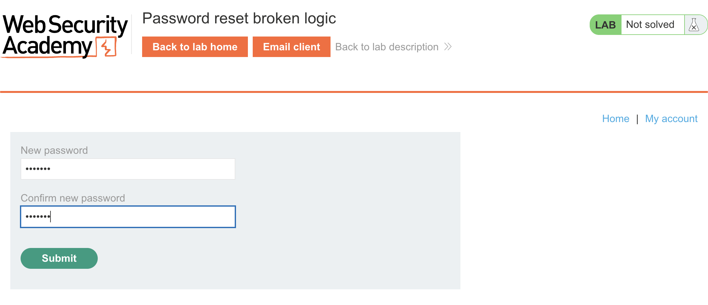
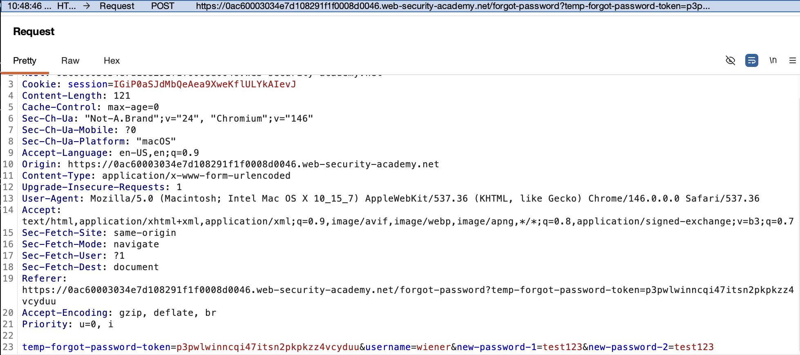
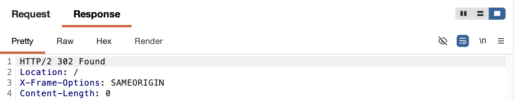
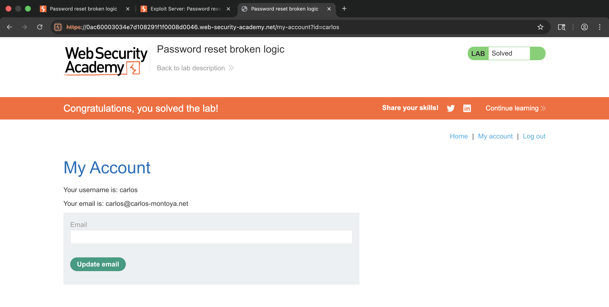

# 🛡️ Lab: Password reset broken logic

> **Category:** `Authentication`  
> **Difficulty:** `Apprentice`  
> **Status:** `Completed` ✅

---

### 🎯 Objective
The objective of this lab is to exploit a logic flaw in the password reset functionality to reset the password of the user `carlos` without possessing a valid reset token.

### 🛠️ Exploit Strategy
* **Vulnerability Point:** Server-side verification of the `temp-forgot-password-token`.
* **Payload Type:** Parameter Manipulation / Logic Bypass.
* **Technical Logic:** The application fails to enforce token validation if the token parameter is empty. By stripping the token value and manually specifying a target username in the request body, I can trick the backend into updating the password for an arbitrary account, as the server defaults to using the `username` parameter for the database update without a valid session or token check.

---

### 📑 Technical Walkthrough

#### 1. Identification
I initiated a legitimate password reset for my own account to capture the structure of the final submission request.

  
  
<i><b>Figure 1:</b> Accessing the password reset interface.</i>

#### 2. Proxy Interception
I captured the password change request in Burp Suite. This request contains both the secret token (in the URL) and the target username (in the body).

  
  
<i><b>Figure 2:</b> Intercepting the password reset POST request.</i>

#### 3. Execution of Traversal (Exploitation)
In Burp Repeater, I removed the token value and changed the `username` parameter to `carlos`. The server accepted the request, proving that the token check is bypassed when the value is null or empty.

  
  
<i><b>Figure 3:</b> Manipulating the request to target Carlos's account.</i>

#### 4. Verification
I successfully authenticated as `carlos` using the password I set in the previous step, confirming that his account has been compromised.

  
  
<i><b>Figure 4:</b> Gaining unauthorized access to the victim's account page.</i>

#### 5. Final Confirmation
The lab status updated to "Solved" upon accessing the compromised account.

  
  
<i><b>Figure 5:</b> Final confirmation of lab completion.</i>

---

### 🧠 Key Takeaway
Security mechanisms must "fail closed." If a required security parameter like a token is missing or invalid, the entire operation must be aborted. Relying on client-side parameters like `username` for sensitive updates without strict server-side validation is a major logic flaw.

**Remediation:** Ensure that the password reset token is strictly validated and cryptographically tied to the specific user session. The server should use the identity associated with a *valid* token to perform the update, rather than a user-supplied username parameter.
---