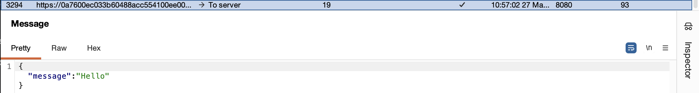
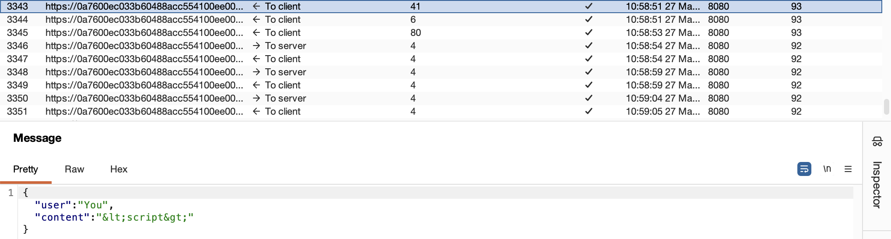
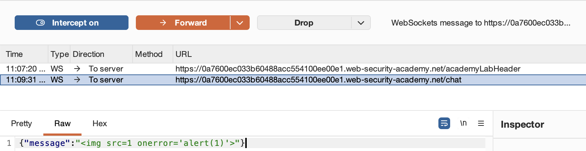
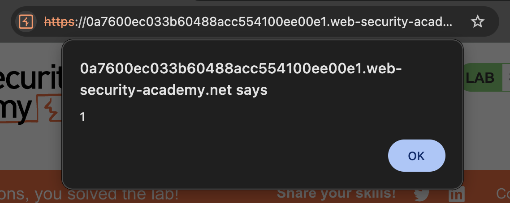
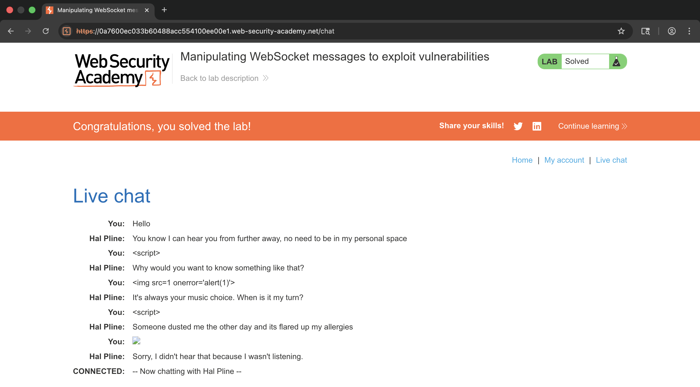

# 🛡️ Lab: Manipulating WebSocket messages to exploit vulnerabilities

> **Category:** `WebSockets`  
> **Difficulty:** `Apprentice`  
> **Status:** `Completed` ✅

---

### 🎯 Objective
The objective of this lab is to exploit a Cross-Site Scripting (XSS) vulnerability delivered via a WebSocket connection to trigger an `alert()` box in the support agent's browser.

### 🛠️ Exploit Strategy
* **Vulnerability Point:** Live chat message input rendered in the browser.
* **Payload Type:** Stored XSS via WebSocket Frame Manipulation.
* **Technical Logic:** The application uses WebSockets for real-time communication. While the client-side JavaScript attempts to encode special characters (like `<` and `>`), this is a client-side-only defense. By using Burp Suite to intercept the raw WebSocket frame after it leaves the browser but before it reaches the server, I can inject a raw HTML payload that the server then broadcasts to all chat participants without sanitization.

---

### 📑 Technical Walkthrough

#### 1. Identification
I began by sending a standard "Hello" message in the live chat and identifying the outgoing message frame in Burp Suite's **WebSockets history**. This established the JSON structure used by the application.

  
  
<i><b>Figure 1:</b> Identifying the basic JSON message structure in the WebSocket history.</i>

#### 2. Analyzing Client-Side Protections
I attempted to send a script tag through the browser chat box. I observed in the history that the client-side code automatically performed HTML encoding, turning `<script>` into `&lt;script&gt;`, effectively neutralizing the attack before transmission.

  
  
<i><b>Figure 2:</b> Observing client-side HTML encoding in the WebSocket history.</i>

#### 3. Execution of XSS Traversal (Injection)
To bypass the client-side encoding, I enabled **WebSocket Interception** in Burp Proxy. I sent a new message and modified the JSON content in the Interceptor to include a raw HTML `` tag with an `onerror` event. This allowed the payload to reach the server unencoded.

  
  
<i><b>Figure 3:</b> Injecting the raw XSS payload into the intercepted WebSocket frame.</i>

#### 4. Verification
Upon forwarding the modified frame, the server echoed the raw HTML back to the browser. The browser then executed the `alert(1)` command, confirming a successful XSS injection through the WebSocket channel.

  
  
<i><b>Figure 4:</b> Confirming the execution of the injected JavaScript alert.</i>

#### 5. Final Confirmation
The lab was solved once the administrative support agent's browser rendered the payload, as confirmed by the lab status banner.

  
  
<i><b>Figure 5:</b> Final confirmation of lab completion with the 'Solved' banner.</i>

---

### 🧠 Key Takeaway
Security controls must never rely on client-side encoding. Because WebSockets can be intercepted and modified just like standard HTTP requests, all data received must be treated as untrusted and sanitized on the server-side before being rendered for other users.

**Remediation:** Implement server-side output encoding or a Content Security Policy (CSP) to prevent the execution of unauthorized inline scripts.
---