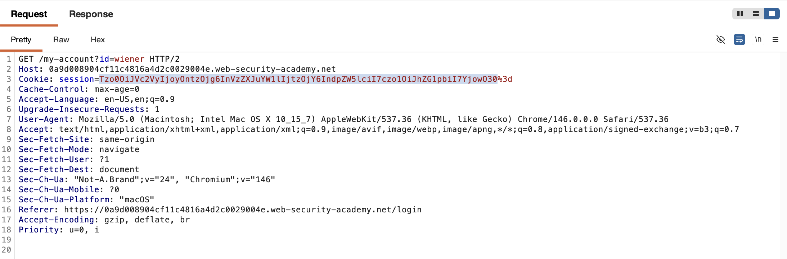
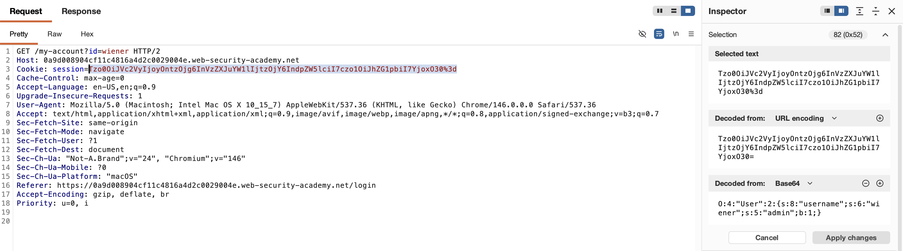
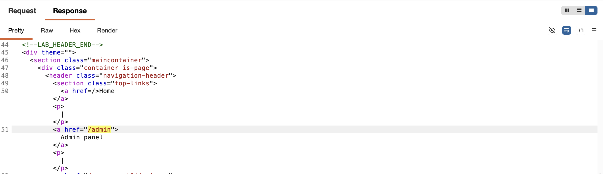
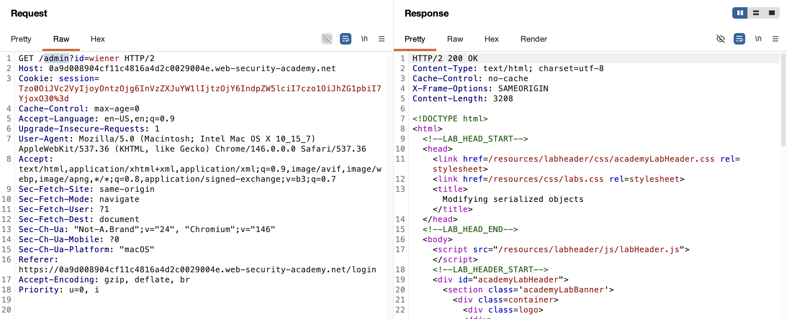
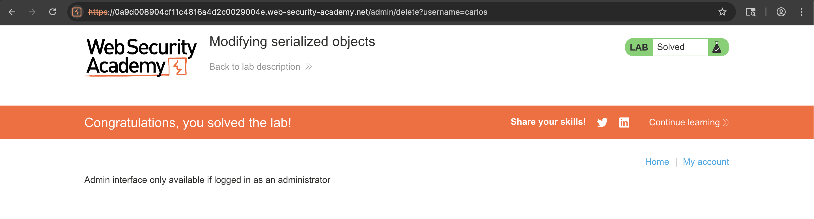

# WEB APPLICATION PENETRATION TEST REPORT: INSECURE DESERIALIZATION

## 1. Document Control

| Detail | Value |
| :--- | :--- |
| **Report Date** | 25 March 2026 |
| **Report Version** | 1.0 |
| **Classification** | CONFIDENTIAL |
| **Prepared By** | Ramil V. Deocariza Jr. |

---

## 2. Executive Summary
This report details the exploitation of a High-severity Insecure Deserialization vulnerability. The application utilizes a client-side session cookie containing a serialized PHP object to manage user state. By intercepting, decoding, and modifying this object, an attacker can arbitrarily elevate their privileges to Administrator and execute unauthorized actions.

### 2.1 Overall Risk Rating
**Rating: HIGH**

### 2.2 Risk Summary
| Critical | High | Medium | Low | Info | Total Findings |
| :---: | :---: | :---: | :---: | :---: | :---: |
| 0 | 1 | 0 | 0 | 0 | 1 |

---

## 3. Detailed Findings

### VULN-001 — Privilege Escalation via PHP Object Injection

| Attribute | Detail |
| :--- | :--- |
| **Severity** | High |
| **Finding ID** | VULN-001 |
| **Affected Endpoint** | All authenticated endpoints (via `session` cookie) |
| **CWE** | CWE-502: Deserialization of Untrusted Data |
| **CVSSv3 Score** | 8.8 (High) |
| **OWASP Category**| A08:2021 – Software and Data Integrity Failures |
| **Status** | Open |

#### 3.1 Description
The application manages sessions by passing a URL- and Base64-encoded serialized PHP object to the client. This object contains the user's state, including an `admin` boolean attribute set to `b:0` (false) for standard users. Because the server does not cryptographically sign or validate the integrity of this serialized object upon deserialization, a user can modify the attribute to `b:1` (true), re-encode the cookie, and gain complete administrative access to the platform.

#### 3.2 Proof of Concept (PoC)

**1. Identification & Decoding**
Captured the `GET /my-account` request and used the Burp Inspector to decode the `session` cookie, revealing the underlying PHP serialized object and the target `admin` attribute.

  
  
<i><b>Figure 1:</b> Inspecting the decoded PHP serialized object revealing 'b:0' (admin=false).</i>

**2. Payload Modification**
Modified the `admin` attribute to `b:1` within the Inspector and applied the changes, forcing Burp Suite to re-encode the malicious payload into the request header.

  
  
<i><b>Figure 2:</b> The manipulated Base64 string successfully injected into the session cookie.</i>

**3. Execution & Verification**
Transmitted the modified request. The server deserialized the tampered object, trusting the altered state, and returned the administrative dashboard interface.

  
  
<i><b>Figure 3:</b> Server response confirming unauthorized access to the admin panel.</i>

**4. Administrative Action**
Navigated the administrative endpoints to locate the user management controls.

  
  
<i><b>Figure 4:</b> Enumerating the administrative actions to identify the deletion endpoint.</i>

**5. Final Confirmation**
Issued a request to `/admin/delete?username=carlos` using the forged administrative session, successfully removing the target user from the database.

  
  
<i><b>Figure 5:</b> Final confirmation of lab completion following the unauthorized deletion.</i>

#### 3.3 Business Impact
Client-side modification of serialized objects completely nullifies the application's access control models. It allows any low-privileged user to immediately escalate to administrative roles, resulting in total system compromise, data breaches, and arbitrary account deletion.

#### 3.4 Remediation
Never store sensitive state or privilege information within client-accessible serialized objects. 
1. **Primary:** Transition to a secure, server-side session management architecture where the client only holds a randomized, unpredictable session ID.
2. **Secondary:** If client-side tokens are absolutely necessary, utilize cryptographically signed tokens (such as JSON Web Tokens - JWTs) so that any tampering invalidates the signature.

#### 3.5 References
* **CWE-502:** https://cwe.mitre.org/data/definitions/502.html
* **OWASP Deserialization Cheat Sheet:** https://cheatsheetseries.owasp.org/cheatsheets/Deserialization_Cheat_Sheet.html