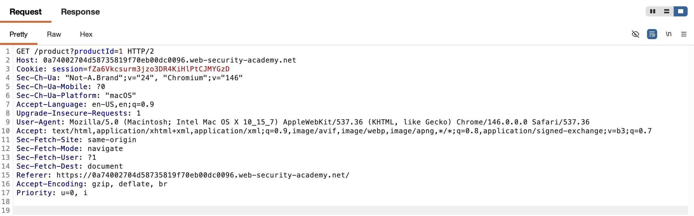
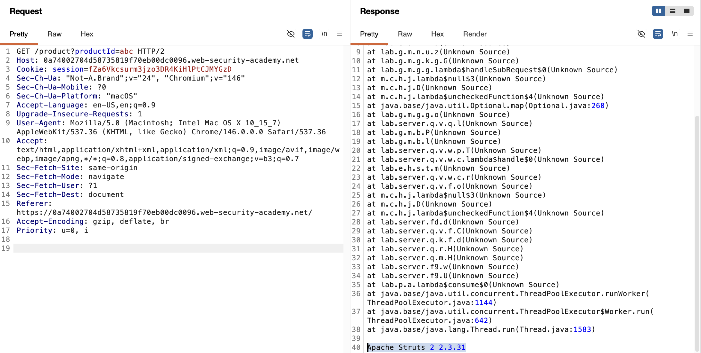

# WEB APPLICATION PENETRATION TEST REPORT: INFORMATION DISCLOSURE

## 1. Document Control

| Detail | Value |
| :--- | :--- |
| **Report Date** | 25 March 2026 |
| **Report Version** | 1.0 |
| **Classification** | CONFIDENTIAL |
| **Prepared By** | Ramil V. Deocariza Jr. |

---

## 2. Executive Summary
This report details a Medium-severity Information Disclosure vulnerability. The application fails to handle unexpected input types gracefully, resulting in verbose stack traces being rendered to the client. This error leakage exposes the precise version of the underlying third-party framework, significantly reducing an attacker's reconnaissance time and facilitating targeted exploitation.

### 2.1 Overall Risk Rating
**Rating: MEDIUM**

### 2.2 Risk Summary
| Critical | High | Medium | Low | Info | Total Findings |
| :---: | :---: | :---: | :---: | :---: | :---: |
| 0 | 0 | 1 | 0 | 0 | 1 |

---

## 3. Detailed Findings

### VULN-001 — Verbose Error Messages Revealing Framework Version

| Attribute | Detail |
| :--- | :--- |
| **Severity** | Medium |
| **Finding ID** | VULN-001 |
| **Affected Endpoint** | `GET /product?productId=` |
| **CWE** | CWE-209: Generation of Error Message Containing Sensitive Information |
| **CVSSv3 Score** | 5.3 (Medium) |
| **OWASP Category**| A05:2021 – Security Misconfiguration |
| **Status** | Open |

#### 3.1 Description
The product details endpoint expects an integer value for the `productId` parameter. When a user submits a non-integer data type (such as a string), the application's backend throws an unhandled exception. Because the server is misconfigured to display debug-level information in production, the full Java stack trace is returned in the HTTP response. This trace explicitly reveals that the server is running Apache Struts 2 version 2.3.31.

#### 3.2 Proof of Concept (PoC)

**1. Identification**
Captured standard web traffic while navigating the product catalog to identify dynamic parameters. Isolated the `productId` parameter for testing.

  
  
<i><b>Figure 1:</b> Identifying the target parameter in the standard HTTP GET request.</i>

**2. Execution & Verification**
Injected a string payload (`"example"`) into the `productId` parameter to test the application's type handling and error responses. The server crashed and returned a full stack trace, disclosing the framework version.

  
  
<i><b>Figure 2:</b> Verbose stack trace revealing the use of Apache Struts 2 2.3.31.</i>

**3. Confirmation**
The extracted version number was verified against the lab's success criteria.

  
  
<i><b>Figure 3:</b> Final confirmation of successful intelligence gathering.</i>

#### 3.3 Business Impact
While information disclosure alone does not directly compromise data, revealing the exact version of the technology stack—especially a framework like Apache Struts 2 2.3.31, which is infamous for highly critical Remote Code Execution (RCE) vulnerabilities—gives attackers a direct roadmap to compromise the server without needing to perform noisy vulnerability scanning.

#### 3.4 Remediation
1. **Disable Verbose Errors:** Ensure that production environments are configured to suppress debug information and stack traces. Return a generic, user-friendly 500 Internal Server Error page instead.
2. **Input Validation & Exception Handling:** Implement robust server-side input validation and `try-catch` blocks to gracefully handle unexpected data types without crashing the application thread.

#### 3.5 References
* **CWE-209:** https://cwe.mitre.org/data/definitions/209.html
* **OWASP Error Handling Cheat Sheet:** https://cheatsheetseries.owasp.org/cheatsheets/Error_Handling_Cheat_Sheet.html