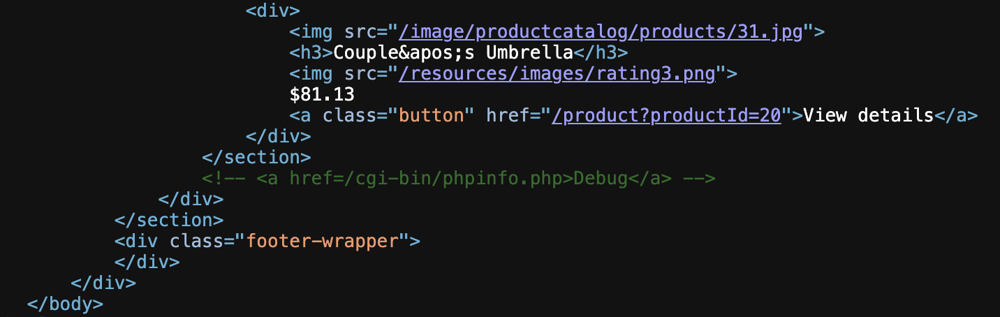
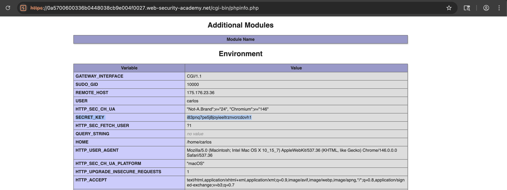

# WEB APPLICATION PENETRATION TEST REPORT: SENSITIVE INFORMATION DISCLOSURE

## 1. Document Control

| Detail | Value |
| :--- | :--- |
| **Report Date** | 13 April 2026 |
| **Report Version** | 1.0 |
| **Classification** | CONFIDENTIAL |
| **Prepared By** | Ramil V. Deocariza Jr. |

---

## 2. Executive Summary
This report details a High-severity Information Disclosure vulnerability. The application contains a publicly accessible debugging page that exposes sensitive server-side configurations, including critical environment variables. This intelligence enables an attacker to harvest cryptographic keys and API credentials, drastically reducing the effort required to compromise the underlying infrastructure.

### 2.1 Overall Risk Rating
**Rating: HIGH**

### 2.2 Risk Summary
| Critical | High | Medium | Low | Info | Total Findings |
| :---: | :---: | :---: | :---: | :---: | :---: |
| 0 | 1 | 0 | 0 | 0 | 1 |

---

## 3. Detailed Findings

### VULN-001 — Information Exposure via Active Debug Code

| Attribute | Detail |
| :--- | :--- |
| **Severity** | High |
| **Finding ID** | VULN-001 |
| **Affected Endpoint** | `/cgi-bin/phpinfo.php` |
| **CWE** | CWE-489: Active Debug Code |
| **CVSSv3 Score** | 7.5 (High) |
| **OWASP Category**| A05:2021 – Security Misconfiguration |
| **Status** | Open |

#### 3.1 Description
Developers occasionally leave diagnostic scripts (such as `phpinfo.php`) on production servers to troubleshoot issues. In this instance, the development team also left an HTML comment in the homepage source code revealing the exact path to this debug file. Accessing this endpoint uncovers extensive internal configuration details, most notably the `SECRET_KEY` environment variable. Such keys are typically used for signing session cookies, encrypting database fields, or authenticating with backend microservices.

#### 3.2 Proof of Concept (PoC)

**1. Identification**
Inspected the source code of the application's root endpoint (`/`) and discovered an artifact left by developers revealing the location of a debugging script.

  
  
<i><b>Figure 1:</b> Uncovering the hidden HTML comment pointing to the debug endpoint.</i>

**2. Execution & Verification**
Navigated to the discovered `/cgi-bin/phpinfo.php` endpoint. The server processed the PHP function and returned the complete server configuration profile. Enumerated the response to locate application-specific environment variables.

  
  
<i><b>Figure 2:</b> Extracting the SECRET_KEY environment variable from the diagnostic output.</i>

**3. Confirmation**
The extracted cryptographic key was verified as authentic against the lab's success criteria.

  
  
<i><b>Figure 3:</b> Final confirmation of successful intelligence gathering.</i>

#### 3.3 Business Impact
The exposure of environment variables often leads to direct infrastructure compromise. If the `SECRET_KEY` is utilized for cryptographic signing (e.g., JWT signatures or Django session tokens), an attacker can forge administrative sessions and execute complete account takeovers. Furthermore, exposing internal paths and software versions aids in chaining subsequent targeted attacks.

#### 3.4 Remediation
1. **Remove Diagnostic Files:** Immediately remove all `phpinfo()`, debugging scripts, and testing directories from production web servers.
2. **Scrub Source Code:** Implement automated CI/CD pipeline checks to prevent the deployment of development comments (e.g., TODOs, debug links) into production environments.
3. **Restrict Access:** If diagnostic endpoints are strictly required for operational monitoring, ensure they are heavily restricted by network ACLs (Internal IPs only) and require strong, multi-factor authentication.

#### 3.5 References
* **CWE-489:** https://cwe.mitre.org/data/definitions/489.html
* **OWASP Security Misconfiguration:** https://owasp.org/Top10/A05_2021-Security_Misconfiguration/