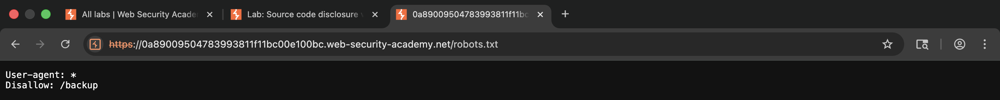
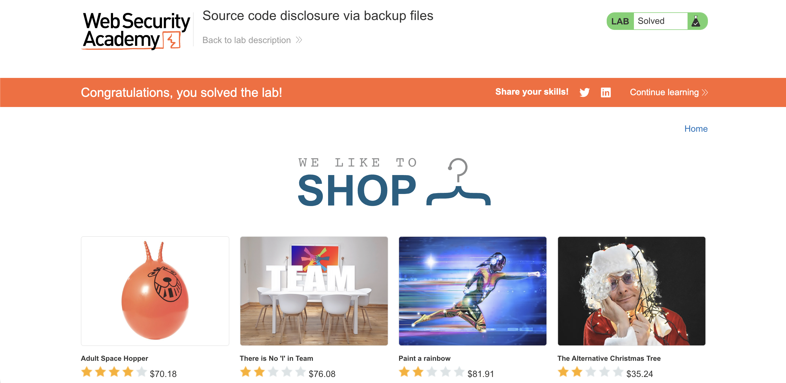
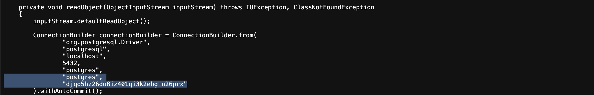

# WEB APPLICATION PENETRATION TEST REPORT: SOURCE CODE DISCLOSURE VIA BACKUP FILES

## 1. Document Control

| Detail | Value |
| :--- | :--- |
| **Report Date** | 13 April 2026 |
| **Report Version** | 1.0 |
| **Classification** | CONFIDENTIAL |
| **Prepared By** | Ramil V. Deocariza Jr. |

---

## 2. Executive Summary
This report details a High-severity Information Disclosure vulnerability. The web application inadvertently exposes a hidden backup directory containing raw source code. The disclosed source code reveals hardcoded database credentials, providing an attacker with a direct vector to compromise the backend database infrastructure.

### 2.1 Overall Risk Rating
**Rating: HIGH**

### 2.2 Risk Summary
| Critical | High | Medium | Low | Info | Total Findings |
| :---: | :---: | :---: | :---: | :---: | :---: |
| 0 | 1 | 0 | 0 | 0 | 1 |

---

## 3. Detailed Findings

### VULN-001 — Sensitive Information Exposure via Backup Files and Hardcoded Credentials

| Attribute | Detail |
| :--- | :--- |
| **Severity** | High |
| **Finding ID** | VULN-001 |
| **Affected Endpoint** | `/robots.txt` and `/backup/ProductTemplate.java.bak` |
| **CWE** | CWE-530: Exposure of Backup File to an Unauthorized Control Sphere CWE-798: Use of Hard-coded Credentials |
| **CVSSv3 Score** | 7.5 (High) |
| **OWASP Category**| A05:2021 – Security Misconfiguration |
| **Status** | Open |

#### 3.1 Description
The application utilizes a `/robots.txt` file intended for search engine crawlers; however, it inadvertently discloses the existence of a restricted `/backup` directory. Directory listing is enabled on this path, allowing unauthenticated users to view and download its contents. Specifically, a backup Java source file (`ProductTemplate.java.bak`) is accessible. Because `.bak` files are not executed by the application server, the raw source code is returned to the client. This file contains a hardcoded plaintext password for the backend PostgreSQL database.

#### 3.2 Proof of Concept (PoC)

**1. Identification**
Navigated to the standard `/robots.txt` endpoint and discovered a directive explicitly disallowing web crawlers from accessing a `/backup` directory, effectively mapping out a sensitive path.

  
  
<i><b>Figure 1:</b> The robots.txt file leaking the location of the hidden backup directory.</i>

**2. Execution & Verification**
Navigated to the `/backup` directory and accessed the `ProductTemplate.java.bak` file. Analyzed the raw Java source code and identified the database connection configuration, successfully extracting the hardcoded PostgreSQL password.

  
  
<i><b>Figure 2:</b> Extracting the hardcoded database password from the exposed source code.</i>

**3. Confirmation**
The extracted database credentials were authenticated and verified against the lab's success criteria.

  
  
<i><b>Figure 3:</b> Final confirmation of successful credential extraction.</i>

#### 3.3 Business Impact
The disclosure of source code provides attackers with deep insights into the application's underlying logic, significantly accelerating the discovery of further vulnerabilities. The exposure of hardcoded database credentials directly compromises the confidentiality and integrity of backend data, potentially leading to a complete data breach.

#### 3.4 Remediation
1. **Remove Backup Files:** Never store backup files, old versions, or uncompiled source code (`.bak`, `.old`, `.swp`) within the web root directory.
2. **Disable Directory Listing:** Ensure the web server is configured to deny directory listing globally so users cannot browse folders that lack an index file.
3. **Externalize Secrets:** Strictly prohibit the hardcoding of passwords, API keys, or cryptographic secrets within source code. Utilize secure environment variables or a dedicated secrets management service (e.g., AWS Secrets Manager, HashiCorp Vault) injected at runtime.

#### 3.5 References
* **CWE-530:** https://cwe.mitre.org/data/definitions/530.html
* **CWE-798:** https://cwe.mitre.org/data/definitions/798.html
* **OWASP Hardcoded Passwords:** https://owasp.org/www-community/vulnerabilities/Use_of_hard-coded_password