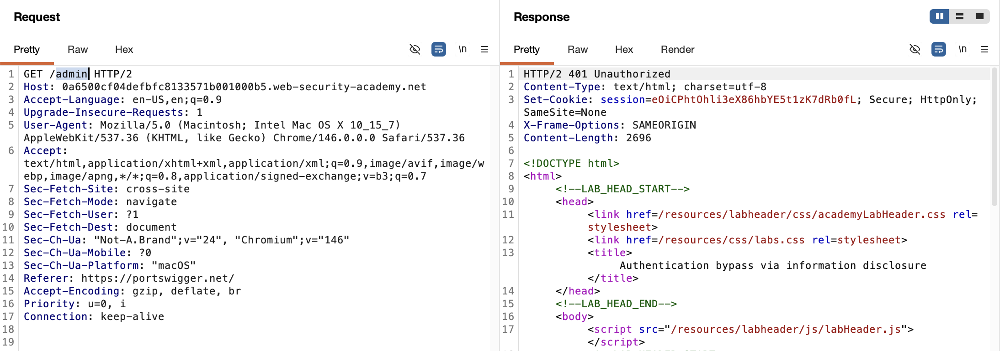
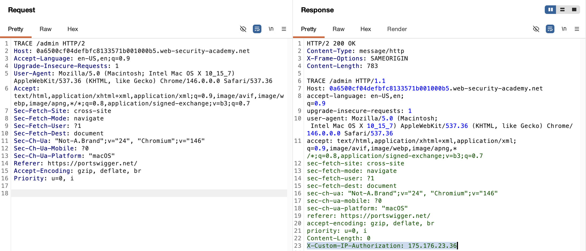
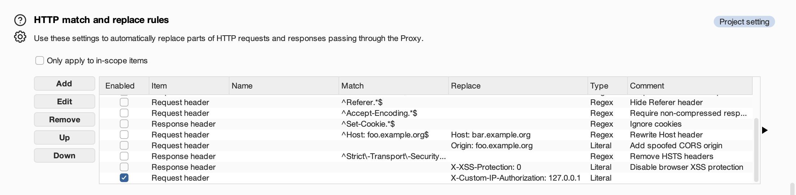
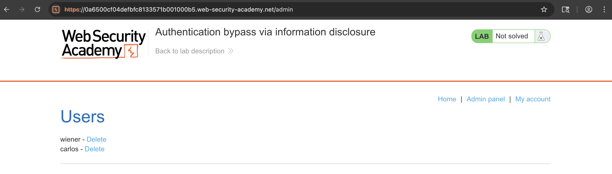
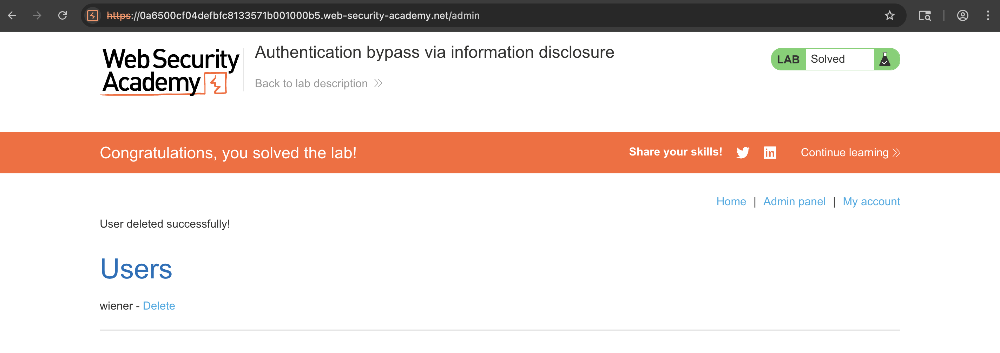

# WEB APPLICATION PENETRATION TEST REPORT: AUTH BYPASS VIA INFO DISCLOSURE

## 1. Document Control

| Detail | Value |
| :--- | :--- |
| **Report Date** | 13 April 2026 |
| **Report Version** | 1.0 |
| **Classification** | CONFIDENTIAL |
| **Prepared By** | Ramil V. Deocariza Jr. |

---

## 2. Executive Summary
This report details a Critical vulnerability chain resulting in a complete Authentication Bypass. The application exposes internal infrastructure routing behavior by enabling the insecure HTTP `TRACE` method. This information disclosure reveals a custom IP authorization header, which an attacker can subsequently spoof to impersonate an internal localhost connection, granting unauthorized administrative access.

### 2.1 Overall Risk Rating
**Rating: CRITICAL**

### 2.2 Risk Summary
| Critical | High | Medium | Low | Info | Total Findings |
| :---: | :---: | :---: | :---: | :---: | :---: |
| 1 | 0 | 0 | 0 | 0 | 1 |

---

## 3. Detailed Findings

### VULN-001 — Auth Bypass via Insecure TRACE Method and Header Spoofing

| Attribute | Detail |
| :--- | :--- |
| **Severity** | Critical |
| **Finding ID** | VULN-001 |
| **Affected Endpoint** | `*` (Global HTTP Methods) and `/admin` |
| **CWE** | CWE-287: Improper Authentication CWE-200: Exposure of Sensitive Info to an Unauthorized Actor |
| **CVSSv3 Score** | 9.8 (Critical) |
| **OWASP Category**| A01:2021 – Broken Access Control |
| **Status** | Open |

#### 3.1 Description
The application restricts access to the `/admin` endpoint, permitting only authenticated administrators or connections originating from the local loopback address (`127.0.0.1`). However, the server is misconfigured to support the `TRACE` HTTP method, which echoes the exact HTTP request received by the backend server. By issuing a `TRACE` request, an attacker can observe that a front-end reverse proxy is injecting an `X-Custom-IP-Authorization` header containing the client's IP address. Because the backend relies implicitly on this header for access control, an attacker can manually forge this header, setting it to `127.0.0.1`, to completely bypass all authentication checks.

#### 3.2 Proof of Concept (PoC)

**1. Identification**
Attempted to access the restricted `/admin` directory via standard `GET` requests. The server returned a 401 Unauthorized error, confirming IP-based and role-based restrictions.

  
  
<i><b>Figure 1:</b> Initial access denial to the administrative interface.</i>

**2. Information Disclosure via TRACE**
Modified the HTTP method to `TRACE`. The server response echoed back the request, exposing the `X-Custom-IP-Authorization` header added dynamically by the infrastructure.

  
  
<i><b>Figure 2:</b> Utilizing the TRACE method to leak internal proxy headers.</i>

**3. Payload Forgery**
Utilized Burp Suite's "Match and Replace" proxy rules to automatically inject `X-Custom-IP-Authorization: 127.0.0.1` into all outgoing HTTP requests.

  
  
<i><b>Figure 3:</b> Forging the IP authorization header to simulate a localhost connection.</i>

**4. Execution & Verification**
Navigated back to the `/admin` endpoint with the spoofed header active. The application bypassed all authentication checks and rendered the administrative dashboard.

  
  
<i><b>Figure 4:</b> Successful unauthorized access to the admin panel.</i>

**5. Confirmation**
Executed an administrative action (deleting the user 'carlos') to prove the severity of the compromise.

  
  
<i><b>Figure 5:</b> Final confirmation of successful privilege escalation and account deletion.</i>

#### 3.3 Business Impact
The ability to bypass administrative authentication controls leads to total application compromise. An attacker can manipulate user accounts, extract sensitive customer data, alter backend configurations, and potentially pivot to the underlying server operating system.

#### 3.4 Remediation
1. **Disable Insecure HTTP Methods:** Immediately disable the `TRACE` and `TRACK` HTTP methods on all web servers and load balancers to prevent diagnostic routing leaks.
2. **Robust Access Control:** Do not rely on easily spoofed client-supplied HTTP headers (like `X-Forwarded-For` or custom IP authorization headers) as the sole mechanism for authentication or authorization. Enforce strict server-side session validation for all administrative interfaces.

#### 3.5 References
* **CWE-287:** https://cwe.mitre.org/data/definitions/287.html
* **OWASP Broken Access Control:** https://owasp.org/Top10/A01_2021-Broken_Access_Control/