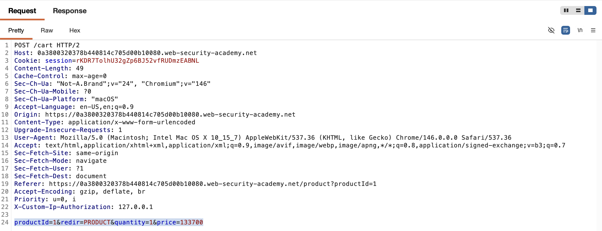
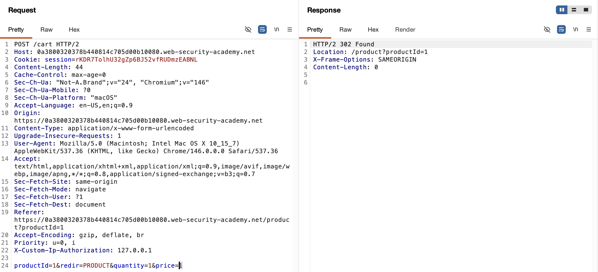
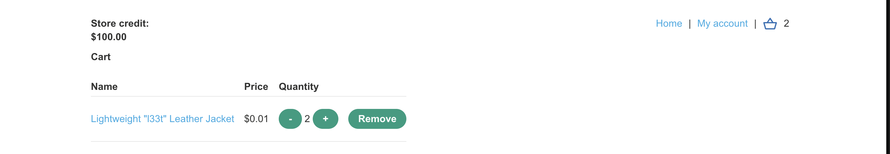
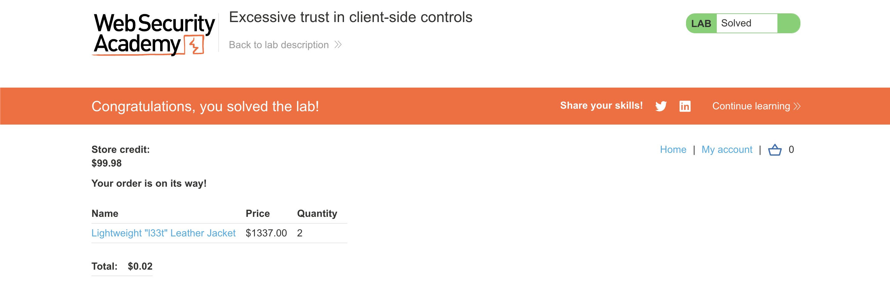

# WEB APPLICATION PENETRATION TEST REPORT: BUSINESS LOGIC FLAW (PRICE MANIPULATION)

## 1. Document Control

| Detail | Value |
| :--- | :--- |
| **Report Date** | 26 March 2026 |
| **Report Version** | 1.0 |
| **Classification** | CONFIDENTIAL |
| **Prepared By** | Ramil V. Deocariza Jr. |

---

## 2. Executive Summary
This report details a Critical business logic vulnerability within the application's e-commerce purchasing workflow. The application relies entirely on client-side controls to enforce product pricing, allowing an attacker to intercept and manipulate HTTP requests to purchase items at arbitrary prices. This fundamental architectural flaw results in immediate and unmitigated financial loss.

### 2.1 Overall Risk Rating
**Rating: CRITICAL**

### 2.2 Risk Summary
| Critical | High | Medium | Low | Info | Total Findings |
| :---: | :---: | :---: | :---: | :---: | :---: |
| 1 | 0 | 0 | 0 | 0 | 1 |

---

## 3. Detailed Findings

### VULN-001 — Excessive Trust in Client-Side Input Leading to Arbitrary Pricing

| Attribute | Detail |
| :--- | :--- |
| **Severity** | Critical |
| **Finding ID** | VULN-001 |
| **Affected Endpoint** | `POST /cart` |
| **CWE** | CWE-602: Client-Side Enforcement of Server-Side Security CWE-807: Reliance on Untrusted Inputs in a Security Decision |
| **CVSSv3 Score** | 9.3 (Critical) |
| **OWASP Category**| A04:2021 – Insecure Design |
| **Status** | Open |

#### 3.1 Description
During the "Add to Cart" transaction, the client submits a `POST` request containing the `productId`, `quantity`, and `price`. The backend server accepts the `price` parameter provided by the client as the authoritative cost of the item without independently verifying it against the backend database. By intercepting this request via a proxy and modifying the `price` parameter to an arbitrary low value (e.g., `1`), an attacker can populate their cart with high-value items priced at fractions of a cent, successfully completing the checkout process using limited store credit.

#### 3.2 Proof of Concept (PoC)

**1. Identification**
Captured the `POST /cart` request during a standard "Add to Cart" operation. Identified that the item's cost was being transmitted explicitly in the `price` parameter of the request body.

  
  
<i><b>Figure 1:</b> Discovering the price parameter passed from the client to the server.</i>

**2. Payload Injection**
Utilized Burp Suite Repeater to manually tamper with the POST request, modifying the `price` parameter from `133700` (its intended value) to `1`.

  
  
<i><b>Figure 2:</b> Injecting the manipulated price value into the HTTP request.</i>

**3. Execution & Verification**
Navigated to the user's shopping cart interface. The server successfully processed the tampered request, updating the cart total to reflect the manipulated price.

  
  
<i><b>Figure 3:</b> The shopping cart rendering the unauthorized discount.</i>

**4. Confirmation**
Proceeded through the checkout workflow. The transaction successfully cleared using the user's existing store credit, demonstrating a complete bypass of the intended economic logic.

  
  
<i><b>Figure 4:</b> Final confirmation of successful purchase manipulation.</i>

#### 3.3 Business Impact
This vulnerability guarantees direct, unmitigated financial loss. Attackers can purchase any item in the inventory for arbitrary amounts, completely destroying the integrity of the platform's revenue model. If automated, this flaw could drain the entire warehouse inventory at near-zero cost to the attackers.

#### 3.4 Remediation
1. **Server-Side Authority:** Never trust the client to dictate sensitive state or financial values. The client should only submit the `productId` and the `quantity` during a cart transaction. 
2. **Database Verification:** The backend server must query the internal database using the provided `productId` to retrieve the authoritative, unalterable price for the transaction.
3. **Remove Redundant Parameters:** Strip the `price` parameter entirely from the front-end HTML forms and API requests to prevent confusion and reduce the attack surface.

#### 3.5 References
* **CWE-602:** https://cwe.mitre.org/data/definitions/602.html
* **OWASP Business Logic Vulnerabilities:** https://owasp.org/www-community/vulnerabilities/Business_logic_vulnerability