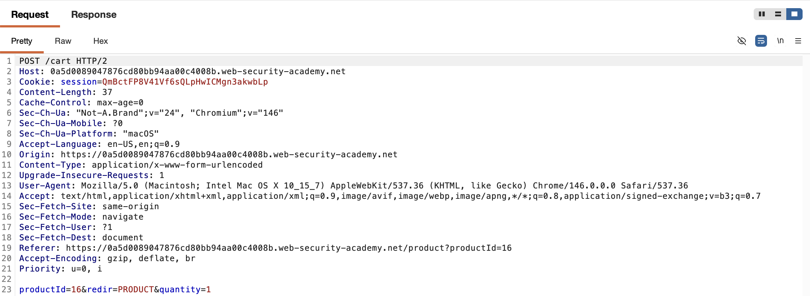
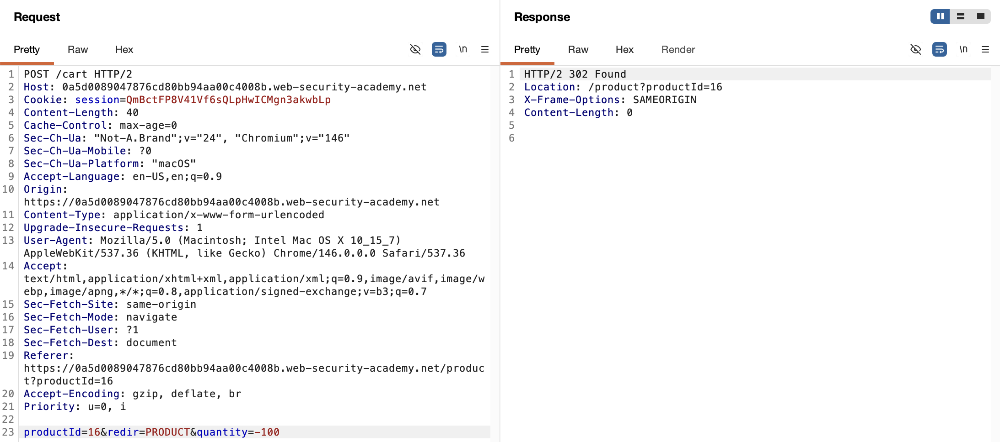
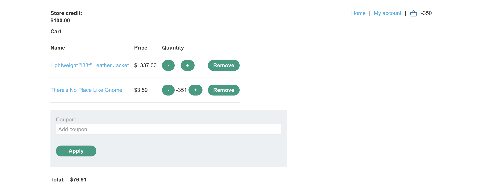
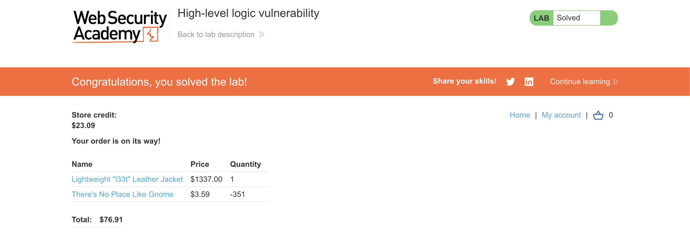

# WEB APPLICATION PENETRATION TEST REPORT: BUSINESS LOGIC FLAW (NEGATIVE QUANTITY)

## 1. Document Control

| Detail | Value |
| :--- | :--- |
| **Report Date** | 26 March 2026 |
| **Report Version** | 1.0 |
| **Classification** | CONFIDENTIAL |
| **Prepared By** | Ramil V. Deocariza Jr. |

---

## 2. Executive Summary
This report details a Critical business logic vulnerability within the application's shopping cart mechanism. The application fails to validate the boundaries of user-supplied quantity values. By injecting a negative integer into the quantity parameter, an attacker can force the system to calculate negative subtotals, allowing them to offset the cost of high-value items and purchase them for a fraction of their intended price.

### 2.1 Overall Risk Rating
**Rating: CRITICAL**

### 2.2 Risk Summary
| Critical | High | Medium | Low | Info | Total Findings |
| :---: | :---: | :---: | :---: | :---: | :---: |
| 1 | 0 | 0 | 0 | 0 | 1 |

---

## 3. Detailed Findings

### VULN-001 — Improper Input Validation Leading to Negative Cart Totals

| Attribute | Detail |
| :--- | :--- |
| **Severity** | Critical |
| **Finding ID** | VULN-001 |
| **Affected Endpoint** | `POST /cart` |
| **CWE** | CWE-1284: Improper Validation of Specified Quantity in Input CWE-682: Incorrect Calculation |
| **CVSSv3 Score** | 9.3 (Critical) |
| **OWASP Category**| A04:2021 – Insecure Design |
| **Status** | Open |

#### 3.1 Description
When a user adds an item to their cart, the `POST /cart` endpoint accepts a `quantity` parameter. The backend business logic multiplies this quantity by the item's established price to generate a subtotal. However, the application does not verify if the supplied quantity is a positive integer greater than zero. If a negative integer (e.g., `-100`) is submitted, the backend performs the mathematical operation verbatim, resulting in a negative subtotal. This negative subtotal is then aggregated with the rest of the cart, effectively subtracting from the total cost of other items.

#### 3.2 Proof of Concept (PoC)

**1. Identification**
Captured the `POST /cart` request while adding a low-value item to the cart. Identified the `quantity` parameter governing the multiplier logic.

  
  
<i><b>Figure 1:</b> Discovering the quantity parameter passed from the client.</i>

**2. Payload Injection**
Utilized Burp Suite Repeater to modify the `quantity` parameter from `1` to `-100`. The server accepted the payload without throwing a validation error.

  
  
<i><b>Figure 2:</b> Injecting a negative quantity value into the HTTP request.</i>

**3. Execution & Verification**
Navigated to the shopping cart interface. The cart successfully rendered the negative subtotal, which was aggregated against a high-value item (Leather Jacket), reducing the overall cart total to an amount within the user's limited store credit balance.

  
  
<i><b>Figure 3:</b> The shopping cart calculating a negative subtotal to offset the total cost.</i>

**4. Confirmation**
Proceeded through the checkout workflow. The transaction successfully cleared using the manipulated total, demonstrating a complete subversion of the purchasing logic.

  
  
<i><b>Figure 4:</b> Final confirmation of successful purchase via negative aggregation.</i>

#### 3.3 Business Impact
This vulnerability allows malicious actors to acquire high-value physical goods for virtually no cost by offsetting their price with negative quantities of arbitrary items. This leads to direct financial loss, inventory desynchronization, and total compromise of the e-commerce platform's economic integrity.

#### 3.4 Remediation
1. **Strict Type and Range Validation:** The backend must strictly validate all input associated with quantities. Implement checks to ensure the `quantity` parameter is strictly an integer and strictly greater than zero (`quantity > 0`) before processing any mathematical operations.
2. **Server-Side Aggregation Checks:** Implement safeguards during the final cart tallying process to ensure no individual item subtotal is less than zero.

#### 3.5 References
* **CWE-682:** https://cwe.mitre.org/data/definitions/682.html
* **OWASP Business Logic Vulnerabilities:** https://owasp.org/www-community/vulnerabilities/Business_logic_vulnerability