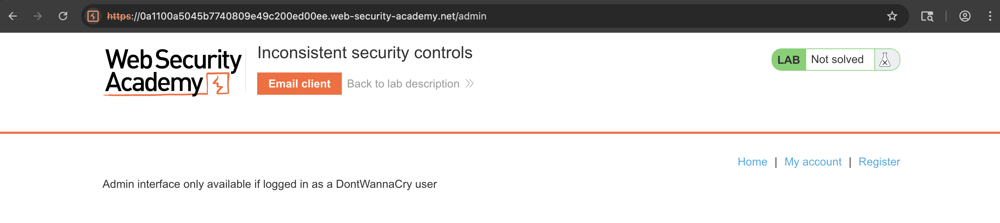
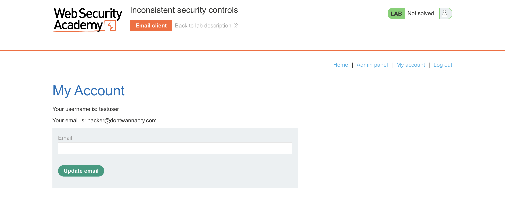
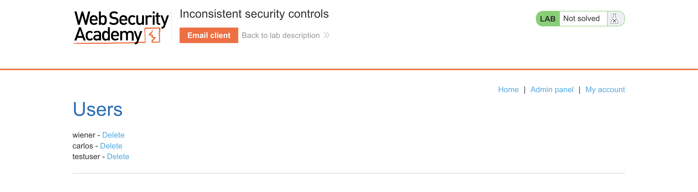
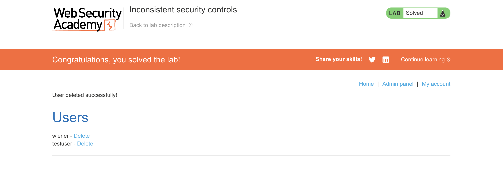

# WEB APPLICATION PENETRATION TEST REPORT: INCONSISTENT SECURITY CONTROLS

## 1. Document Control

| Detail | Value |
| :--- | :--- |
| **Report Date** | 13 April 2026 |
| **Report Version** | 1.0 |
| **Classification** | CONFIDENTIAL |
| **Prepared By** | Ramil V. Deocariza Jr. |

---

## 2. Executive Summary
This report details a High-severity logic flaw resulting in unauthorized Privilege Escalation. The application enforces strict email verification during the initial account registration phase but fails to apply the same verification controls when a user subsequently updates their email address within their profile. An attacker can exploit this inconsistency to spoof a corporate email domain, tricking the authorization engine into granting administrative privileges.

### 2.1 Overall Risk Rating
**Rating: HIGH**

### 2.2 Risk Summary
| Critical | High | Medium | Low | Info | Total Findings |
| :---: | :---: | :---: | :---: | :---: | :---: |
| 0 | 1 | 0 | 0 | 0 | 1 |

---

## 3. Detailed Findings

### VULN-001 — Privilege Escalation via Unverified Email Update

| Attribute | Detail |
| :--- | :--- |
| **Severity** | High |
| **Finding ID** | VULN-001 |
| **Affected Endpoint** | `POST /my-account/change-email` |
| **CWE** | CWE-863: Incorrect Authorization CWE-287: Improper Authentication |
| **CVSSv3 Score** | 8.8 (High) |
| **OWASP Category**| A01:2021 – Broken Access Control |
| **Status** | Open |

#### 3.1 Description
The application utilizes domain-based authorization to provision administrative access, automatically granting elevated rights to any user possessing a `@dontwannacry.com` email address. While the initial `/register` endpoint strictly mandates out-of-band email verification (via a sent link) to confirm domain ownership, the `/my-account/change-email` endpoint lacks this control. An attacker can register a standard account using a valid, attacker-controlled email address, complete the verification process, and then immediately update their profile to use a forged `@dontwannacry.com` address. The system accepts the update without secondary verification, resulting in an immediate bypass of the authorization boundaries.

#### 3.2 Proof of Concept (PoC)

**1. Identification**
Attempted to access the restricted `/admin` directory. The application disclosed its authorization logic via the error message: "Admin interface only available if logged in as a DontWannaCry user."

  
  
<i><b>Figure 1:</b> The application leaking its internal domain-based authorization requirement.</i>

**2. Payload Injection**
Registered a standard account using a verified public email. Post-authentication, utilized the profile management feature to alter the account's email to `hacker@dontwannacry.com`. The application accepted the unverified update.

  
  
<i><b>Figure 2:</b> Successfully spoofing the corporate domain via the vulnerable update mechanism.</i>

**3. Execution & Verification**
Navigated back to the `/admin` endpoint. The backend evaluated the newly injected `@dontwannacry.com` domain, dynamically updated the user's role, and rendered the administrative dashboard.

  
  
<i><b>Figure 3:</b> Unauthorized access to the administrative user management interface.</i>

**4. Confirmation**
Executed an administrative account deletion (removing user 'carlos') to definitively prove the severity of the privilege escalation.

  
  
<i><b>Figure 4:</b> Final confirmation of successful exploitation and task completion.</i>

#### 3.3 Business Impact
This vulnerability completely compromises the application's role-based access control (RBAC) architecture. Any external user can self-promote to an administrative role within minutes, granting them the ability to view sensitive corporate data, alter application configurations, and arbitrarily delete customer or employee accounts.

#### 3.4 Remediation
1. **Consistent Security Controls:** Security mechanisms must be applied uniformly across all endpoints handling sensitive state changes. The email update function must implement the exact same verification logic as the registration function.
2. **Re-Verification on Change:** Require users to click a secure, time-limited verification link sent to the *new* email address before the system officially updates the database record and applies any associated privilege changes.
3. **Decouple Roles from Email Domains:** Do not dynamically assign privileges based solely on string matching against an email domain. Administrative roles should be manually provisioned and managed via a dedicated identity provider (IdP) or strict backend database mapping.

#### 3.5 References
* **CWE-863:** https://cwe.mitre.org/data/definitions/863.html
* **OWASP Broken Access Control:** https://owasp.org/Top10/A01_2021-Broken_Access_Control/