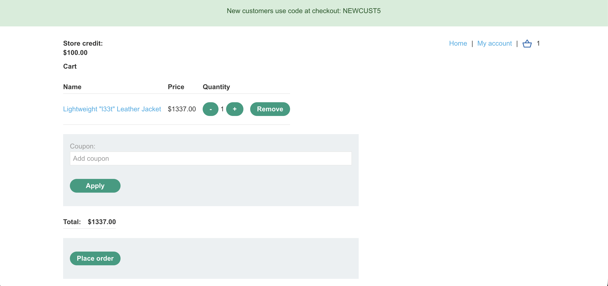
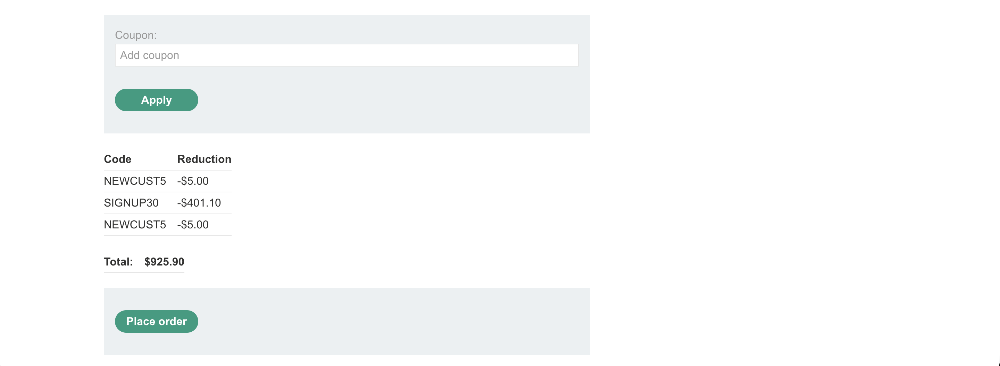
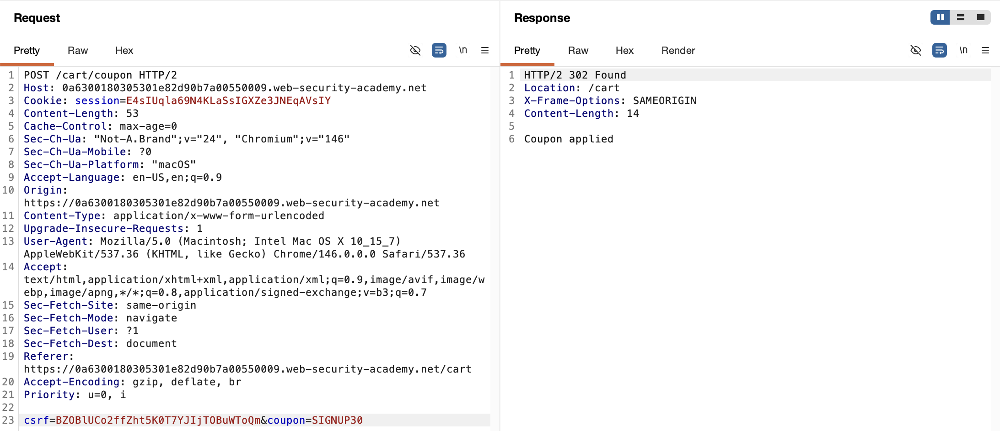
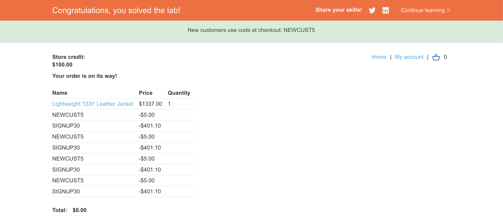

# WEB APPLICATION PENETRATION TEST REPORT: FLAWED BUSINESS RULE ENFORCEMENT

## 1. Document Control

| Detail | Value |
| :--- | :--- |
| **Report Date** | 13 April 2026 |
| **Report Version** | 1.0 |
| **Classification** | CONFIDENTIAL |
| **Prepared By** | Ramil V. Deocariza Jr. |

---

## 2. Executive Summary
This report details a High-severity business logic vulnerability within the application's promotional discount workflow. The application attempts to prevent the duplicate application of coupon codes but utilizes a flawed state-tracking mechanism. By alternating between two distinct coupon codes, an attacker can bypass the duplication check, stacking infinite discounts and purchasing high-value merchandise for zero or near-zero cost.

### 2.1 Overall Risk Rating
**Rating: HIGH**

### 2.2 Risk Summary
| Critical | High | Medium | Low | Info | Total Findings |
| :---: | :---: | :---: | :---: | :---: | :---: |
| 0 | 1 | 0 | 0 | 0 | 1 |

---

## 3. Detailed Findings

### VULN-001 — Arbitrary Discount Stacking via Flawed State Validation

| Attribute | Detail |
| :--- | :--- |
| **Severity** | High |
| **Finding ID** | VULN-001 |
| **Affected Endpoint** | `POST /cart/coupon` |
| **CWE** | CWE-840: Business Logic Errors CWE-384: Session Fixation (State Management Flaw) |
| **CVSSv3 Score** | 8.1 (High) |
| **OWASP Category**| A04:2021 – Insecure Design |
| **Status** | Open |

#### 3.1 Description
The e-commerce cart implements a rudimentary control to prevent users from reusing promotional codes. However, the backend validation logic only verifies if the *currently submitted* coupon matches the *most recently applied* coupon. It does not validate against a comprehensive array or database record of all coupons applied to the current session's cart. Therefore, if an attacker possesses two valid codes (e.g., `NEWCUST5` and `SIGNUP30`), they can alternate their submission. Applying the second code clears the "last applied" state of the first code, allowing the first code to be successfully submitted again. This logic loop can be repeated indefinitely.

#### 3.2 Proof of Concept (PoC)

**1. Identification**
Identified the coupon submission mechanism and collected two valid promotional codes issued by the application's front-end marketing features.

  
  
<i><b>Figure 1:</b> The initial cart state prior to coupon application.</i>

**2. Payload Injection**
Observed that applying the same code consecutively triggered a server-side rejection. However, submitting `NEWCUST5`, followed by `SIGNUP30`, and then `NEWCUST5` again successfully bypassed the rejection logic.

  
  
<i><b>Figure 2:</b> Successfully applying the same coupon multiple times by alternating codes.</i>

**3. Execution & Verification**
Repeated the alternating submission pattern to iteratively stack the percentage and flat-rate discounts until the total cost of the high-value item fell below the user's available store credit threshold.

  
  
<i><b>Figure 3:</b> The cart subtotal drastically reduced due to infinite coupon stacking.</i>

**4. Confirmation**
Finalized the checkout process. The server authorized the transaction based on the mathematically manipulated subtotal.

  
  
<i><b>Figure 4:</b> Successful purchase transaction using the stacked discounts.</i>

#### 3.3 Business Impact
This vulnerability allows malicious actors to systematically drain inventory at virtually no cost, resulting in direct and immediate financial loss to the organization. Additionally, automated exploitation of this endpoint could lead to significant revenue impact before anomaly detection systems flag the behavior.

#### 3.4 Remediation
1. **Holistic State Tracking:** The server must maintain a permanent array of all coupon codes applied to a specific cart or user session.
2. **Comprehensive Validation:** When a new coupon is submitted, the backend must check the submitted string against the *entire array* of previously applied coupons, not just the most recent entry.
3. **Business Rule Limitations:** Implement strict global business rules restricting the total number of promotional codes that can be applied to a single transaction (e.g., "Limit 1 coupon per order").

#### 3.5 References
* **CWE-840:** https://cwe.mitre.org/data/definitions/840.html
* **OWASP Business Logic Vulnerabilities:** https://owasp.org/www-community/vulnerabilities/Business_logic_vulnerability