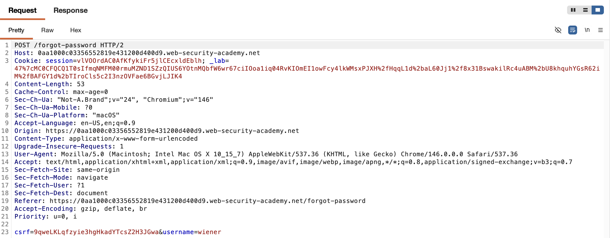
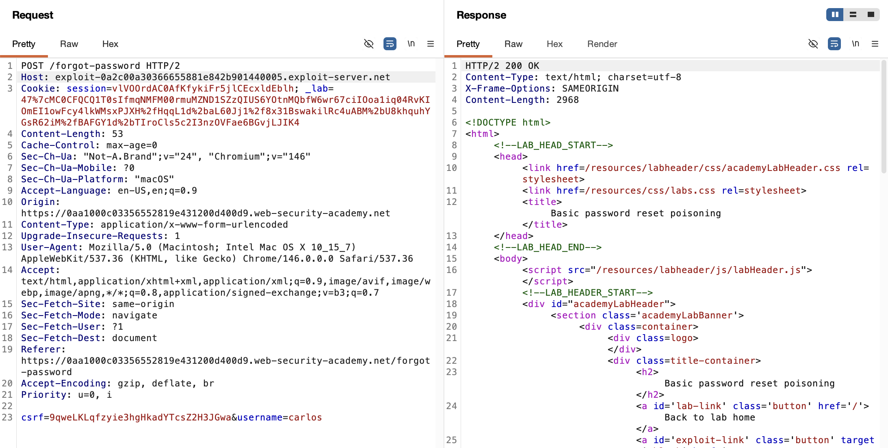
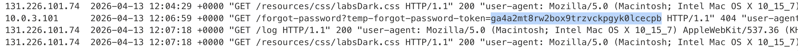
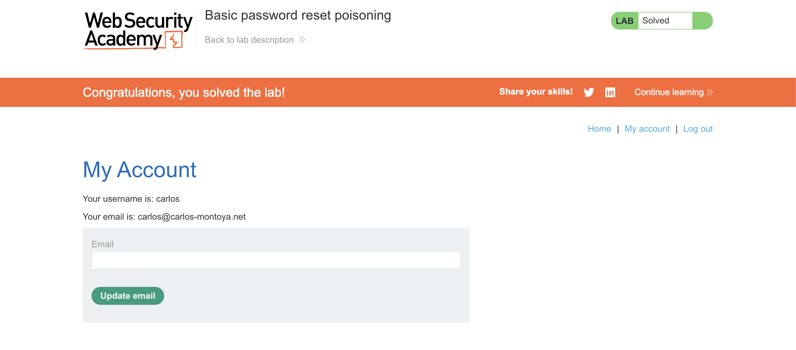

# WEB APPLICATION PENETRATION TEST REPORT: HOST HEADER INJECTION (PASSWORD RESET POISONING)

## 1. Document Control

| Detail | Value |
| :--- | :--- |
| **Report Date** | 27 March 2026 |
| **Report Version** | 1.0 |
| **Classification** | CONFIDENTIAL |
| **Prepared By** | Ramil V. Deocariza Jr. |

---

## 2. Executive Summary
This report details a Critical vulnerability involving HTTP Host Header Injection. The application dynamically generates password reset links by blindly trusting the client-supplied `Host` header. An attacker can manipulate this header to generate malicious reset links pointing to an external server. When the victim interacts with the link, their cryptographic reset token is leaked, leading to a complete Account Takeover (ATO).

### 2.1 Overall Risk Rating
**Rating: CRITICAL**

### 2.2 Risk Summary
| Critical | High | Medium | Low | Info | Total Findings |
| :---: | :---: | :---: | :---: | :---: | :---: |
| 1 | 0 | 0 | 0 | 0 | 1 |

---

## 3. Detailed Findings

### VULN-001 — Account Takeover via Password Reset Poisoning

| Attribute | Detail |
| :--- | :--- |
| **Severity** | Critical |
| **Finding ID** | VULN-001 |
| **Affected Endpoint** | `POST /forgot-password` |
| **CWE** | CWE-644: Improper Neutralization of HTTP Headers for Routing CWE-287: Improper Authentication |
| **CVSSv3 Score** | 9.8 (Critical) |
| **OWASP Category**| A07:2021 – Identification and Authentication Failures |
| **Status** | Open |

#### 3.1 Description
During the password reset workflow, the application generates an email containing a secure, time-limited cryptographic token. However, the domain name used to construct the URL within the email is dynamically extracted from the `Host` header of the incoming HTTP request. Because the `Host` header is entirely user-controllable, an attacker can intercept the password reset request for a victim's account and inject the domain of an attacker-controlled server. The victim receives a legitimate-looking email from the application, but the embedded link directs them to the attacker's server, appending the secret token in the URL query string.

#### 3.2 Proof of Concept (PoC)

**1. Identification**
Intercepted the legitimate `POST /forgot-password` request to analyze the reset mechanism.

  
  
<i><b>Figure 1:</b> The standard password reset request utilizing the default Host header.</i>

**2. Payload Injection**
Modified the request, explicitly targeting the victim user (`username=carlos`) and maliciously altering the `Host` header to point to an external exploit server.

  
  
<i><b>Figure 2:</b> Injecting the attacker-controlled domain into the Host header.</i>

**3. Execution & Verification**
Monitored the access logs of the exploit server. The victim clicked the poisoned link within the email, inadvertently transmitting their secure reset token to the attacker's infrastructure via an HTTP GET request.

  
  
<i><b>Figure 3:</b> The victim's cryptographic token successfully intercepted in the server access logs.</i>

**4. Confirmation**
Constructed the valid password reset URL using the application's true domain and the stolen token. Successfully reset the victim's password and assumed complete control of the account.

  
  
<i><b>Figure 4:</b> Final confirmation of successful Account Takeover (ATO).</i>

#### 3.3 Business Impact
This vulnerability guarantees a total compromise of user accounts with zero interaction required beyond the victim clicking a link in an email that genuinely originated from the application's trusted mail server. Attackers can hijack administrative accounts, access highly sensitive data, and pivot further into the platform's infrastructure.

#### 3.4 Remediation
1. **Absolute URLs from Configuration:** Do not rely on the client-supplied `Host` header to generate links, especially in security-critical workflows like password resets. The base URL for the application must be hardcoded securely in a server-side configuration file.
2. **Host Header Validation:** If dynamic host generation is absolutely necessary, the server must validate the incoming `Host` header against a strict whitelist of permitted domains before processing the request.

#### 3.5 References
* **CWE-644:** https://cwe.mitre.org/data/definitions/644.html
* **PortSwigger Host Header Attacks:** https://portswigger.net/web-security/host-header