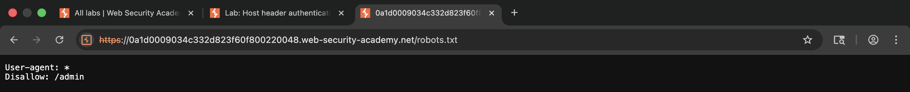
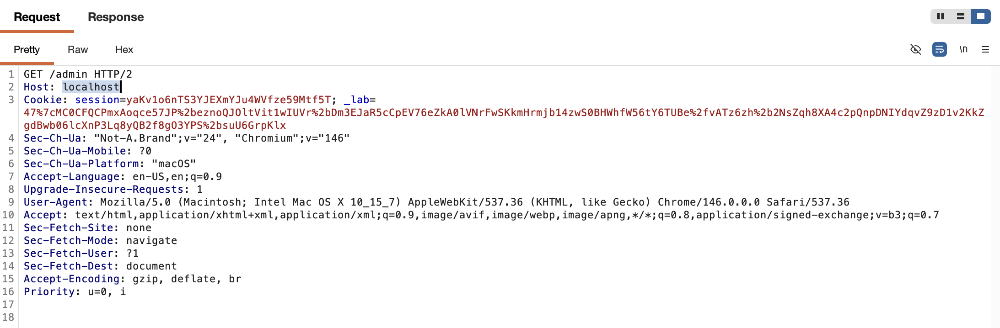
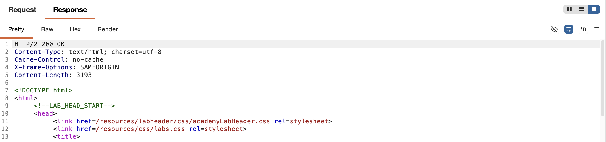
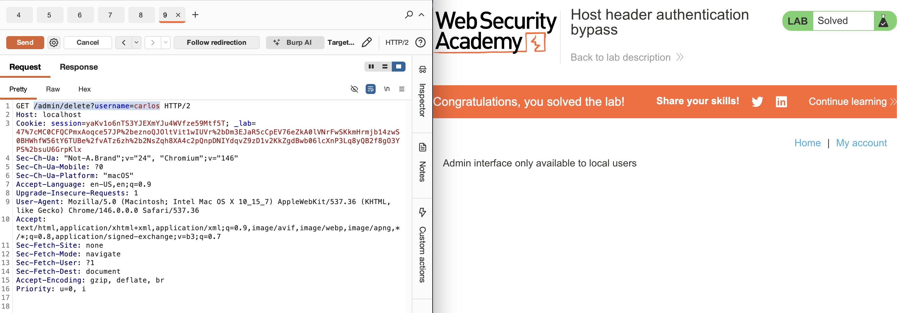

# WEB APPLICATION PENETRATION TEST REPORT: HOST HEADER INJECTION (AUTH BYPASS)

## 1. Document Control

| Detail | Value |
| :--- | :--- |
| **Report Date** | 27 March 2026 |
| **Report Version** | 1.0 |
| **Classification** | CONFIDENTIAL |
| **Prepared By** | Ramil V. Deocariza Jr. |

---

## 2. Executive Summary
This report details a High-severity vulnerability involving HTTP Host Header Injection resulting in a complete Authentication Bypass. The application utilizes the client-provided `Host` header to determine the request's origin and associated privilege level. By spoofing this header to simulate a local connection, an unauthenticated external attacker can bypass access controls and interact with the administrative dashboard.

### 2.1 Overall Risk Rating
**Rating: HIGH**

### 2.2 Risk Summary
| Critical | High | Medium | Low | Info | Total Findings |
| :---: | :---: | :---: | :---: | :---: | :---: |
| 0 | 1 | 0 | 0 | 0 | 1 |

---

## 3. Detailed Findings

### VULN-001 — Administrative Access Bypass via Host Header Spoofing

| Attribute | Detail |
| :--- | :--- |
| **Severity** | High |
| **Finding ID** | VULN-001 |
| **Affected Endpoint** | `GET /admin` |
| **CWE** | CWE-287: Improper Authentication CWE-644: Improper Neutralization of HTTP Headers for Routing |
| **CVSSv3 Score** | 8.6 (High) |
| **OWASP Category**| A01:2021 – Broken Access Control |
| **Status** | Open |

#### 3.1 Description
The application restricts access to the `/admin` interface, intending to expose it only to internal system administrators accessing the application locally. However, the backend server relies implicitly on the HTTP `Host` header to determine if a request originated locally. Because the `Host` header is easily manipulated by the client, an attacker can modify this header value to `localhost`. The authorization middleware evaluates the spoofed header, assumes the request is an internal administrative action, and grants full access to the restricted panel without requiring secondary authentication.

#### 3.2 Proof of Concept (PoC)

**1. Identification**
Discovered the `/admin` path via `robots.txt`. Attempted standard access and received a localized error message disclosing the internal access requirement: *"Admin interface only available to local users."*

  
  
<i><b>Figure 1:</b> Initial access denial leaking the authorization mechanism.</i>

**2. Payload Injection**
Intercepted the restricted `GET /admin` request using Burp Suite Repeater and modified the `Host` header to `localhost`.

  
  
<i><b>Figure 2:</b> Injecting the spoofed localhost value into the HTTP headers.</i>

**3. Execution & Verification**
Transmitted the tampered request. The application bypassed all authentication checks and returned the fully rendered administrative user management interface.

  
  
<i><b>Figure 3:</b> Successful unauthorized access to the restricted administrative panel.</i>

**4. Confirmation**
Executed an administrative account deletion (`GET /admin/delete?username=carlos`) using the spoofed header, proving the ability to execute high-privileged state-changing actions.

  
  
<i><b>Figure 4:</b> Final confirmation of successful exploitation and task completion.</i>

#### 3.3 Business Impact
This vulnerability completely compromises the application's access control architecture. Any external attacker can instantly elevate their privileges to a system administrator, allowing them to view sensitive data, modify configurations, or arbitrarily delete user accounts.

#### 3.4 Remediation
1. **Do Not Trust User Input for Authorization:** Never rely on the `Host` header, `X-Forwarded-For` header, or any other client-controllable input to make security or authorization decisions.
2. **Robust Access Control:** Implement strict, token-based or session-based authentication for all administrative endpoints, regardless of the perceived origin of the request.
3. **Network Zoning:** If the administrative panel is truly only meant for internal use, enforce this restriction at the network layer (e.g., via firewall rules or reverse proxy configurations that drop external requests to `/admin`) rather than relying on application-layer header checks.

#### 3.5 References
* **CWE-644:** https://cwe.mitre.org/data/definitions/644.html
* **OWASP Broken Access Control:** https://owasp.org/Top10/A01_2021-Broken_Access_Control/