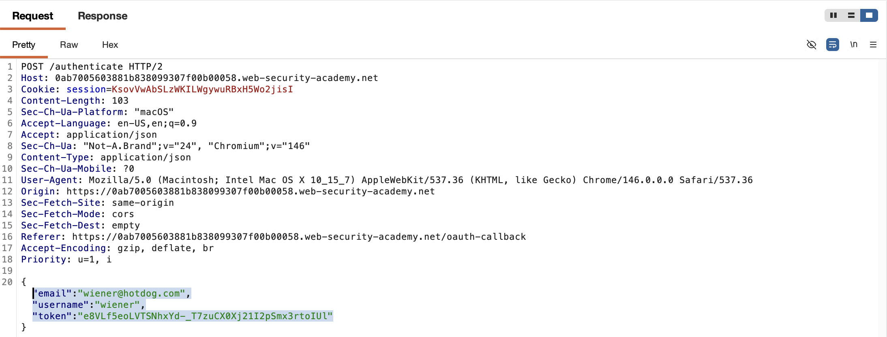
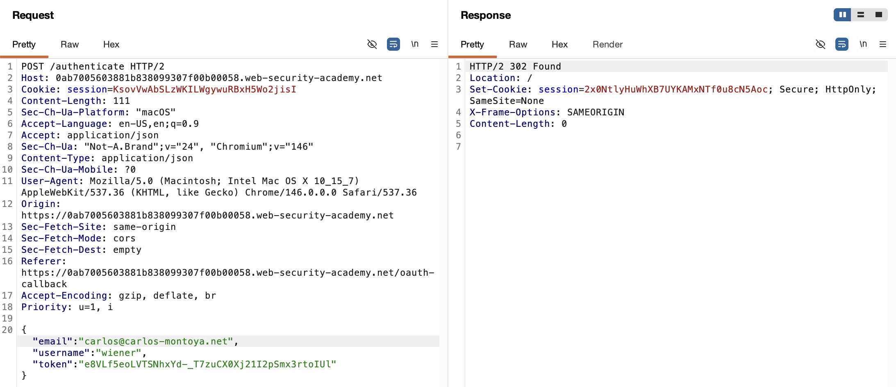

# WEB APPLICATION PENETRATION TEST REPORT: OAUTH IMPLICIT FLOW AUTH BYPASS

## 1. Document Control

| Detail | Value |
| :--- | :--- |
| **Report Date** | 28 March 2026 |
| **Report Version** | 1.0 |
| **Classification** | CONFIDENTIAL |
| **Prepared By** | Ramil V. Deocariza Jr. |

---

## 2. Executive Summary
This report details a Critical Authentication Bypass vulnerability resulting from the insecure implementation of the OAuth 2.0 Implicit Grant type. The application relies on client-submitted data to identify the authenticated user rather than cryptographically validating the OAuth token server-side. By intercepting and modifying the authentication payload, an attacker can trivially log in to any arbitrary user account without requiring their password or interacting with the OAuth provider.

### 2.1 Overall Risk Rating
**Rating: CRITICAL**

### 2.2 Risk Summary
| Critical | High | Medium | Low | Info | Total Findings |
| :---: | :---: | :---: | :---: | :---: | :---: |
| 1 | 0 | 0 | 0 | 0 | 1 |

---

## 3. Detailed Findings

### VULN-001 — Account Takeover via Insecure Client-Side Identity Assertion

| Attribute | Detail |
| :--- | :--- |
| **Severity** | Critical |
| **Finding ID** | VULN-001 |
| **Affected Endpoint** | `POST /authenticate` |
| **CWE** | CWE-287: Improper Authentication CWE-306: Missing Authentication for Critical Function |
| **CVSSv3 Score** | 9.8 (Critical) |
| **OWASP Category**| A07:2021 – Identification and Authentication Failures |
| **Status** | Open |

#### 3.1 Description
The application integrates a third-party OAuth service to facilitate Single Sign-On (SSO). Following a successful OAuth authentication phase, the client's browser issues a `POST /authenticate` request to the application's backend. This request contains a JSON payload including the user's `email`, `username`, and an OAuth `token`. However, the backend application completely fails to validate the `token` against the OAuth provider to ensure it genuinely matches the supplied `email`. Instead, the application blindly trusts the client-provided `email` address and issues a valid session cookie for that user. An attacker can authenticate using their own legitimate credentials, intercept the final `POST` request, alter the `email` parameter to match a target victim, and achieve immediate Account Takeover (ATO).

#### 3.2 Proof of Concept (PoC)

**1. Identification**
Completed the standard OAuth login flow using an attacker-controlled account. Intercepted the final `POST /authenticate` request transmitted from the client to the backend application server.

  
  
<i><b>Figure 1:</b> The original authentication payload containing the attacker's email and token.</i>

**2. Payload Injection**
Utilized Burp Suite Repeater to modify the JSON body, replacing the attacker's email address with the victim's email (`carlos@carlos-montoya.net`), while leaving the attacker's token intact.

  
  
<i><b>Figure 2:</b> Spoofing the identity parameter within the authentication payload.</i>

**3. Execution & Confirmation**
Transmitted the manipulated payload. The backend server accepted the mismatched data without validation and returned a new session cookie mapped to the victim's account. This session was subsequently applied to the browser.

  
  
<i><b>Figure 3:</b> Successful unauthorized access to the victim's account dashboard.</i>

#### 3.3 Business Impact
This vulnerability results in a complete compromise of the platform's authentication mechanism. Attackers can hijack any user account, including administrative accounts, simply by knowing the target's email address. This leads to immediate unauthorized access to sensitive PII, unauthorized financial transactions, and total loss of data confidentiality and integrity.

#### 3.4 Remediation
1. **Server-Side Token Validation:** The backend application must **never** trust user identity data (like an email address) sent directly from the client during an OAuth flow. 
2. **Use the /userinfo Endpoint:** Upon receiving an access token from the client, the backend server must make a secure, server-to-server request to the OAuth provider's `/userinfo` endpoint using that token. The email address returned directly by the OAuth provider is the *only* identity that should be used to log the user in.
3. **Transition to Authorization Code Flow:** Deprecate the use of the Implicit Grant type. Migrate the application to use the OAuth 2.0 Authorization Code Flow with PKCE, which is the modern industry standard for securely handling authentication in web applications.

#### 3.5 References
* **CWE-287:** https://cwe.mitre.org/data/definitions/287.html
* **OAuth 2.0 Security Best Current Practice:** https://datatracker.ietf.org/doc/html/draft-ietf-oauth-security-topics