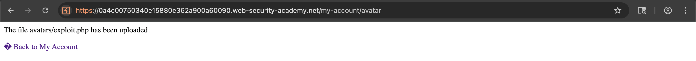
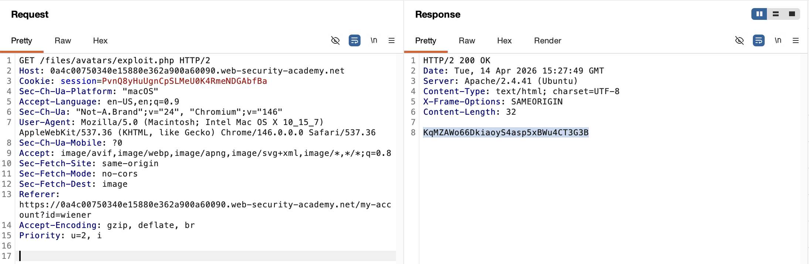
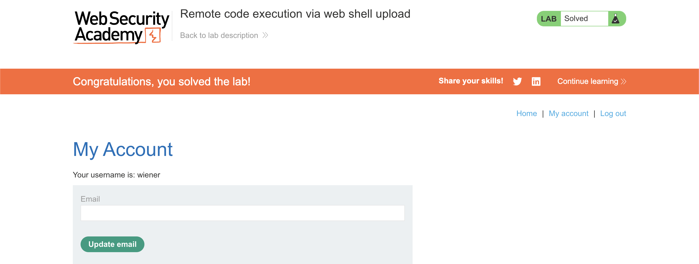

# WEB APPLICATION PENETRATION TEST REPORT: UNRESTRICTED FILE UPLOAD (RCE)

## 1. Document Control

| Detail | Value |
| :--- | :--- |
| **Report Date** | 28 March 2026 |
| **Report Version** | 1.0 |
| **Classification** | CONFIDENTIAL |
| **Prepared By** | Ramil V. Deocariza Jr. |

---

## 2. Executive Summary
This report details a Critical vulnerability allowing Unrestricted File Upload. The application's avatar upload functionality completely fails to validate file extensions or content types. This allows an attacker to upload a malicious PHP web shell directly to the web root. Accessing this uploaded file triggers server-side execution, leading to complete Remote Code Execution (RCE) and total compromise of the underlying host.

### 2.1 Overall Risk Rating
**Rating: CRITICAL**

### 2.2 Risk Summary
| Critical | High | Medium | Low | Info | Total Findings |
| :---: | :---: | :---: | :---: | :---: | :---: |
| 1 | 0 | 0 | 0 | 0 | 1 |

---

## 3. Detailed Findings

### VULN-001 — Remote Code Execution via Unrestricted Web Shell Upload

| Attribute | Detail |
| :--- | :--- |
| **Severity** | Critical |
| **Finding ID** | VULN-001 |
| **Affected Endpoint** | `POST /my-account/avatar` and `GET /files/avatars/` |
| **CWE** | CWE-434: Unrestricted Upload of File with Dangerous Type |
| **CVSSv3 Score** | 10.0 (Critical) |
| **OWASP Category**| A03:2021 – Injection |
| **Status** | Open |

#### 3.1 Description
The application permits authenticated users to upload avatar images to personalize their profiles. However, the server-side upload handler lacks any form of validation (e.g., extension whitelisting, MIME type checking, or magic byte verification). Furthermore, the uploaded files are stored directly within the web root (`/files/avatars/`) in a directory where the PHP execution engine is active. By uploading a file with a `.php` extension containing malicious code, an attacker can navigate to the file's URL to force the server to execute arbitrary OS commands or PHP functions. 

#### 3.2 Proof of Concept (PoC)

**1. Payload Generation & Upload**
Created a malicious PHP payload (`exploit.php`) designed to read sensitive local files:
```php
<?php echo file_get_contents('/home/carlos/secret'); ?>
```
Utilized the avatar upload form to submit the `.php` file. The server accepted the file without returning any validation errors.
<div align="center">
  
  <p><i><b>Figure 1:</b> The application explicitly confirming the successful upload of the PHP script.</i></p>
</div>

**2. Execution & Data Exfiltration**
Navigated directly to the uploaded file's path (`/files/avatars/exploit.php`). The backend PHP engine processed the file, executed the `file_get_contents` function, and returned the contents of the highly restricted `/home/carlos/secret` file in the HTTP response.
<div align="center">
  
  <p><i><b>Figure 2:</b> Intercepted HTTP response confirming successful code execution and data exfiltration.</i></p>
</div>

**3. Confirmation**
The extracted secret was successfully verified against the target criteria, confirming the severity of the read access.
<div align="center">
  
  <p><i><b>Figure 3:</b> Final confirmation of successful server compromise.</i></p>
</div>

#### 3.3 Business Impact
Remote Code Execution is the most severe vulnerability possible. An attacker can use this web shell to read any file on the server (including database passwords and source code), pivot to internal network infrastructure, install malware/ransomware, and completely take over the server operating system.

#### 3.4 Remediation
1. **Strict Extension Whitelisting:** Implement server-side validation to only accept safe image extensions (e.g., `.jpg`, `.png`, `.gif`).
2. **Disable Execution in Upload Folders:** Configure the web server (e.g., Apache, Nginx) to disable the execution of server-side scripts within the `/files/avatars/` directory.
3. **Store Files Outside the Web Root:** Uploaded files should ideally be stored in a directory completely inaccessible via direct HTTP requests, or securely streamed from an isolated cloud storage bucket (e.g., AWS S3).
4. **File Content Validation:** Verify the "magic bytes" (file signature) of the uploaded file and strip EXIF data to ensure the file is legitimately an image and does not contain hidden polyglot payloads.

#### 3.5 References
* **CWE-434:** https://cwe.mitre.org/data/definitions/434.html
* **OWASP File Upload Cheat Sheet:** https://cheatsheetseries.owasp.org/cheatsheets/File_Upload_Cheat_Sheet.html