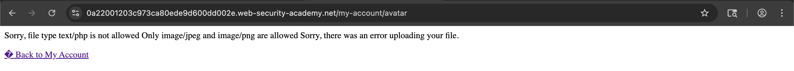
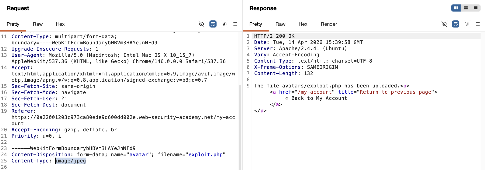
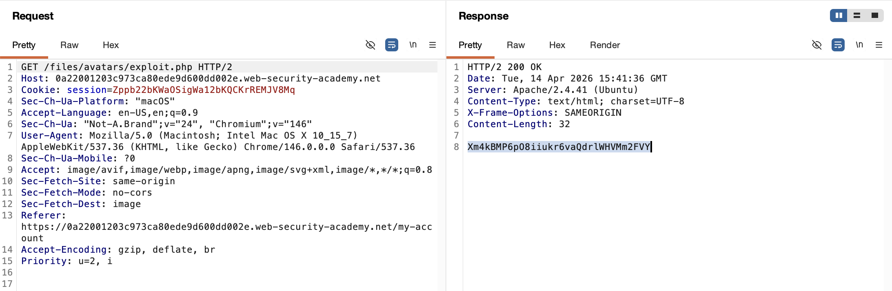
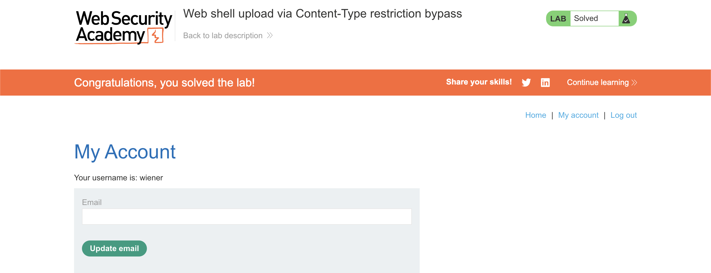

# WEB APPLICATION PENETRATION TEST REPORT: FILE UPLOAD CONTENT-TYPE BYPASS (RCE)

## 1. Document Control

| Detail | Value |
| :--- | :--- |
| **Report Date** | 14 April 2026 |
| **Report Version** | 1.0 |
| **Classification** | CONFIDENTIAL |
| **Prepared By** | Ramil V. Deocariza Jr. |

---

## 2. Executive Summary
This report details a Critical vulnerability allowing Unrestricted File Upload via a Security Control Bypass. The application attempts to restrict uploads to image files by validating the MIME type (Content-Type). However, it relies entirely on the client-supplied `Content-Type` header within the multipart form data. By intercepting the request and spoofing this header, an attacker can upload a malicious PHP web shell. Accessing the uploaded file results in Remote Code Execution (RCE) and full server compromise.

### 2.1 Overall Risk Rating
**Rating: CRITICAL**

### 2.2 Risk Summary
| Critical | High | Medium | Low | Info | Total Findings |
| :---: | :---: | :---: | :---: | :---: | :---: |
| 1 | 0 | 0 | 0 | 0 | 1 |

---

## 3. Detailed Findings

### VULN-001 — Remote Code Execution via Content-Type Validation Bypass

| Attribute | Detail |
| :--- | :--- |
| **Severity** | Critical |
| **Finding ID** | VULN-001 |
| **Affected Endpoint** | `POST /my-account/avatar` and `GET /files/avatars/` |
| **CWE** | CWE-434: Unrestricted Upload of File with Dangerous Type CWE-602: Client-Side Enforcement of Server-Side Security |
| **CVSSv3 Score** | 10.0 (Critical) |
| **OWASP Category**| A03:2021 – Injection |
| **Status** | Open |

#### 3.1 Description
The avatar upload functionality implements a weak defense mechanism to prevent malicious file uploads. The server evaluates the `Content-Type` header provided in the multipart form data boundary to determine if the uploaded file is a safe image type (`image/jpeg` or `image/png`). Because this value is generated by the client browser, it is implicitly untrusted and easily manipulated via an interception proxy. An attacker can upload a file with a `.php` extension but manually modify the multipart `Content-Type` attribute to `image/jpeg`. The server accepts the spoofed type, bypasses the filter, and stores the executable script in the web root.

#### 3.2 Proof of Concept (PoC)

**1. Identification**
Attempted to upload a standard PHP script (`exploit.php`). The server correctly rejected the file, leaking the validation criteria in the error message: "Sorry, only MIME type image/jpeg or image/png are allowed."

  
  
<i><b>Figure 1:</b> The application rejecting the upload based on MIME type.</i>

**2. Payload Injection**
Intercepted the blocked `POST` request using Burp Suite Repeater. Modified the `Content-Type` directive associated with the file payload from `application/x-php` to the whitelisted `image/jpeg`. The server processed the file as a valid image and completed the upload.

  
  
<i><b>Figure 2:</b> Spoofing the multipart Content-Type to bypass server-side validation.</i>

**3. Execution & Verification**
Navigated directly to the uploaded file (`/files/avatars/exploit.php`). Because the file extension remained `.php`, the backend server executed the script. The script successfully executed local OS file-read commands and returned the contents of `/home/carlos/secret`.

  
  
<i><b>Figure 3:</b> Successful server-side execution of the injected PHP payload.</i>

**4. Confirmation**
The extracted data was verified against the lab's success criteria.

  
  
<i><b>Figure 4:</b> Final confirmation of successful Server Compromise.</i>

#### 3.3 Business Impact
This vulnerability allows a complete bypass of intended security controls, directly resulting in Remote Code Execution (RCE). An attacker can read sensitive backend files, access databases, pivot into internal networks, and establish persistent backdoors on the infrastructure.

#### 3.4 Remediation
1. **Never Trust Client-Supplied Data:** Do not rely on the `Content-Type` header or file extensions provided by the client to determine the true nature of a file.
2. **Server-Side Content Verification:** Implement robust verification by inspecting the file's "magic bytes" (the first few bytes of the file content) to definitively identify its format using internal server libraries (e.g., PHP's `finfo` or `mime_content_type` functions).
3. **Disable Execution:** Ensure that directories designated for user uploads (e.g., `/files/avatars/`) have script execution explicitly disabled in the web server configuration (e.g., via `.htaccess` in Apache or location blocks in Nginx).

#### 3.5 References
* **CWE-434:** https://cwe.mitre.org/data/definitions/434.html
* **OWASP File Upload Cheat Sheet:** https://cheatsheetseries.owasp.org/cheatsheets/File_Upload_Cheat_Sheet.html