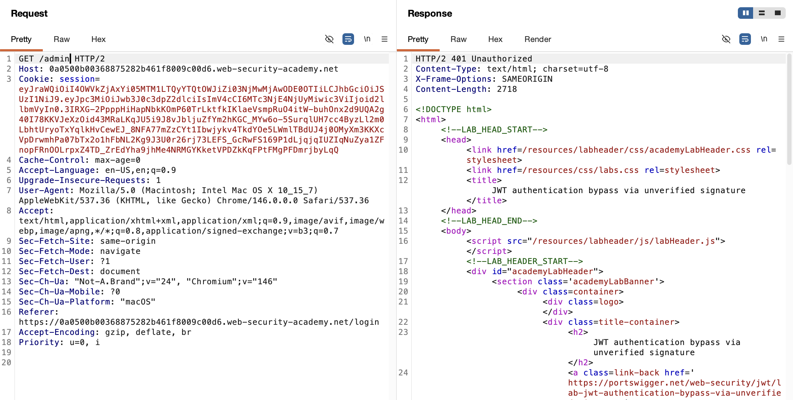
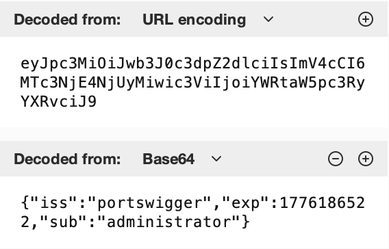
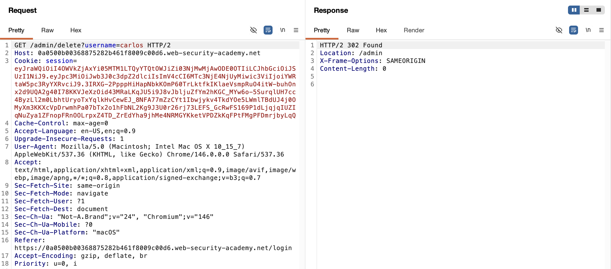
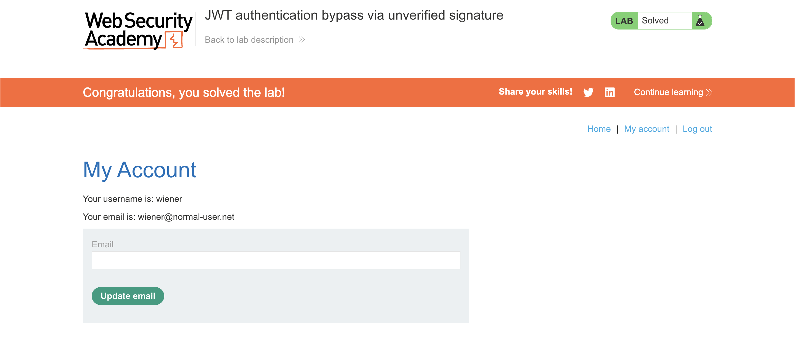

# WEB APPLICATION PENETRATION TEST REPORT: JWT AUTH BYPASS VIA UNVERIFIED SIGNATURE

## 1. Document Control

| Detail | Value |
| :--- | :--- |
| **Report Date** | 15 April 2026 |
| **Report Version** | 1.1 |
| **Classification** | CONFIDENTIAL |
| **Prepared By** | Ramil V. Deocariza Jr. |

---

## 2. Executive Summary
This report details a Critical vulnerability involving JSON Web Token (JWT) implementation. The backend application utilizes JWTs for session management but critically fails to verify the cryptographic signature attached to the tokens. This oversight allows an attacker to easily decode the token, alter the identity claims within the payload, and forge a valid administrative session, leading to complete Account Takeover (ATO) and Privilege Escalation.

### 2.1 Overall Risk Rating
**Rating: CRITICAL**

### 2.2 Risk Summary
| Critical | High | Medium | Low | Info | Total Findings |
| :---: | :---: | :---: | :---: | :---: | :---: |
| 1 | 0 | 0 | 0 | 0 | 1 |

---

## 3. Detailed Findings

### VULN-001 — Privilege Escalation via Unverified JWT Signature

| Attribute | Detail |
| :--- | :--- |
| **Severity** | Critical |
| **Finding ID** | VULN-001 |
| **Affected Endpoint** | `GET /admin` (Global Session Handling) |
| **CWE** | CWE-345: Insufficient Verification of Data Authenticity CWE-287: Improper Authentication |
| **CVSSv3 Score** | 9.8 (Critical) |
| **OWASP Category**| A02:2021 – Cryptographic Failures |
| **Status** | Open |

#### 3.1 Description
The application issues JSON Web Tokens (JWTs) upon successful user authentication and stores them within a `session` cookie. A standard JWT consists of three Base64URL-encoded parts: the Header, the Payload (containing user claims like username/role), and the Signature. The Signature's sole purpose is to ensure the Payload has not been tampered with. However, the backend server's JWT library is misconfigured; it parses the token and trusts the claims in the Payload without calculating and verifying the Signature against its secret key. Consequently, an attacker can modify the `sub` (subject) claim to reflect a highly privileged user, and the server will grant access based on this forged assertion.

#### 3.2 Proof of Concept (PoC)

**1. Identification & Baseline Restriction**
Captured an authenticated HTTP request and identified the use of JWTs for session management within the `session` cookie.

  
  
<i><b>Figure 1:</b> Locating the JSON Web Token in the standard user's session cookie.</i>

To establish a baseline, an attempt was made to access the restricted `/admin` directory using the standard, unmodified user token. The server correctly enforced access controls, returning a `401 Unauthorized` response.

  
  
<i><b>Figure 2:</b> The server returning a 401 Unauthorized response prior to exploitation.</i>

**2. Payload Injection**
Utilized Burp Suite's JWT Inspector to decode the payload. Modified the `sub` claim from the standard user `wiener` to the target user `administrator`. Re-encoded the token, leaving the original, now-invalid signature attached.

  
  
<i><b>Figure 3:</b> Forging the token payload to assert administrative identity.</i>

**3. Execution & Verification**
Transmitted the forged JWT to the previously restricted `/admin` endpoint. The server failed to validate the signature, blindly trusted the tampered payload, and successfully returned the administrative dashboard.

  
  
<i><b>Figure 4:</b> Successful unauthorized access to the restricted admin panel, bypassing the previous 401 error.</i>

**4. Confirmation**
Utilized the forged administrative session to execute a privileged state-changing action (account deletion).

  
  
<i><b>Figure 5:</b> Final confirmation of successful privilege escalation and target compromise.</i>

#### 3.3 Business Impact
This vulnerability completely compromises the application's authentication and authorization architecture. Any user (or unauthenticated attacker who can register an account) can arbitrarily escalate their privileges to a system administrator, granting them total control over the application, user data, and backend configurations.

#### 3.4 Remediation
1. **Enforce Signature Verification:** The backend JWT validation logic must be updated to explicitly require and verify the cryptographic signature on *every* incoming token before trusting any data within the payload.
2. **Use Strong Cryptography:** Ensure the token is signed using a strong algorithm (e.g., HMAC SHA-256 or RSA) and that the secret key used for signing is long, complex, and stored securely outside of the application's source code (e.g., in a secure environment variable or KMS).

#### 3.5 References
* **CWE-345:** https://cwe.mitre.org/data/definitions/345.html
* **JWT Security Best Practices:** https://datatracker.ietf.org/doc/html/rfc8725