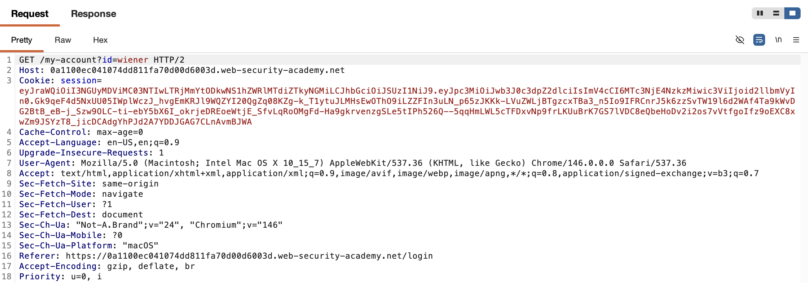
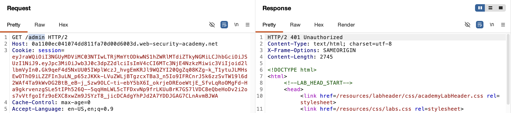
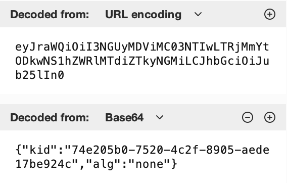
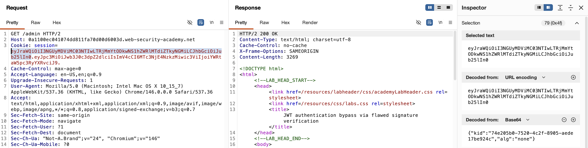
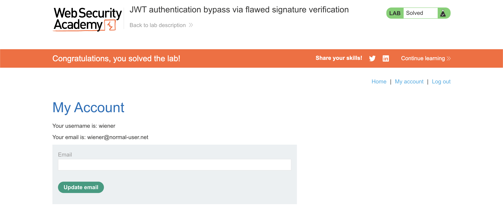

# WEB APPLICATION PENETRATION TEST REPORT: JWT AUTH BYPASS VIA FLAWED SIGNATURE VERIFICATION

## 1. Document Control

| Detail | Value |
| :--- | :--- |
| **Report Date** | 28 March 2026 |
| **Report Version** | 1.0 |
| **Classification** | CONFIDENTIAL |
| **Prepared By** | Ramil V. Deocariza Jr. |

---

## 2. Executive Summary
This report details a Critical vulnerability involving flawed JSON Web Token (JWT) signature verification. The application's backend JWT library insecurely supports the `none` algorithm. An attacker can manipulate their session token by modifying the identity payload, setting the algorithm header to `none`, and stripping the cryptographic signature. The server implicitly trusts this unsigned token, allowing for trivial Account Takeover (ATO) and Privilege Escalation.

### 2.1 Overall Risk Rating
**Rating: CRITICAL**

### 2.2 Risk Summary
| Critical | High | Medium | Low | Info | Total Findings |
| :---: | :---: | :---: | :---: | :---: | :---: |
| 1 | 0 | 0 | 0 | 0 | 1 |

---

## 3. Detailed Findings

### VULN-001 — Privilege Escalation via JWT `alg=none` Bypass

| Attribute | Detail |
| :--- | :--- |
| **Severity** | Critical |
| **Finding ID** | VULN-001 |
| **Affected Endpoint** | `GET /admin` (Global Session Handling) |
| **CWE** | CWE-327: Use of a Broken or Risky Cryptographic Algorithm CWE-347: Improper Verification of Cryptographic Signature |
| **CVSSv3 Score** | 9.8 (Critical) |
| **OWASP Category**| A02:2021 – Cryptographic Failures |
| **Status** | Open |

#### 3.1 Description
The application utilizes JWTs for session management. While the tokens are initially signed by the server, the backend verification logic dynamically relies on the `alg` (algorithm) parameter specified in the *client-provided* JWT Header to determine how to verify the signature. Crucially, the server library accepts the `none` algorithm, which instructs the parser to skip signature verification entirely. An attacker can decode their token, elevate their privileges within the payload, change the header to `{"alg": "none"}`, and remove the signature portion of the token (leaving only `Base64(Header).Base64(Payload).`). The server accepts this forged token as valid.

#### 3.2 Proof of Concept (PoC)

**1. Identification & Baseline Restriction**
Captured an authenticated HTTP request to extract the baseline JWT session cookie.

  
  
<i><b>Figure 1:</b> Locating the JSON Web Token in the standard user's session cookie.</i>

Attempted to access the restricted `/admin` directory using the unmodified token, which correctly resulted in an authorization failure.

  
  
<i><b>Figure 2:</b> The server returning a 401 Unauthorized response prior to exploitation.</i>

**2. Payload Injection**
Utilized Burp Suite to alter the JWT. Modified the `sub` payload claim to `administrator` and the `alg` header to `none`. Stripped the cryptographic signature from the raw string while retaining the requisite trailing delimiter (`.`).

  
  
<i><b>Figure 3:</b> Forging the token payload and exploiting the alg=none vulnerability.</i>

**3. Execution & Verification**
Transmitted the unsigned, forged JWT to the restricted `/admin` endpoint. The server processed the `none` algorithm, bypassed signature verification, and rendered the administrative dashboard.

  
  
<i><b>Figure 4:</b> Successful unauthorized access to the restricted admin panel.</i>

**4. Confirmation**
Utilized the forged administrative session to execute an account deletion action, proving total system compromise.

  
  
<i><b>Figure 5:</b> Final confirmation of successful privilege escalation.</i>

#### 3.3 Business Impact
This vulnerability completely subverts the application's authentication mechanisms. Because the backend explicitly trusts unsigned tokens if the `alg` header dictates it, any user can seamlessly forge administrative tokens. This leads to unauthorized data access, arbitrary modification of backend infrastructure, and complete Account Takeover.

#### 3.4 Remediation
1. **Explicit Algorithm Whitelisting:** The backend application must never rely on the `alg` header provided by the client to dictate the verification process. The server must be hardcoded to strictly require and verify a specific, secure algorithm (e.g., `RS256` or `HS256`).
2. **Reject `alg=none`:** Ensure the backend JWT library is updated or explicitly configured to reject any incoming tokens that specify `none` as the algorithm.
3. **Verify Signature Presence:** Enforce structural validation to ensure that all three parts of the JWT (`Header.Payload.Signature`) are present and non-empty before attempting to parse the claims.

#### 3.5 References
* **CWE-347:** https://cwe.mitre.org/data/definitions/347.html
* **Auth0: Critical vulnerabilities in JSON Web Token libraries:** https://auth0.com/blog/critical-vulnerabilities-in-json-web-token-libraries/