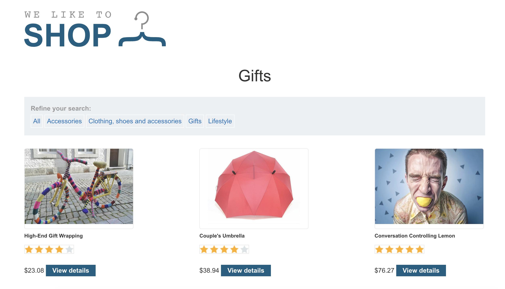
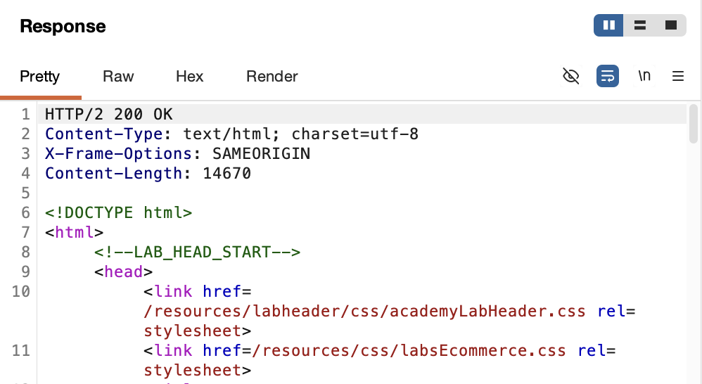
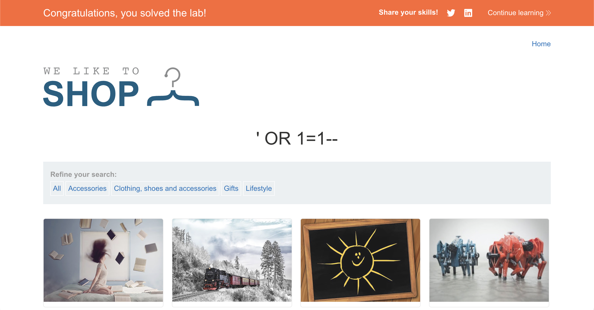

# WEB APPLICATION PENETRATION TEST REPORT: SQL INJECTION IN WHERE CLAUSE

## 1. Document Control

| Detail | Value |
| :--- | :--- |
| **Report Date** | 15 March 2026 |
| **Report Version** | 1.0 |
| **Classification** | CONFIDENTIAL |
| **Prepared By** | Ramil V. Deocariza Jr. |

---

## 2. Executive Summary
This report presents the findings of a web application penetration test performed against the PortSwigger Academy laboratory environment. The assessment identified a High-severity SQL injection vulnerability allowing the retrieval of hidden data.

### 2.1 Overall Risk Rating
**Rating: HIGH**

### 2.2 Risk Summary
| Critical | High | Medium | Low | Info | Total Findings |
| :---: | :---: | :---: | :---: | :---: | :---: |
| 0 | 1 | 0 | 0 | 0 | 1 |

---

## 3. Detailed Findings

### VULN-001 — SQL Injection in Product Category Filter

| Attribute | Detail |
| :--- | :--- |
| **Severity** | High |
| **Finding ID** | VULN-001 |
| **Affected URL** | `/filter?category=[parameter]` |
| **CWE** | CWE-89: Improper Neutralization of Special Elements used in an SQL Command |
| **CVSSv3 Score** | 7.5 (High) |
| **OWASP Category**| A03:2021 – Injection |
| **Status** | Open |

#### 3.1 Description
The application utilizes a product category filter that is vulnerable to SQL injection. The backend query is constructed using unsanitized user input: `SELECT * FROM products WHERE category = '[USER-INPUT]' AND released = 1`. By injecting special characters, an attacker can manipulate the `WHERE` clause to bypass the `released = 1` constraint and view hidden items.

#### 3.2 Proof of Concept (PoC)
**1. Identification**
Navigated to the product filter page and identified the `category` URL parameter.

  
  
<i><b>Figure 1:</b> Initial identification of the category filter parameter.</i>

**2. Proxy Interception**
Intercepted the `GET /filter?category=Gifts` request in Burp Suite to prepare for parameter manipulation.

  
  
<i><b>Figure 2:</b> Intercepting the category filter request.</i>

**3. Execution / Traversal**
Submitted the following payload in the `category` parameter to bypass the release constraint: `Gifts' OR 1=1--`.

  
  
<i><b>Figure 3:</b> Crafting the malicious SQLi payload in Burp Repeater.</i>

**4. Verification**
The response contained all products, including those not marked as released, confirming the injection.

  
  
<i><b>Figure 4:</b> Observing the modified server response containing hidden data.</i>

  
  
<i><b>Figure 5:</b> Final confirmation of lab completion.</i>

#### 3.3 Business Impact
Unauthorized access to unreleased products can lead to information disclosure, competitive disadvantage, and loss of intellectual property. An attacker could potentially escalate this to exfiltrate other sensitive tables.

#### 3.4 Remediation
Implement **parameterized queries** (prepared statements) to ensure user input is treated as data, not executable code. Apply strict input validation using an allow-list of known valid categories.

#### 3.5 References
* **CWE-89:** https://cwe.mitre.org/data/definitions/89.html
* **OWASP SQL Injection Prevention Cheat Sheet:** https://cheatsheetseries.owasp.org/cheatsheets/SQL_Injection_Prevention_Cheat_Sheet.html