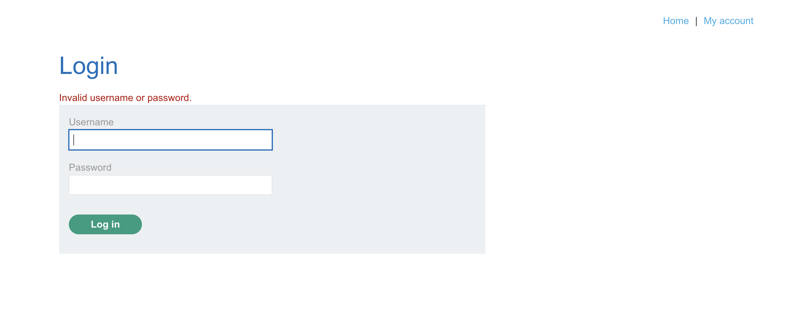
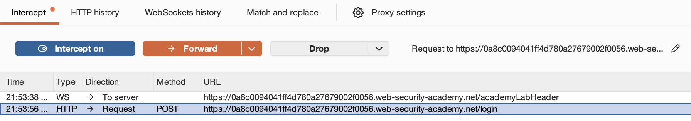
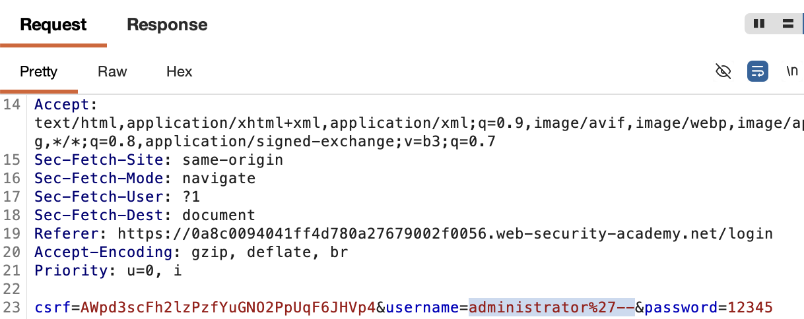
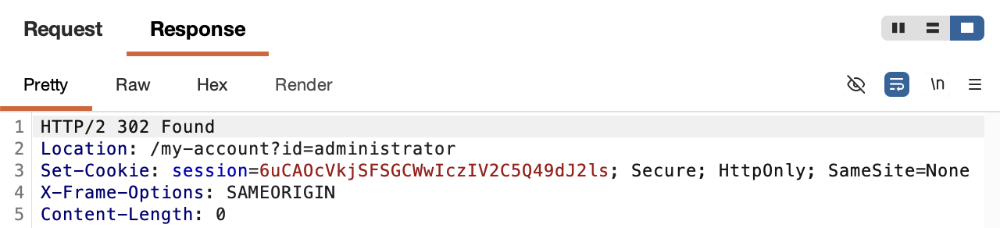

# 🛡️ Lab: SQL injection vulnerability allowing login bypass

> **Category:** `SQL Injection`  
> **Difficulty:** `Apprentice`  
> **Status:** `Completed` ✅

---

### 🎯 Objective
The goal of this lab is to bypass the authentication mechanism of the application and log in as the `administrator` user without knowing the password, utilizing a **SQL Injection** attack.

### 🛠️ Exploit Strategy
* **Vulnerability Point:** Login form username field (`username` parameter).
* **Payload Type:** Authentication Bypass.
* **Technical Logic:** The application query likely follows this structure:  
    `SELECT * FROM users WHERE username = 'USER' AND password = 'PASS'`  
    By injecting `administrator'--`, the query is truncated:  
    `SELECT * FROM users WHERE username = 'administrator'-- AND password = 'PASS'`  
    The database executes the search for the user `administrator` and ignores the password check entirely because of the comment operator (`--`).

---

### 📑 Technical Walkthrough

#### 1. Identification & Reconnaissance
I navigated to the login page and identified that the form submits a `POST` request to the `/login` endpoint. My target account was the `administrator`.

  
  
<i><b>Figure 1:</b> Locating the login interface and target username.</i>

#### 2. Interception and Analysis
Using **Burp Suite Proxy**, I intercepted a login attempt. I observed the `username` and `password` parameters being sent in the request body.

  
  
<i><b>Figure 2:</b> Intercepted POST login request in Burp Proxy.</i>

#### 3. Exploitation (Logic Bypassing)
I sent the request to **Burp Repeater**. I modified the username to `administrator'--` to comment out the password verification logic. I ensured the payload was correctly URL-encoded.

  
  
<i><b>Figure 3:</b> Crafting the login bypass payload in Repeater.</i>

#### 4. Server Response Analysis
The server responded with a `302 Found` status and a `Location` header pointing to the administrator's account page. A new session cookie was issued, indicating a successful bypass.

  
  
<i><b>Figure 4:</b> Successful redirect response and session cookie issuance.</i>

#### 5. Final Verification
After disabling interception, I refreshed the browser. I was successfully authenticated as the `administrator`, and the lab completion banner was displayed.

  
  
<i><b>Figure 5:</b> Dashboard view confirming administrative access.</i>

---

### 🧠 Key Takeaway
This lab demonstrates that authentication should never rely on insecurely constructed SQL queries. 

**Remediation:** The use of **Prepared Statements with Parameterized Queries** is the most effective defense. This ensures the username is treated strictly as a string literal and cannot alter the SQL command's logic.