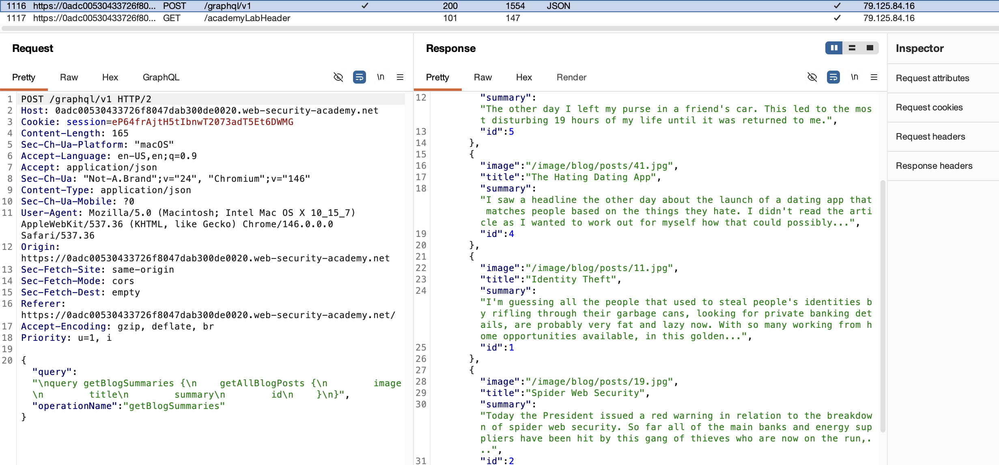
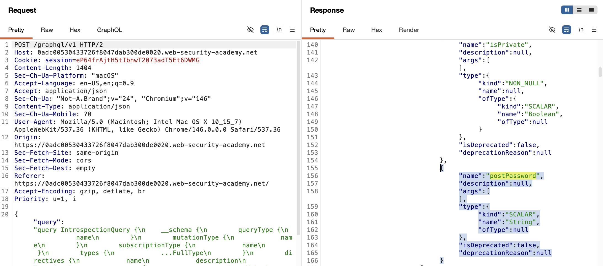
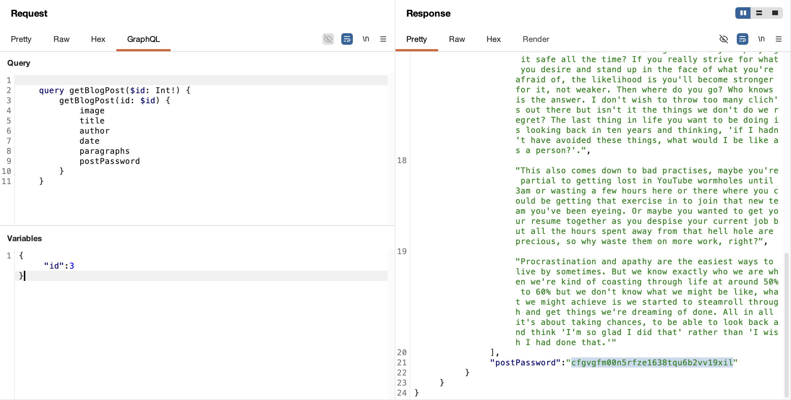
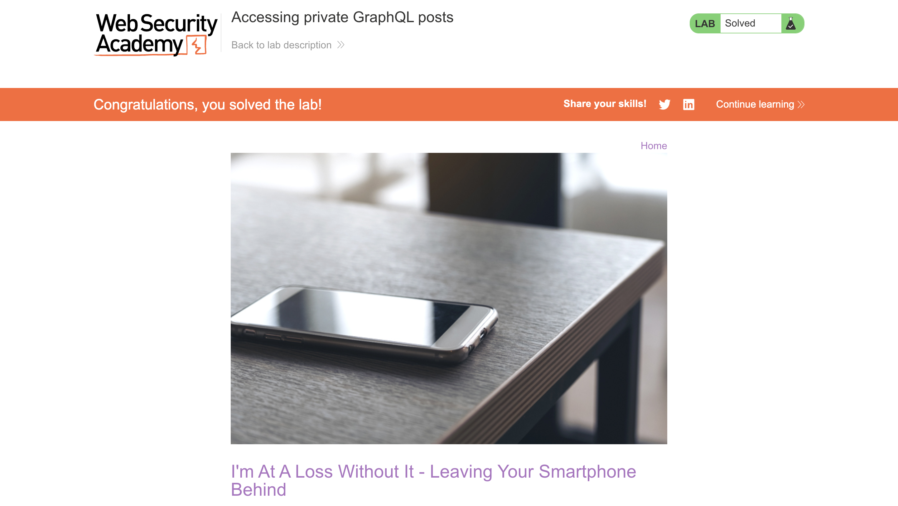

# WEB APPLICATION PENETRATION TEST REPORT: GRAPHQL INFORMATION DISCLOSURE

## 1. Document Control

| Detail | Value |
| :--- | :--- |
| **Report Date** | 30 March 2026 |
| **Report Version** | 1.0 |
| **Classification** | CONFIDENTIAL |
| **Prepared By** | Ramil V. Deocariza Jr. |

---

## 2. Executive Summary
This report details a High-severity vulnerability involving GraphQL Information Disclosure and Improper Access Control. The application's GraphQL endpoint exposes its entire schema via introspection and lacks field-level and object-level authorization. An attacker can map the API structure, identify undocumented sensitive fields, and extract hidden data—specifically, the password to an unpublished, restricted blog post.

### 2.1 Overall Risk Rating
**Rating: HIGH**

### 2.2 Risk Summary
| Critical | High | Medium | Low | Info | Total Findings |
| :---: | :---: | :---: | :---: | :---: | :---: |
| 0 | 1 | 0 | 0 | 0 | 1 |

---

## 3. Detailed Findings

### VULN-001 — Sensitive Information Disclosure via GraphQL Introspection and IDOR

| Attribute | Detail |
| :--- | :--- |
| **Severity** | High |
| **Finding ID** | VULN-001 |
| **Affected Endpoint** | `POST /graphql/v1` |
| **CWE** | CWE-200: Exposure of Sensitive Info CWE-285: Improper Authorization |
| **CVSSv3 Score** | 7.5 (High) |
| **OWASP Category**| A01:2021 – Broken Access Control |
| **Status** | Open |

#### 3.1 Description
The application utilizes a GraphQL API to retrieve blog content. Two significant security misconfigurations exist within this implementation. First, GraphQL Introspection is enabled in the production environment, allowing unauthenticated users to query the API schema and discover all types, queries, and fields, including a sensitive `postPassword` field. Second, the API resolvers lack object-level authorization (IDOR) and field-level access controls. By explicitly requesting the data for a non-public asset (`id: 3`) and specifying the `postPassword` field in the query, an attacker can force the server to return sensitive credentials.

#### 3.2 Proof of Concept (PoC)

**1. Identification**
Intercepted the initial `POST /graphql/v1` query used to populate the blog feed. Observed sequential IDs returned in the response array, noting the conspicuous absence of `id: 3`, indicating a hidden or unpublished post.

  
  
<i><b>Figure 1:</b> Identifying the gap in sequential object IDs within the GraphQL response.</i>

**2. Schema Introspection**
Executed a full GraphQL Introspection query (`__schema`) against the endpoint. The server successfully returned the API schema, revealing the undocumented `postPassword` field associated with the `BlogPost` object type.

  
  
<i><b>Figure 2:</b> Utilizing Introspection to discover sensitive API fields.</i>

**3. Execution & Data Exfiltration**
Constructed a targeted GraphQL query requesting the hidden post (`id: 3`) and appended the newly discovered `postPassword` field to the selection set. The server bypassed intended visibility controls and returned the secret payload.

  
  
<i><b>Figure 3:</b> Exploiting missing field-level authorization to extract the hidden password.</i>

**4. Confirmation**
The extracted password was verified against the lab's success criteria.

  
  
<i><b>Figure 4:</b> Final confirmation of successful data exfiltration.</i>

#### 3.3 Business Impact
Leaving GraphQL introspection enabled provides attackers with a complete blueprint of the application's data model. Combined with missing field-level authorization, this allows attackers to systematically scrape databases, extract user credentials, PII, and internal business secrets that were never intended to be exposed to the client-side application.

#### 3.4 Remediation
1. **Disable Introspection in Production:** Ensure that the GraphQL server configuration strictly disables introspection queries (`__schema`, `__type`) in production environments to prevent schema mapping.
2. **Implement Field-Level Authorization:** Authorization checks must be performed within the GraphQL resolvers, not just on the client side. Ensure that the server validates the user's session and permissions before returning sensitive fields like `postPassword`.
3. **Implement Object-Level Authorization:** Ensure that users cannot arbitrarily query object IDs (like `id: 3`) that do not belong to them or are marked as unpublished/private in the backend database.

#### 3.5 References
* **CWE-200:** https://cwe.mitre.org/data/definitions/200.html
* **GraphQL Security Best Practices:** https://graphql.org/learn/best-practices/