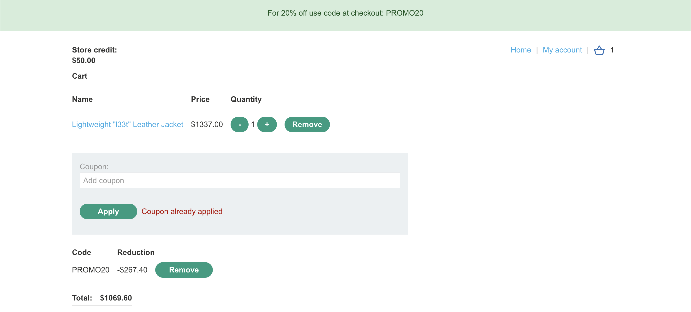
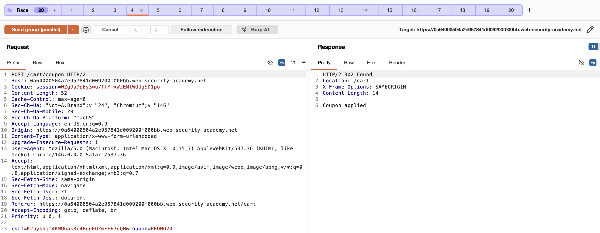
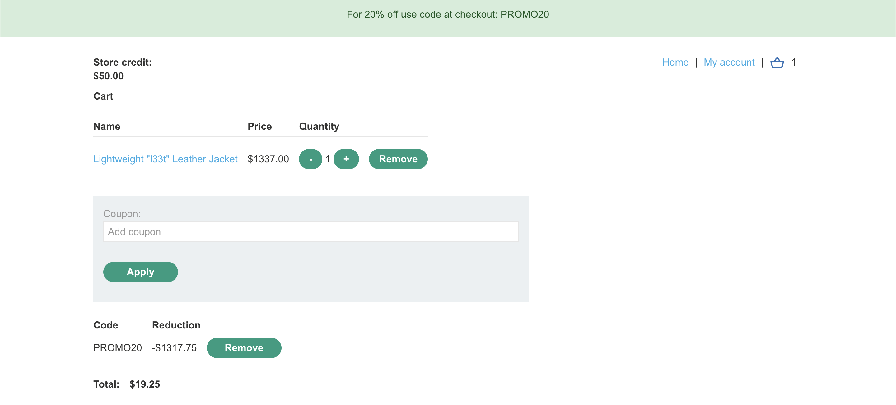
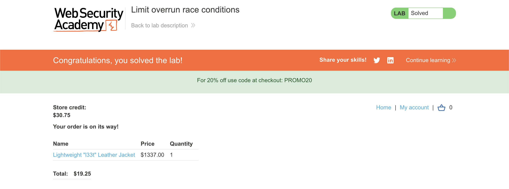

# WEB APPLICATION PENETRATION TEST REPORT: LIMIT OVERRUN RACE CONDITION

## 1. Document Control

| Detail | Value |
| :--- | :--- |
| **Report Date** | 1 April 2026 |
| **Report Version** | 1.0 |
| **Classification** | CONFIDENTIAL |
| **Prepared By** | Ramil V. Deocariza Jr. |

---

## 2. Executive Summary
This report details a High-severity vulnerability known as a Limit Overrun Race Condition (also referred to as a Time-of-Check to Time-of-Use or TOCTOU flaw). The application's promotional discount functionality fails to properly synchronize concurrent requests. By utilizing a Single-Packet Attack to send multiple coupon application requests simultaneously, an attacker can bypass the intended "one-per-order" business logic, stacking percentage-based discounts to purchase high-value merchandise for a fraction of its intended cost.

### 2.1 Overall Risk Rating
**Rating: HIGH**

### 2.2 Risk Summary
| Critical | High | Medium | Low | Info | Total Findings |
| :---: | :---: | :---: | :---: | :---: | :---: |
| 0 | 1 | 0 | 0 | 0 | 1 |

---

## 3. Detailed Findings

### VULN-001 — Arbitrary Discount Stacking via Limit Overrun Race Condition

| Attribute | Detail |
| :--- | :--- |
| **Severity** | High |
| **Finding ID** | VULN-001 |
| **Affected Endpoint** | `POST /cart/coupon` |
| **CWE** | CWE-362: Concurrent Execution using Shared Resource with Improper Synchronization CWE-367: Time-of-Check Time-of-Use (TOCTOU) Race Condition |
| **CVSSv3 Score** | 8.1 (High) |
| **OWASP Category**| A04:2021 – Insecure Design |
| **Status** | Open |

#### 3.1 Description
The application limits the application of promotional codes (e.g., `PROMO20`) to a single use per cart. However, the mechanism enforcing this rule suffers from a Time-of-Check to Time-of-Use (TOCTOU) vulnerability. When a user submits a coupon, the system first checks the database to see if it has been applied (Check), and then applies the discount and updates the database state (Use). Because these actions are not wrapped in an atomic database transaction or locked mutex, concurrent requests can all pass the "Check" phase simultaneously before any single thread reaches the "Use" phase to update the database. 

#### 3.2 Proof of Concept (PoC)

**1. Identification & Baseline Limitation**
Attempted to sequentially apply the `PROMO20` discount code twice. The application behaved as intended, blocking the second sequential request with a "Coupon already applied" error, establishing the intended business logic.

  
  
<i><b>Figure 1:</b> The intended business rule blocking sequential duplicate coupons.</i>

**2. Execution (Single-Packet Attack)**
Utilized Burp Suite Community Edition's parallel request grouping functionality. Copied the `POST /cart/coupon` payload into 20 identical Repeater tabs and fired them concurrently. By sending the requests in parallel over synchronized TCP connections, multiple threads processed the payload simultaneously.

  
  
<i><b>Figure 2:</b> Executing 20 simultaneous POST requests, resulting in multiple successful (302) applications.</i>

**3. Verification**
Navigated back to the shopping cart interface. The race condition successfully allowed the 20% discount to be applied numerous times, reducing the total cost of a high-value item from $1337.00 to an amount well below the available $100.00 store credit limit.

  
  
<i><b>Figure 3:</b> The shopping cart subtotal drastically reduced due to concurrent coupon stacking.</i>

**4. Confirmation**
Finalized the checkout process. The server authorized the transaction based on the artificially deflated cart subtotal.

  
  
<i><b>Figure 4:</b> Final confirmation of successful checkout utilizing the manipulated total.</i>

#### 3.3 Business Impact
This vulnerability allows malicious actors to systematically bypass financial controls, enabling them to drain inventory at near-zero cost. This results in direct and immediate financial loss, inventory depletion, and circumvention of all intended marketing promotion restrictions.

#### 3.4 Remediation
1. **Database Locking:** Implement pessimistic locking (e.g., `SELECT ... FOR UPDATE` in SQL) on the database row associated with the user's cart when processing a coupon. This forces subsequent requests to queue and wait until the first transaction is entirely complete.
2. **Atomic Operations:** Ensure the validation check and the state update occur within a single, atomic database transaction.
3. **Database Constraints:** Apply a unique constraint at the database level preventing duplicate coupon code entries associated with a single Cart ID. Even if the application logic races, the database layer will firmly reject the duplicate insertion.

#### 3.5 References
* **CWE-362 (Race Conditions):** https://cwe.mitre.org/data/definitions/362.html
* **PortSwigger Race Conditions:** https://portswigger.net/web-security/race-conditions