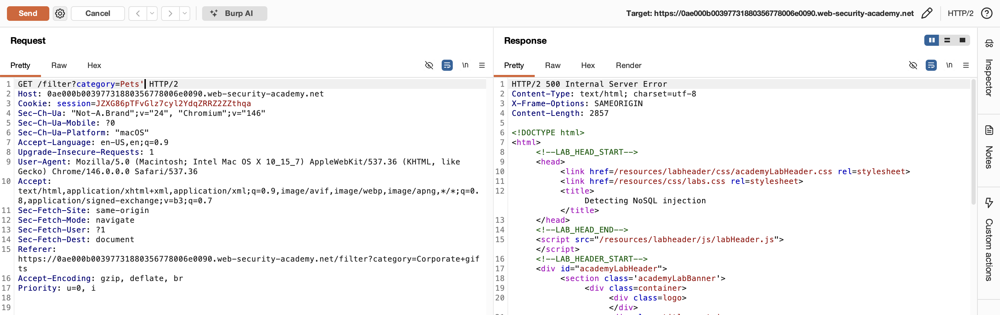
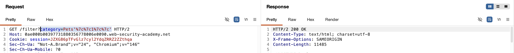
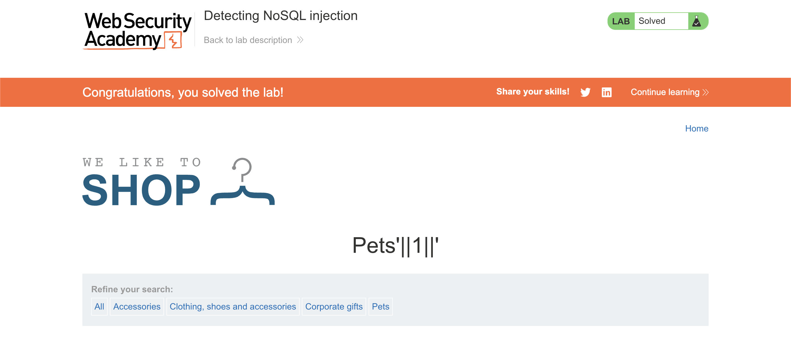

# WEB APPLICATION PENETRATION TEST REPORT: NOSQL INJECTION (MONGODB)

## 1. Document Control

| Detail | Value |
| :--- | :--- |
| **Report Date** | 1 April 2026 |
| **Report Version** | 1.1 |
| **Classification** | CONFIDENTIAL |
| **Prepared By** | Ramil V. Deocariza Jr. |

---

## 2. Executive Summary
This report details a High-severity NoSQL Injection vulnerability located within the application's product filtering mechanism. The backend MongoDB database insecurely concatenates user-supplied input directly into a JavaScript expression. An attacker can break the intended query syntax and inject arbitrary boolean logic. This allows for the circumvention of data visibility controls, leading to the unauthorized disclosure of restricted database entries (unreleased products).

### 2.1 Overall Risk Rating
**Rating: HIGH**

### 2.2 Risk Summary
| Critical | High | Medium | Low | Info | Total Findings |
| :---: | :---: | :---: | :---: | :---: | :---: |
| 0 | 1 | 0 | 0 | 0 | 1 |

---

## 3. Detailed Findings

### VULN-001 — Sensitive Information Disclosure via NoSQL Injection

| Attribute | Detail |
| :--- | :--- |
| **Severity** | High |
| **Finding ID** | VULN-001 |
| **Affected Endpoint** | `GET /filter?category=` |
| **CWE** | CWE-943: Improper Neutralization of Special Elements in Data Query Logic |
| **CVSSv3 Score** | 7.5 (High) |
| **OWASP Category**| A03:2021 – Injection |
| **Status** | Open |

#### 3.1 Description
The application features a category filter that interacts with a backend NoSQL database (MongoDB). The application dynamically constructs database queries by concatenating the user-supplied `category` parameter directly into a JavaScript function evaluated by the database (likely using the `$where` operator). Because the input is not sanitized, type-checked, or parameterized, an attacker can append JavaScript syntax characters (such as single quotes `'`) to break out of the string context and inject arbitrary logical operators (e.g., `&&`, `||`).

#### 3.2 Proof of Concept (PoC)

**1. Identification**
Injected a single quote (`'`) into the `category` URL parameter targeting the "Pets" category. The server returned a `500 Internal Server Error`, and the response explicitly leaked a JavaScript syntax error, confirming the presence of an injection vector.

  
  
<i><b>Figure 1:</b> The application leaking a backend JS syntax error due to the injected quote.</i>

**2. Boolean Testing**
Verified the vulnerability by injecting boolean logic. Sending `Pets' && 0 && 'x` (URL encoded) resulted in an empty product list, while `Pets' && 1 && 'x` correctly populated the category list, proving the attacker's ability to control the query's execution flow.

**3. Execution & Data Exfiltration**
Injected an "always true" logical bypass payload: `Pets'||1||'` (URL encoded as `Pets'%7c%7c1%7c%7c'`). Because `1` evaluates to true for every document evaluated by the database, the category filter was completely neutralized.

  
  
<i><b>Figure 2:</b> The injected payload executing within the Burp Suite Repeater tool.</i>

  
  
<i><b>Figure 3:</b> The application returning all database records, exposing unreleased merchandise.</i>

**4. Confirmation**
The presence of the restricted data was verified, completing the exploit scenario.

  
  
<i><b>Figure 4:</b> Final confirmation of successful NoSQL injection and data disclosure.</i>

#### 3.3 Business Impact
This vulnerability completely bypasses application-layer visibility controls. An attacker can extract any data stored within the targeted collection. Depending on the database schema and the context of the query, this technique could be leveraged to extract user credentials, financial records, or other highly sensitive intellectual property.

#### 3.4 Remediation
1. **Avoid JavaScript Evaluation:** Do not use the `$where` operator or perform JavaScript evaluation on the database server. These features severely degrade performance and introduce critical security risks.
2. **Use Idiomatic Operators:** Re-write the queries to use standard MongoDB query operators (e.g., `$eq`, `$gt`, `$in`) constructed using safe, parameterized API methods provided by the database driver.
3. **Input Validation and Type Checking:** Enforce strict server-side validation. Ensure that the `category` parameter only accepts expected string values and does not contain logical operators or query syntax characters.

#### 3.5 References
* **CWE-943:** https://cwe.mitre.org/data/definitions/943.html
* **OWASP NoSQL Injection:** https://owasp.org/www-pdf-archive/GOD16-NOSQL.pdf