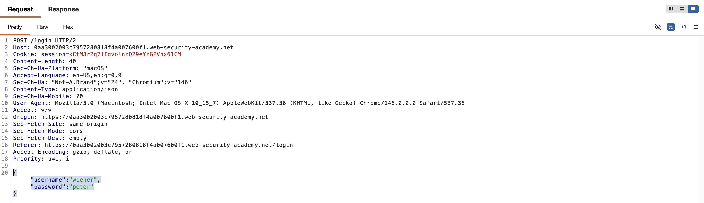
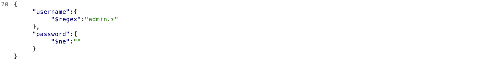
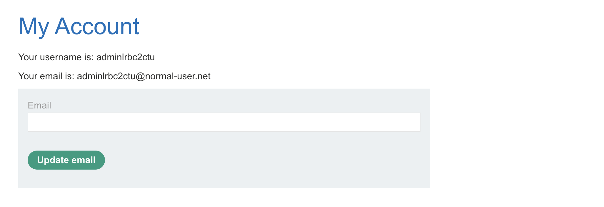
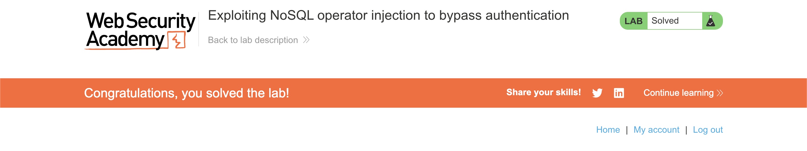

# WEB APPLICATION PENETRATION TEST REPORT: NOSQL OPERATOR INJECTION

## 1. Document Control

| Detail | Value |
| :--- | :--- |
| **Report Date** | 1 April 2026 |
| **Report Version** | 1.0 |
| **Classification** | CONFIDENTIAL |
| **Prepared By** | Ramil V. Deocariza Jr. |

---

## 2. Executive Summary
This report details a Critical vulnerability involving NoSQL Operator Injection within the application's authentication mechanism. The backend application accepts JSON input and insecurely passes these objects directly into a MongoDB query without type validation. An attacker can leverage MongoDB-specific query operators (such as `$ne` and `$regex`) to bypass credential verification entirely, resulting in unauthorized administrative Account Takeover (ATO).

### 2.1 Overall Risk Rating
**Rating: CRITICAL**

### 2.2 Risk Summary
| Critical | High | Medium | Low | Info | Total Findings |
| :---: | :---: | :---: | :---: | :---: | :---: |
| 1 | 0 | 0 | 0 | 0 | 1 |

---

## 3. Detailed Findings

### VULN-001 — Authentication Bypass via NoSQL Operator Injection

| Attribute | Detail |
| :--- | :--- |
| **Severity** | Critical |
| **Finding ID** | VULN-001 |
| **Affected Endpoint** | `POST /login` |
| **CWE** | CWE-943: Improper Neutralization of Special Elements in Data Query Logic CWE-287: Improper Authentication |
| **CVSSv3 Score** | 9.8 (Critical) |
| **OWASP Category**| A03:2021 – Injection |
| **Status** | Open |

#### 3.1 Description
The application utilizes a NoSQL database (MongoDB) for user authentication. The `/login` endpoint consumes user credentials formatted as a JSON object. However, the backend routing logic fails to validate that the provided `username` and `password` fields are strictly string primitives before utilizing them in a database query. Because MongoDB queries natively interpret JSON objects as operational directives, an attacker can submit a crafted JSON payload containing query operators (e.g., `$ne` for "not equal", `$regex` for "regular expression"). The database processes these operators dynamically, allowing the attacker to bypass the intended string-matching logic and authenticate without knowing the target's valid credentials.

#### 3.2 Proof of Concept (PoC)

**1. Identification**
Captured the standard `POST /login` request and identified that the application parses credentials via a JSON payload.

  
  
<i><b>Figure 1:</b> The baseline JSON authentication request.</i>

**2. Payload Injection**
Modified the JSON body within Burp Suite Repeater. The `username` string was replaced with a `$regex` operator targeting the administrative account, and the `password` string was replaced with a `$ne` operator evaluating to true for any non-empty password string.
Payload utilized: `{"username": {"$regex": "admin.*"}, "password": {"$ne": ""}}`

  
  
<i><b>Figure 2:</b> Injecting MongoDB operators directly into the credential fields.</i>

**3. Execution & Verification**
Transmitted the manipulated payload. The backend database evaluated the operators, successfully matched the administrative record, and authorized the session. The server returned a `302 Found` response containing a valid administrative session cookie, leading directly to the restricted account dashboard.

  
  
<i><b>Figure 3:</b> Unauthorized access to the administrative dashboard following the bypass.</i>

**4. Confirmation**
The exploit successfully satisfied the target criteria, confirming a total compromise of the authentication perimeter.

  
  
<i><b>Figure 4:</b> Final confirmation of successful privilege escalation and authentication bypass.</i>

#### 3.3 Business Impact
This vulnerability completely compromises the application's authentication boundary. Any unauthenticated attacker can log in as any user, including system administrators, without requiring password guessing or brute-force attacks. This leads to an immediate total loss of data confidentiality and system integrity.

#### 3.4 Remediation
1. **Strict Type Validation:** The backend application must strictly validate the data types of incoming JSON payloads before parsing them into database queries. Ensure that fields expected to be strings (like `username` and `password`) are strictly evaluated as string primitives (`typeof input === 'string'`).
2. **Data Sanitization:** Utilize libraries that cast incoming data to strings (e.g., `String(req.body.username)`) or sanitize input to strip out MongoDB operators (keys beginning with `$`) prior to query execution.
3. **Use Object Data Modeling (ODM):** Utilize robust ODM libraries like Mongoose (for Node.js) configured with strict schemas, which inherently prevent objects from being injected into fields defined as strings.

#### 3.5 References
* **CWE-943:** https://cwe.mitre.org/data/definitions/943.html
* **OWASP Testing for NoSQL Injection:** https://owasp.org/www-project-web-security-testing-guide/latest/4-Web_Application_Security_Testing/07-Input_Validation_Testing/05.6-Testing_for_NoSQL_Injection