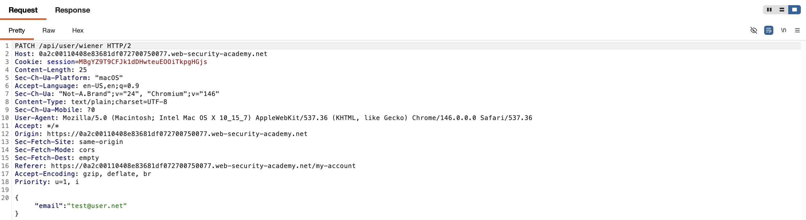
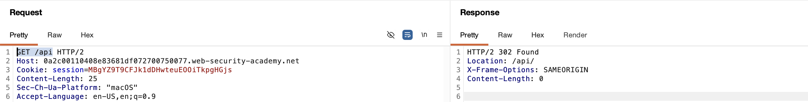
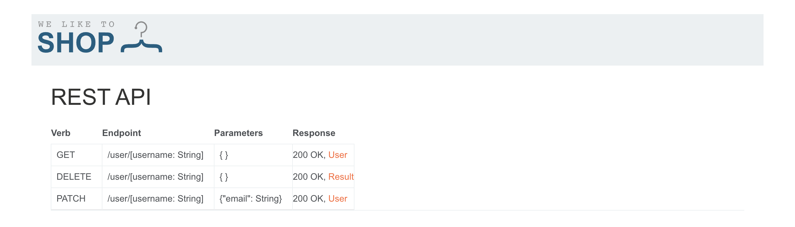
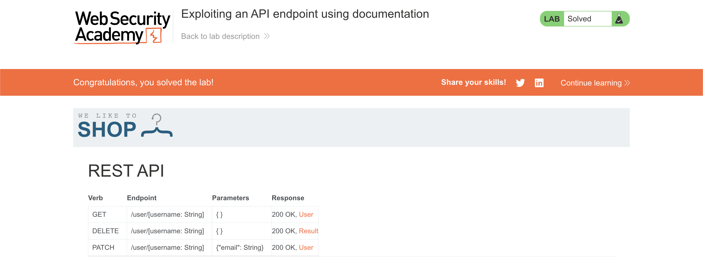

# WEB APPLICATION PENETRATION TEST REPORT: EXPOSED API DOCUMENTATION

## 1. Document Control

| Detail | Value |
| :--- | :--- |
| **Report Date** | 1 April 2026 |
| **Report Version** | 1.0 |
| **Classification** | CONFIDENTIAL |
| **Prepared By** | Ramil V. Deocariza Jr. |

---

## 2. Executive Summary
This report details a High-severity vulnerability involving Information Disclosure and Broken Access Control. The application hosts an interactive API documentation portal in its production environment without requiring administrative authentication. By discovering this endpoint, an attacker gains comprehensive knowledge of the API's structure and can utilize the interactive interface to execute unauthorized, privileged administrative actions, such as arbitrarily deleting user accounts.

### 2.1 Overall Risk Rating
**Rating: HIGH**

### 2.2 Risk Summary
| Critical | High | Medium | Low | Info | Total Findings |
| :---: | :---: | :---: | :---: | :---: | :---: |
| 0 | 1 | 0 | 0 | 0 | 1 |

---

## 3. Detailed Findings

### VULN-001 — Unauthenticated Access to Interactive API Documentation

| Attribute | Detail |
| :--- | :--- |
| **Severity** | High |
| **Finding ID** | VULN-001 |
| **Affected Endpoint** | `GET /api` |
| **CWE** | CWE-200: Exposure of Sensitive Information to an Unauthorized Actor CWE-749: Exposed Dangerous Method or Function |
| **CVSSv3 Score** | 8.5 (High) |
| **OWASP Category**| A01:2021 – Broken Access Control |
| **Status** | Open |

#### 3.1 Description
During dynamic analysis of the application's account management features, it was observed that the application communicates with a backend REST API located at `/api/user/`. By manually traversing the URL path backward (directory traversal/fuzzing) to the base `/api` endpoint, a fully interactive API documentation interface was discovered. This documentation interface maps the entire attack surface of the backend API, detailing expected parameters, methods, and responses. Furthermore, the endpoint lacks robust access controls, allowing standard users (or unauthenticated attackers) to issue requests to privileged administrative API routes directly through the documentation UI.

#### 3.2 Proof of Concept (PoC)

**1. Identification**
Intercepted a legitimate user action (email update) to identify the base structure of the backend API routing (`PATCH /api/user/wiener`).

  
  
<i><b>Figure 1:</b> Identifying the REST API endpoint structure during normal application usage.</i>

**2. Enumeration**
Performed path traversal on the API endpoint, issuing a `GET` request to the root `/api` directory. The server responded with the raw HTML/JS for an API documentation portal.

  
  
<i><b>Figure 2:</b> Discovering the exposed documentation endpoint via path manipulation.</i>

**3. Execution**
Loaded the exposed documentation portal in the browser. The interactive Swagger-style UI fully disclosed all available API methods, including sensitive administrative functions like `DELETE /user/{username}`.

  
  
<i><b>Figure 3:</b> The unauthenticated, interactive API documentation portal revealing administrative routes.</i>

**4. Confirmation**
Utilized the interactive UI to construct and execute a `DELETE` request targeting the user `carlos`. The API accepted the command without verifying the user's administrative authorization, successfully deleting the target account.

  
  
<i><b>Figure 4:</b> Final confirmation of successful privilege escalation and account deletion.</i>

#### 3.3 Business Impact
Exposing API documentation provides attackers with a complete blueprint of the application's backend architecture, significantly reducing the time and effort required to find and exploit other vulnerabilities. Combined with a lack of authorization on the API endpoints themselves, an attacker can arbitrarily modify or delete user data, leading to total data loss and system compromise.

#### 3.4 Remediation
1. **Disable Documentation in Production:** API documentation tools (like Swagger UI, ReDoc, etc.) should be strictly limited to development and staging environments. Ensure the build process removes or disables these routes before deploying to production.
2. **Implement API Authentication:** If documentation must be hosted in a live environment, it must be protected behind strict authentication and authorization controls, accessible only to verified administrators or developers.
3. **Enforce Endpoint Authorization:** Regardless of whether the documentation is hidden, the backend API endpoints (e.g., `DELETE /api/user/`) must independently verify the user's role and permissions before executing sensitive state-changing operations.

#### 3.5 References
* **CWE-200:** https://cwe.mitre.org/data/definitions/200.html
* **OWASP API Security Top 10 (API9:2023 - Improper Inventory Management):** https://owasp.org/API-Security/editions/2023/en/0x11-t9-improper-inventory-management/