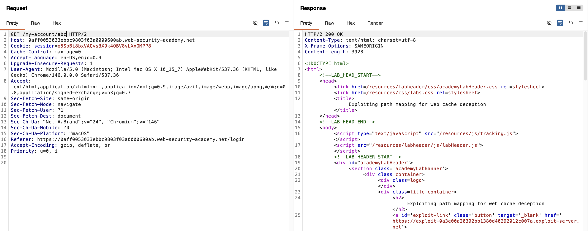
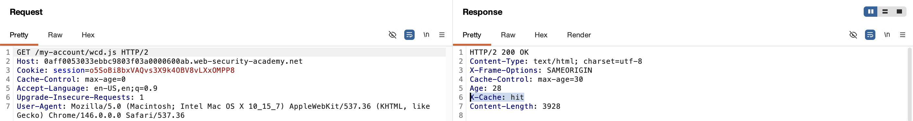
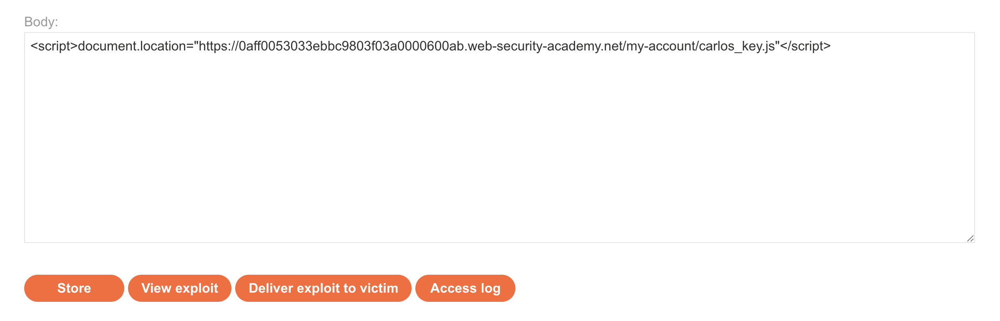
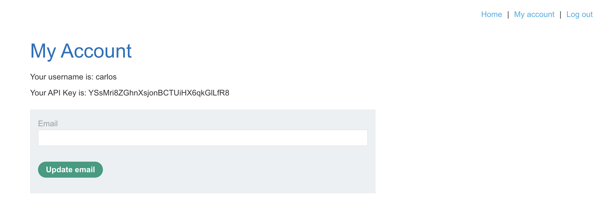

# WEB APPLICATION PENETRATION TEST REPORT: WEB CACHE DECEPTION

## 1. Document Control

| Detail | Value |
| :--- | :--- |
| **Report Date** | 1 April 2026 |
| **Report Version** | 1.1 |
| **Classification** | CONFIDENTIAL |
| **Prepared By** | Ramil V. Deocariza Jr. |

---

## 2. Executive Summary
This report details a High-severity vulnerability known as Web Cache Deception (WCD). The vulnerability arises from a configuration discrepancy between the frontend caching server (e.g., CDN/Reverse Proxy) and the backend origin server. By tricking an authenticated victim into navigating to a specifically crafted URL, an attacker can force the caching server to store the victim's highly sensitive, dynamically generated account page. The attacker can then retrieve this cached response to steal the victim's API key.

### 2.1 Overall Risk Rating
**Rating: HIGH**

### 2.2 Risk Summary
| Critical | High | Medium | Low | Info | Total Findings |
| :---: | :---: | :---: | :---: | :---: | :---: |
| 0 | 1 | 0 | 0 | 0 | 1 |

---

## 3. Detailed Findings

### VULN-001 — Sensitive Information Disclosure via Web Cache Deception

| Attribute | Detail |
| :--- | :--- |
| **Severity** | High |
| **Finding ID** | VULN-001 |
| **Affected Endpoint** | `GET /my-account` |
| **CWE** | CWE-524: Information Exposure Through Caching |
| **CVSSv3 Score** | 7.4 (High) |
| **OWASP Category**| A05:2021 – Security Misconfiguration |
| **Status** | Open |

#### 3.1 Description
The application suffers from a path mapping discrepancy. The backend origin server utilizes a forgiving routing mechanism (e.g., regex mapping) that abstracts paths; it serves the dynamic user profile page for `/my-account`, but also for any arbitrary appended path like `/my-account/arbitrary-string`. Conversely, the frontend caching layer is configured to aggressively cache responses based solely on static file extensions (e.g., `.js`, `.css`). 

When an attacker appends a static extension to the dynamic route (e.g., `/my-account/exploit.js`), the origin server processes it as a request for the dynamic account page. However, as the response passes back through the caching layer, the cache identifies the `.js` extension and stores the sensitive HTML response as if it were a public, static JavaScript file.

#### 3.2 Proof of Concept (PoC)

**1. Path Mapping Discrepancy Identification**
Intercepted a standard `GET /my-account` request. Appended an arbitrary segment to the path (`/my-account/abc`). The origin server ignored the appended segment and returned the dynamic profile page, confirming path abstraction.

  
  
<i><b>Figure 1:</b> The origin server resolving an arbitrary path to the dynamic account page.</i>

**2. Cache Rule Testing**
Appended a static extension to the path (`/my-account/wcd.js`). Issued the request twice sequentially. The first response returned `X-Cache: miss`. The subsequent response within the 30-second TTL returned `X-Cache: hit`, confirming that the caching layer was actively storing the dynamic page based on the spoofed extension.

  
  
<i><b>Figure 2:</b> Confirming the caching behavior via the X-Cache HTTP response header.</i>

**3. Execution & Exploit Delivery**
Utilized an exploit server to deliver a cross-site scripting (XSS) / JavaScript redirect payload to the victim: ``. When the victim's browser executed the redirect, their authenticated session requested the file, causing their sensitive profile data to be cached.

  
  
<i><b>Figure 3:</b> The malicious payload designed to force the victim to cache their own session data.</i>

**4. Confirmation & Data Exfiltration**
Navigated to the precise URL requested by the victim within the TTL window. The caching server returned a `HIT`, serving the victim's authenticated profile page to the attacker's unauthenticated browser, leaking their private API key.

  
  
<i><b>Figure 4:</b> Successful extraction of the victim's API key from the cached response.</i>

  
  
<i><b>Figure 5:</b> Final confirmation of successful exploitation and lab completion.</i>

#### 3.3 Business Impact
Web Cache Deception allows an unauthenticated attacker to passively harvest highly sensitive information from authenticated users. Depending on the contents of the cached page, this can lead to the exposure of API keys, session tokens, PII, financial data, and CSRF tokens, frequently resulting in complete Account Takeover (ATO).

#### 3.4 Remediation
1. **Cache Control Headers:** The origin server must explicitly instruct the caching layer not to cache sensitive dynamic content by setting strict HTTP headers: `Cache-Control: private, no-store, must-revalidate`.
2. **Path-Based Caching:** Configure the caching layer (CDN/Reverse Proxy) to cache static assets based on explicitly whitelisted directories (e.g., `/static/*`, `/assets/*`) rather than relying solely on file extensions.
3. **Strict Origin Routing:** Configure the backend framework to strictly validate URL paths. Requests to `/my-account/anything.js` should return a `404 Not Found` rather than defaulting to the `/my-account` route.

#### 3.5 References
* **CWE-524:** https://cwe.mitre.org/data/definitions/524.html
* **Web Cache Deception Attacks:** https://portswigger.net/web-security/web-cache-deception