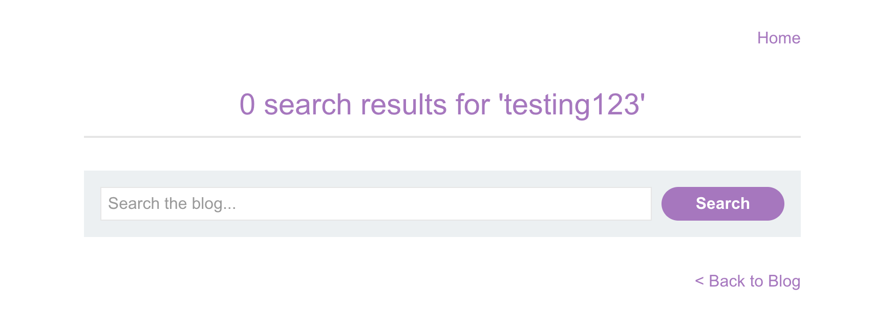
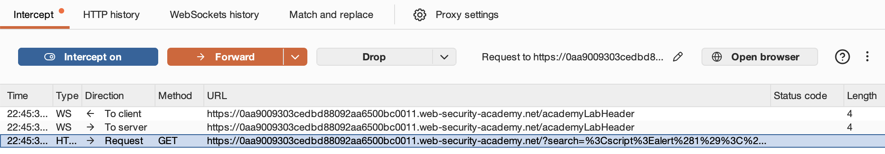
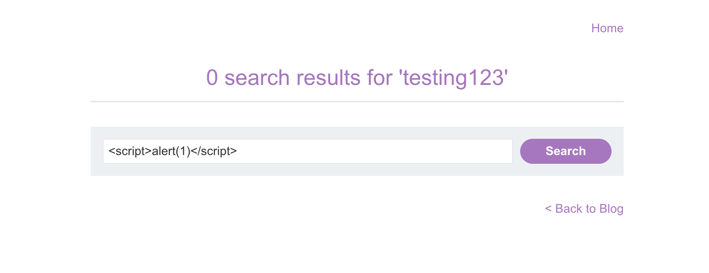
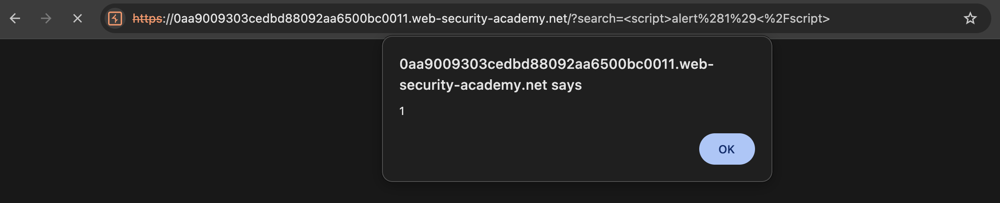

# WEB APPLICATION PENETRATION TEST REPORT: REFLECTED CROSS-SITE SCRIPTING

## 1. Document Control

| Detail | Value |
| :--- | :--- |
| **Report Date** | 15 March 2026 |
| **Report Version** | 1.0 |
| **Classification** | CONFIDENTIAL |
| **Prepared By** | Ramil V. Deocariza Jr. |

---

## 2. Executive Summary
This report details the discovery of a Reflected Cross-Site Scripting (XSS) vulnerability within the search functionality of the target application, allowing for arbitrary JavaScript execution in a victim's browser.

### 2.1 Overall Risk Rating
**Rating: MEDIUM**

### 2.2 Risk Summary
| Critical | High | Medium | Low | Info | Total Findings |
| :---: | :---: | :---: | :---: | :---: | :---: |
| 0 | 0 | 1 | 0 | 0 | 1 |

---

## 3. Detailed Findings

### VULN-001 — Reflected XSS via Search Parameter

| Attribute | Detail |
| :--- | :--- |
| **Severity** | Medium |
| **Finding ID** | VULN-001 |
| **Affected URL** | `/?search=[parameter]` |
| **CWE** | CWE-79: Improper Neutralization of Input During Web Page Generation |
| **CVSSv3 Score** | 6.1 (Medium) |
| **OWASP Category**| A03:2021 – Injection |
| **Status** | Open |

#### 3.1 Description
The application takes input from the `search` GET parameter and reflects it directly into the HTML body without output encoding. This allows an attacker to craft a malicious URL containing JavaScript that will execute in the browser of any user who clicks the link.

#### 3.2 Proof of Concept (PoC)
**1. Identification**
Tested the search feature with a standard string to observe reflection behavior.

  
  
<i><b>Figure 1:</b> Search string reflected in the HTML without sanitization.</i>

**2. Proxy Interception**
Intercepted the GET request to verify raw transmission.

  
  
<i><b>Figure 2:</b> Raw XSS payload in the GET request.</i>

**3. Exploitation & Verification**
Injected the payload ``. The browser interpreted the tags and executed the script.

  
  
<i><b>Figure 3:</b> Entering the XSS payload.</i>

  
  
<i><b>Figure 4:</b> Execution of the alert(1) popup.</i>

  
  
<i><b>Figure 5:</b> Lab completion confirmation.</i>

#### 3.3 Business Impact
Reflected XSS can be used to steal session cookies, perform actions on behalf of the user, or deface the application, requiring social engineering to deliver the malicious link.

#### 3.4 Remediation
Implement **Context-Aware Output Encoding** before rendering user-supplied data in the HTML document (e.g., convert `<` to `&lt;`).

#### 3.5 References
* **CWE-79:** https://cwe.mitre.org/data/definitions/79.html
* **OWASP XSS Prevention Cheat Sheet:** https://cheatsheetseries.owasp.org/cheatsheets/Cross_Site_Scripting_Prevention_Cheat_Sheet.html