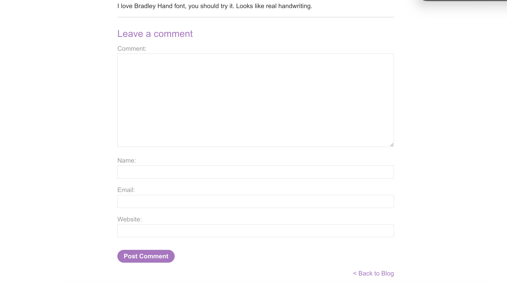
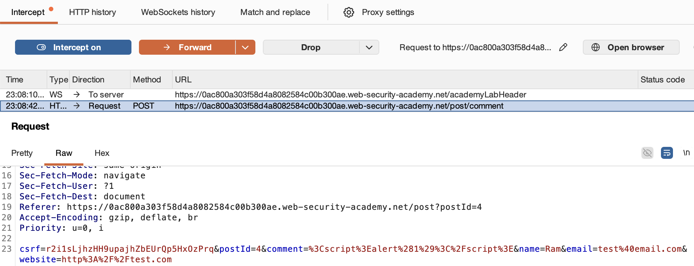
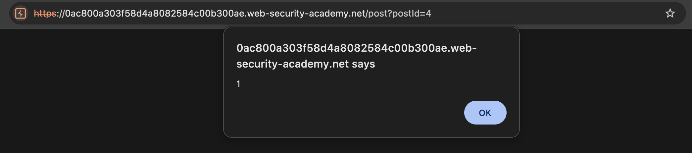

# 🛡️ Lab: Stored XSS into HTML context with nothing encoded

> **Category:** `Cross-site Scripting (XSS)`  
> **Difficulty:** `Apprentice`  
> **Status:** `Completed` ✅

---

### 🎯 Objective
The objective of this lab is to exploit a **Stored Cross-site Scripting (XSS)** vulnerability in the comment functionality of a blog. The goal is to submit a comment that executes the `alert()` function whenever a user views the blog post.

### 🛠️ Exploit Strategy
* **Vulnerability Point:** Comment submission form.
* **Payload Type:** Stored (Persistent) XSS.
* **Technical Logic:** Unlike Reflected XSS, the payload is stored in the application's database. When the blog post is loaded, the server retrieves the malicious script and embeds it in the HTML response. Because there is no output encoding, every user viewing the comments will trigger the script.

---

### 📑 Technical Walkthrough

#### 1. Identification & Reconnaissance
I navigated to a blog post and identified the comment section. This area allows users to submit text that is persistently displayed to other visitors, making it a prime target for Stored XSS.

  
  
<i><b>Figure 1:</b> The blog comment form identified as the injection point.</i>

#### 2. Interception and Analysis
Using **Burp Suite Proxy**, I intercepted the `POST /post/comment` request. I analyzed the parameters (`comment`, `name`, `email`) to ensure the payload would be sent correctly in the body of the request.

  
  
<i><b>Figure 2:</b> Intercepted POST request showing the comment submission parameters.</i>

#### 3. Exploitation (Payload Delivery)
I entered the payload `` into the comment box, filled out the required metadata (name, email, website), and submitted the form. This action saved the script into the application's database.

  
  
<i><b>Figure 3:</b> Submitting the malicious script via the comment functionality.</i>

#### 4. Execution & Verification
I navigated back to the blog post. Upon loading the page, the browser retrieved the stored comment and executed the JavaScript within the `<script>` tags, triggering the alert box.

  
  
<i><b>Figure 4:</b> The browser executing the stored script upon viewing the blog post.</i>

#### 5. Final Confirmation
The successful execution of the stored script confirmed the vulnerability. The "Congratulations" banner appeared, indicating the lab was solved.

  
  
<i><b>Figure 5:</b> Final confirmation of the successful Stored XSS exploit.</i>

---

### 🧠 Key Takeaway
**Stored XSS** is high-impact because it does not require the attacker to trick a user into clicking a link; the victim only needs to visit a legitimate page where the payload is stored.

**Remediation:** The application should use **Context-Aware Output Encoding** when displaying comments and ideally implement a **Content Security Policy (CSP)** to restrict the execution of unauthorized inline scripts.

---