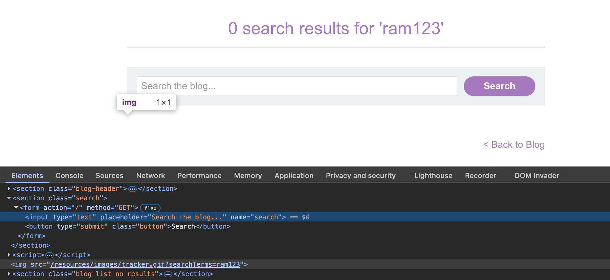
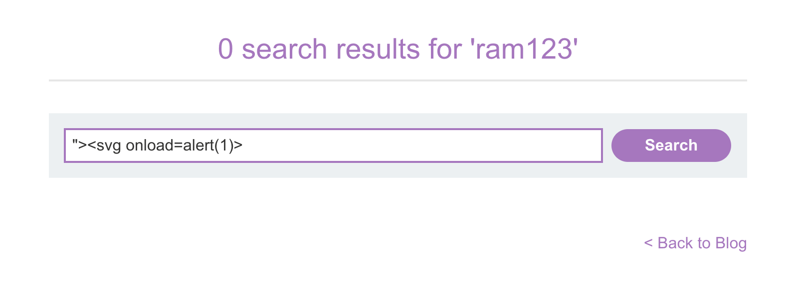
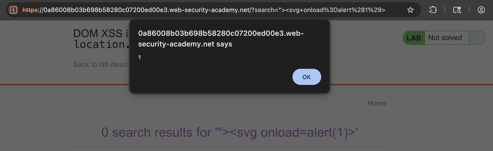

# 🛡️ Lab: DOM XSS in document.write sink using source location.search

> **Category:** `Cross-site Scripting (XSS)`  
> **Difficulty:** `Apprentice`  
> **Status:** `Completed` ✅

---

### 🎯 Objective
The objective of this lab is to exploit a **DOM-based Cross-site Scripting (DOM XSS)** vulnerability. The application uses a `document.write` sink to output data from `location.search` without proper sanitization, allowing for an attribute escape and script injection.

### 🛠️ Exploit Strategy
* **Source:** `location.search` (the query string in the URL).
* **Sink:** `document.write()`.
* **Vulnerability Point:** The search tracking functionality.
* **Payload:** `"><svg onload=alert(1)>`
* **Technical Logic:** The script on the page takes the search term and writes it into an `` tag: 
    `document.write('');`
    By starting the payload with `">`, I close the `src` attribute and the `` tag itself, allowing the subsequent `<svg>` tag to be rendered and executed by the browser.

---

### 📑 Technical Walkthrough

#### 1. Identification & Reconnaissance
I searched for a random alphanumeric string and inspected the DOM. I discovered that the input was being reflected inside the `src` attribute of an `` element used for tracking.

  
  
<i><b>Figure 1:</b> Inspecting the DOM to see the input reflected in an img attribute.</i>

#### 2. Exploitation (Breaking the Attribute)
I crafted a payload to break out of the `` tag context. By entering `"><svg onload=alert(1)>`, I force the browser to finish the image tag prematurely and begin parsing a new SVG element.

  
  
<i><b>Figure 3:</b> Entering the breakout payload into the search bar.</i>

#### 3. Execution & Verification
The browser processed the injected HTML. Since the SVG element's `onload` event is triggered automatically, the JavaScript executed and displayed the alert box.

  
  
<i><b>Figure 4:</b> The browser executing the injected SVG script.</i>

#### 4. Final Confirmation
The execution of the script satisfied the lab requirements, and the PortSwigger banner confirmed the successful exploit.

  
  
<i><b>Figure 5:</b> Final confirmation of the DOM XSS solution.</i>

---

### 🧠 Key Takeaway
**DOM-based XSS** occurs entirely within the client-side code. The server may never even "see" the malicious payload if it's handled strictly via JavaScript. 

**Remediation:** Avoid using dangerous sinks like `document.write()`. Instead, use safer alternatives like `textContent` which treat input as plain text, or use modern web frameworks that automatically handle output encoding.

---