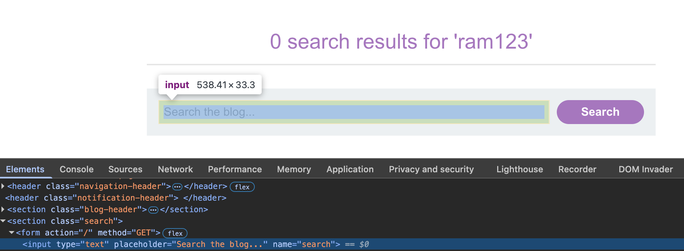
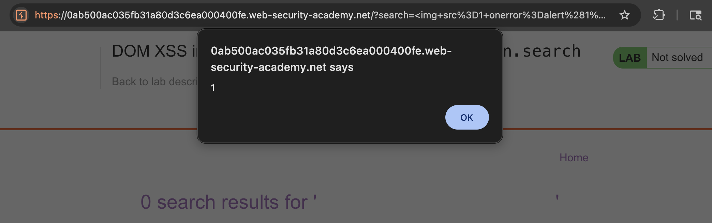

# 🛡️ Lab: DOM XSS in innerHTML sink using source location.search

> **Category:** `Cross-site Scripting (XSS)`  
> **Difficulty:** `Apprentice`  
> **Status:** `Completed` ✅

---

### 🎯 Objective
The objective of this lab is to exploit a **DOM-based XSS** vulnerability where the application uses the `innerHTML` property to render user-supplied data from the URL.

### 🛠️ Exploit Strategy
* **Source:** `location.search`
* **Sink:** `innerHTML`
* **Vulnerability Point:** Search results display logic.
* **Payload:** ``
* **Technical Logic:** While `innerHTML` ignores `<script>` elements as a security measure in modern browsers, it still parses other HTML elements. By injecting an `` tag with a non-existent `src`, I can use the `onerror` event handler to execute arbitrary JavaScript.

---

### 📑 Technical Walkthrough

#### 1. Identification & Reconnaissance
I performed a search for a test string and inspected the resulting DOM. I found that the application reflects the search term inside a `span` element.

  
  
<i><b>Figure 1:</b> Inspecting the DOM to locate the search reflection point.</i>

#### 2. Exploitation (Event Handler Injection)
I used an event-based payload. I entered `` into the search box to trigger an execution upon an image load error.

  
  
<i><b>Figure 3:</b> Entering the img-based XSS payload.</i>

#### 3. Execution & Verification
The browser attempted to load the image with the source "1". When it failed, the `onerror` handler fired, executing the `alert(1)` function.

  
  
<i><b>Figure 4:</b> The browser executing the JavaScript alert via the onerror event.</i>

#### 4. Final Confirmation
The script execution successfully triggered the lab completion state, as evidenced by the banner.

  
  
<i><b>Figure 5:</b> Final confirmation of the solved lab.</i>

---

### 🧠 Key Takeaway
Developers often mistakenly assume `innerHTML` is safe because it doesn't execute `<script>` blocks. However, event handlers (`onerror`, `onload`, `onmouseover`) remain active and dangerous.

**Remediation:** Use `textContent` or `innerText` instead of `innerHTML`. These properties treat all input as literal text, preventing the browser from parsing any HTML or executing scripts.

---