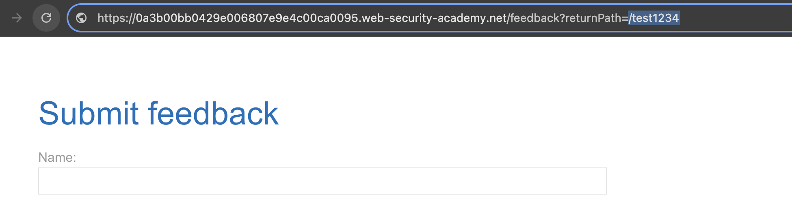
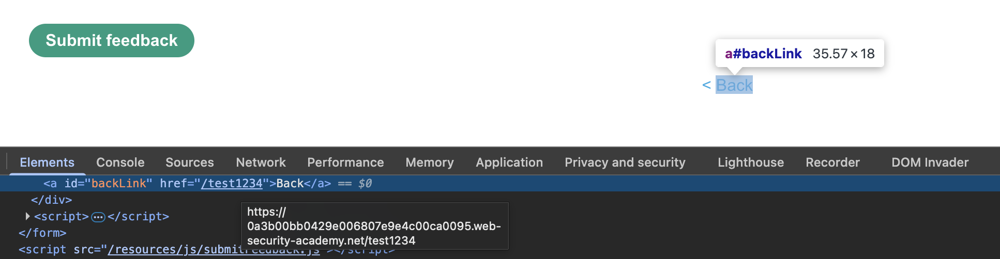
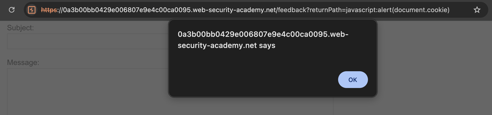

# 🛡️ Lab: DOM XSS in jQuery anchor href attribute sink using location.search source

> **Category:** `Cross-site Scripting (XSS)`  
> **Difficulty:** `Apprentice`  
> **Status:** `Completed` ✅

---

### 🎯 Objective
The objective of this lab is to exploit a **DOM-based XSS** vulnerability where jQuery is used to dynamically update the `href` attribute of an anchor element using a source from the URL.

### 🛠️ Exploit Strategy
* **Source:** `location.search` (specifically the `returnPath` parameter).
* **Sink:** jQuery's `attr()` method (specifically for the `href` attribute).
* **Vulnerability Point:** The "Back" link on the feedback submission page.
* **Payload:** `javascript:alert(document.cookie)`
* **Technical Logic:** The application uses jQuery to find the "Back" link and set its destination. By providing a payload using the `javascript:` pseudo-protocol, the browser executes the script when the link is clicked instead of navigating to a new path.

---

### 📑 Technical Walkthrough

#### 1. Identification & Reconnaissance
I navigated to the feedback page and noticed the `returnPath` parameter in the URL. I modified it to a test string and observed that the "Back" link's destination changed accordingly.

  
  
<i><b>Figure 1:</b> Locating the returnPath parameter and the associated back link.</i>

#### 2. Source and Sink Analysis
I inspected the DOM and confirmed that my input was being placed directly into the `href` attribute of the anchor tag. The use of jQuery to manipulate this attribute without sanitizing the protocol allows for script injection.

  
  
<i><b>Figure 2:</b> Inspecting the href attribute to confirm the reflection of the returnPath.</i>

#### 3. Exploitation (Pseudo-Protocol Injection)
I replaced the `returnPath` value with `javascript:alert(document.cookie)`. This technique exploits the browser's ability to execute JavaScript directly from the URL context of an anchor tag.

  
  
<i><b>Figure 3:</b> Crafting the javascript: alert payload in the URL.</i>

#### 4. Execution & Verification
After reloading the page, I clicked the "Back" link. The browser interpreted the `href` value as a command, resulting in a popup displaying the session cookies.

  
  
<i><b>Figure 4:</b> The alert box displaying document.cookie upon clicking the link.</i>

#### 5. Final Confirmation
The execution of the script satisfied the lab requirements, confirming the successful exploit of the jQuery-based DOM sink.

  
  
<i><b>Figure 5:</b> Final confirmation of the solved lab.</i>

---

### 🧠 Key Takeaway
Sinks aren't always functions like `alert()` or `innerHTML`. Attributes that can handle protocols, like `href` or `src`, are also dangerous sinks if they are populated with unsanitized user data.

**Remediation:** Validate that the `returnPath` starts with an expected safe character (like a single `/`) and does not contain any pseudo-protocols like `javascript:`.

---