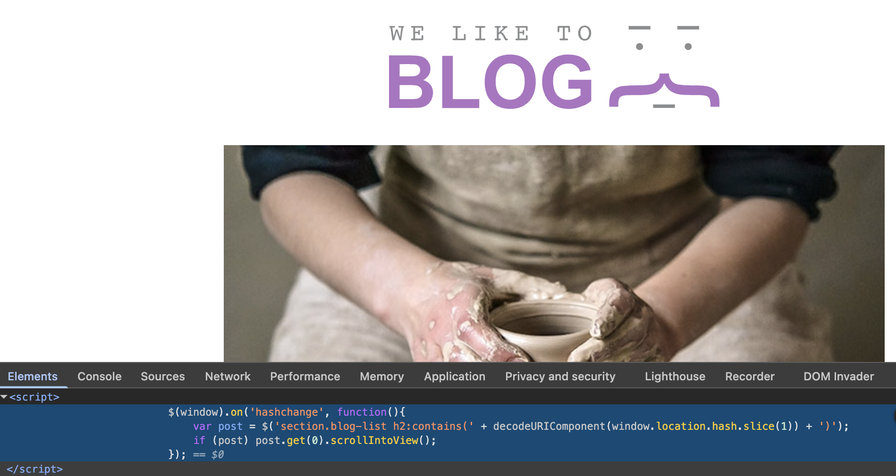
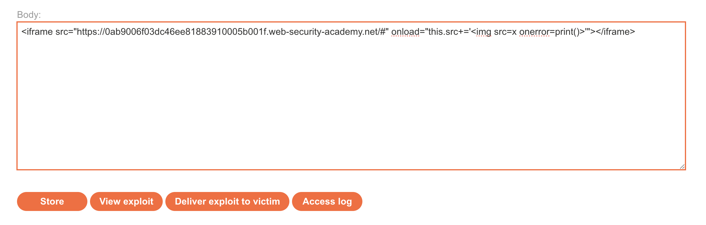
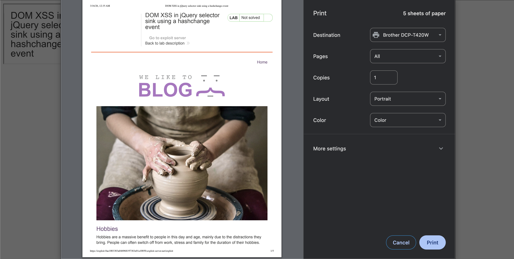
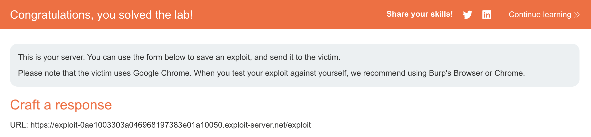

# WEB APPLICATION PENETRATION TEST REPORT: DOM-BASED XSS (hashchange)

## 1. Document Control

| Detail | Value |
| :--- | :--- |
| **Report Date** | 16 March 2026 |
| **Report Version** | 1.0 |
| **Classification** | CONFIDENTIAL |
| **Prepared By** | Ramil V. Deocariza Jr. |

---

## 2. Executive Summary
This assessment identified a DOM-based Cross-Site Scripting (XSS) vulnerability triggered by a `hashchange` event. The application insecurely passes URL fragment data directly into a jQuery selector, allowing for arbitrary code execution.

### 2.1 Overall Risk Rating
**Rating: MEDIUM**

### 2.2 Risk Summary
| Critical | High | Medium | Low | Info | Total Findings |
| :---: | :---: | :---: | :---: | :---: | :---: |
| 0 | 0 | 1 | 0 | 0 | 1 |

---

## 3. Detailed Findings

### VULN-001 — DOM XSS via jQuery Selector Sink

| Attribute | Detail |
| :--- | :--- |
| **Severity** | Medium |
| **Finding ID** | VULN-001 |
| **Affected Component** | `location.hash` (Source) to jQuery `$()` (Sink) |
| **CWE** | CWE-79: Improper Neutralization of Input During Web Page Generation |
| **CVSSv3 Score** | 6.1 (Medium) |
| **OWASP Category**| A03:2021 – Injection |
| **Status** | Open |

#### 3.1 Description
The vulnerable script uses `$(location.hash)` to dynamically find and scroll to elements on the page. When unsanitized input is passed into the jQuery `$()` selector, it attempts to parse the input as HTML. By appending an `` tag to the URL hash, an attacker can force jQuery to create a new element and trigger its associated error handlers.

#### 3.2 Proof of Concept (PoC)

**1. Identification & Reconnaissance**
Examined the page source and identified a JavaScript block listening for a `hashchange` event and passing `location.hash` directly into the `$()` sink.

  
  
<i><b>Figure 1:</b> Discovering the vulnerable jQuery hashchange logic in the source code.</i>

**2. Crafting the Exploit**
Configured an exploit server to host a malicious `<iframe>` that loads the vulnerable application and subsequently appends an `` payload to the hash: `<iframe src="[LAB_URL]/#" onload="this.src+=''"></iframe>`.

  
  
<i><b>Figure 2:</b> Configuring the malicious iframe on the exploit server.</i>

**3. Execution & Verification**
Upon loading the exploit, the iframe successfully triggered the hash change. jQuery processed the injected tag, and the `onerror` event fired the `print()` function.

  
  
<i><b>Figure 3:</b> The print dialog triggered via the DOM XSS payload.</i>

  
  
<i><b>Figure 4:</b> Final confirmation of lab completion.</i>

#### 3.3 Business Impact
Because URL fragments (`#`) are typically not sent to the server, this payload bypasses traditional server-side monitoring and Web Application Firewalls (WAFs), allowing attackers to execute scripts silently on the client side.

#### 3.4 Remediation
Avoid passing user-controlled data directly into the `$()` selector. Validate the `location.hash` to ensure it corresponds to an existing, safe element ID, or utilize strict alphanumeric sanitization before processing.

#### 3.5 References
* **CWE-79:** https://cwe.mitre.org/data/definitions/79.html
* **OWASP DOM-based XSS Prevention:** https://cheatsheetseries.owasp.org/cheatsheets/DOM_based_XSS_Prevention_Cheat_Sheet.html