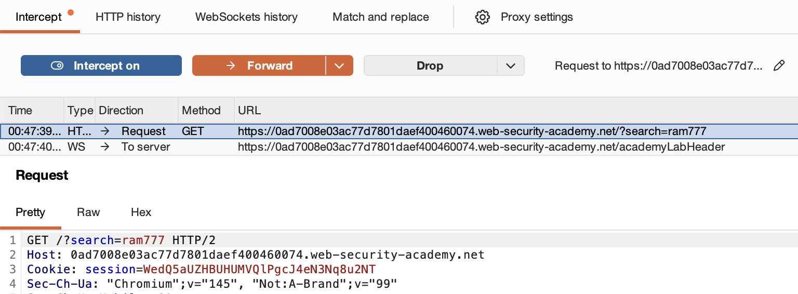

# 🛡️ Lab: Reflected XSS into attribute with angle brackets HTML-encoded

> **Category:** `Cross-site Scripting (XSS)`  
> **Difficulty:** `Apprentice`  
> **Status:** `Completed` ✅

---

### 🎯 Objective
The objective of this lab is to exploit a **Reflected XSS** vulnerability where the application filters angle brackets (`<` and `>`) but remains vulnerable to attribute injection within an existing HTML tag.

### 🛠️ Exploit Strategy
* **Vulnerability Point:** Search input `value` attribute.
* **Payload Type:** Attribute Injection / Event Handler.
* **Payload:** `" onmouseover="alert(1)`
* **Technical Logic:** The server takes the search term and places it inside an input tag: `<input value="USER_INPUT">`. Since angle brackets are encoded, I cannot create a new tag. Instead, I use a double quote (`"`) to close the `value` attribute and inject the `onmouseover` event handler directly into the existing tag.

---

### 📑 Technical Walkthrough

#### 1. Identification & Reconnaissance
I searched for a unique string and inspected the DOM. I found that my input was reflected inside the `value` attribute of the search input field. 

  
  
<i><b>Figure 1:</b> Inspecting the DOM to see the input reflected in the value attribute.</i>

#### 2. Analyzing the Filter
I attempted to inject a standard `<script>` tag. By observing the response in Burp Suite, I confirmed that the server encodes `<` and `>` into `&lt;` and `&gt;`, effectively neutralizing tag-based XSS.

  
  
<i><b>Figure 2:</b> Burp Suite evidence showing HTML encoding of angle brackets.</i>

#### 3. Exploitation (Attribute Escaping)
I crafted a payload to escape the attribute context. By starting with a double quote, I terminated the `value` attribute and injected a new event-driven attribute: `onmouseover="alert(1)`.

  
  
<i><b>Figure 3:</b> Entering the attribute injection payload.</i>

#### 4. Execution & Verification
After submitting the search, I hovered my mouse over the search input box. The browser triggered the `onmouseover` event, executing the injected JavaScript and displaying the alert.

  
  
<i><b>Figure 4:</b> Triggering the alert by interacting with the injected attribute.</i>

#### 5. Final Confirmation
The successful execution of the event handler satisfied the lab requirements and triggered the completion banner.

  
  
<i><b>Figure 5:</b> Final confirmation of lab completion.</i>

---

### 🧠 Key Takeaway
Encoding angle brackets is a good defense against **tag injection**, but it does not stop **attribute injection**. If user input is reflected inside a tag's attribute, an attacker can use quotes to break out and add malicious event handlers.

**Remediation:** In addition to encoding angle brackets, developers must also HTML-encode double quotes (`&quot;`) and single quotes (`&apos;`) when reflecting input inside attributes.

---