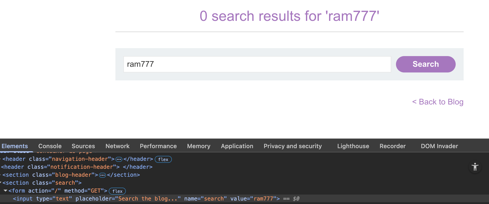
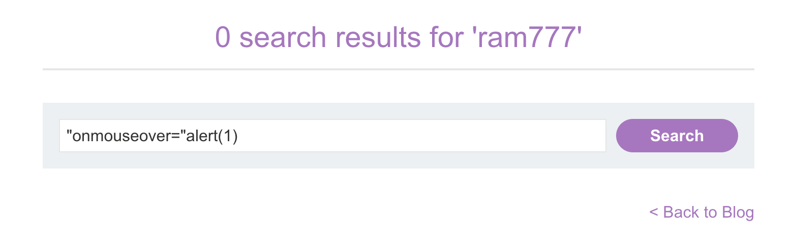
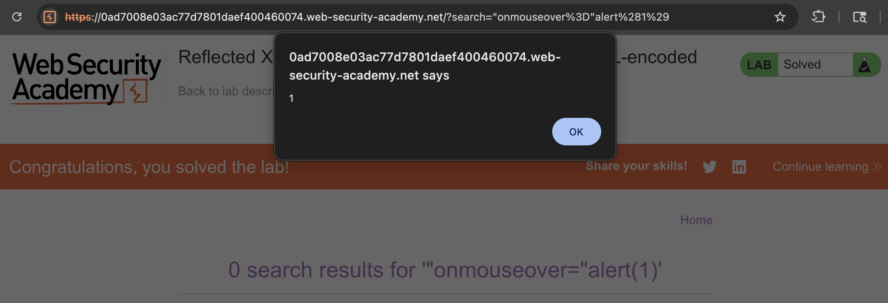

# WEB APPLICATION PENETRATION TEST REPORT: REFLECTED XSS (ATTRIBUTE INJECTION)

## 1. Document Control

| Detail | Value |
| :--- | :--- |
| **Report Date** | 16 March 2026 |
| **Report Version** | 1.0 |
| **Classification** | CONFIDENTIAL |
| **Prepared By** | Ramil V. Deocariza Jr. |

---

## 2. Executive Summary
This report details a Reflected Cross-Site Scripting (XSS) vulnerability. Although the application implements partial protections by encoding angle brackets, it remains vulnerable to attribute injection, allowing for JavaScript execution via event handlers.

### 2.1 Overall Risk Rating
**Rating: MEDIUM**

### 2.2 Risk Summary
| Critical | High | Medium | Low | Info | Total Findings |
| :---: | :---: | :---: | :---: | :---: | :---: |
| 0 | 0 | 1 | 0 | 0 | 1 |

---

## 3. Detailed Findings

### VULN-001 — Reflected XSS via Attribute Escaping

| Attribute | Detail |
| :--- | :--- |
| **Severity** | Medium |
| **Finding ID** | VULN-001 |
| **Affected Component** | Search input `value` attribute |
| **CWE** | CWE-79: Improper Neutralization of Input During Web Page Generation |
| **CVSSv3 Score** | 6.1 (Medium) |
| **OWASP Category**| A03:2021 – Injection |
| **Status** | Open |

#### 3.1 Description
The server reflects user search input inside an HTML input tag: `<input value="[USER_INPUT]">`. While the application successfully HTML-encodes angle brackets (`<` and `>`), it fails to encode double quotes (`"`). This oversight allows an attacker to prematurely terminate the `value` attribute and inject malicious event handlers (like `onmouseover`) directly into the existing tag.

#### 3.2 Proof of Concept (PoC)

**1. Identification & Reconnaissance**
Searched for a unique string and confirmed reflection inside the `value` attribute of the search input field.

  
  
<i><b>Figure 1:</b> Inspecting the DOM to see the input reflected in the value attribute.</i>

**2. Exploitation (Attribute Escaping)**
Crafted an escape payload: `" onmouseover="alert(1)`. The initial double quote closed the `value` attribute, exposing the remainder of the payload as a new attribute.

  
  
<i><b>Figure 2:</b> Entering the attribute injection payload.</i>

**3. Execution & Verification**
Hovering the mouse over the input box triggered the newly injected `onmouseover` event, executing the JavaScript.

  
  
<i><b>Figure 3:</b> Triggering the alert by interacting with the injected attribute.</i>

  
  
<i><b>Figure 4:</b> Final confirmation of lab completion.</i>

#### 3.3 Business Impact
Allows for arbitrary code execution in the context of the user's session, leading to potential session hijacking or forced interactions with the application.

#### 3.4 Remediation
Implement comprehensive Context-Aware Output Encoding. When reflecting input inside HTML attributes, double quotes (`&quot;`) and single quotes (`&#x27;` or `&apos;`) must be strictly encoded to prevent boundary escapes.

#### 3.5 References
* **CWE-79:** https://cwe.mitre.org/data/definitions/79.html
* **OWASP XSS Prevention Cheat Sheet:** https://cheatsheetseries.owasp.org/cheatsheets/Cross_Site_Scripting_Prevention_Cheat_Sheet.html