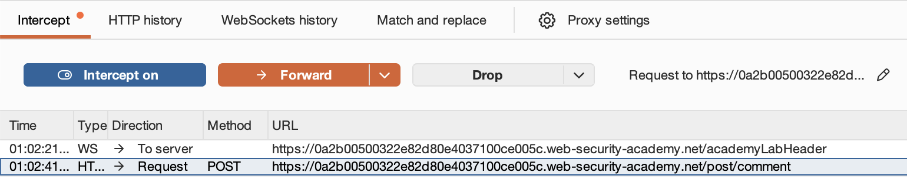
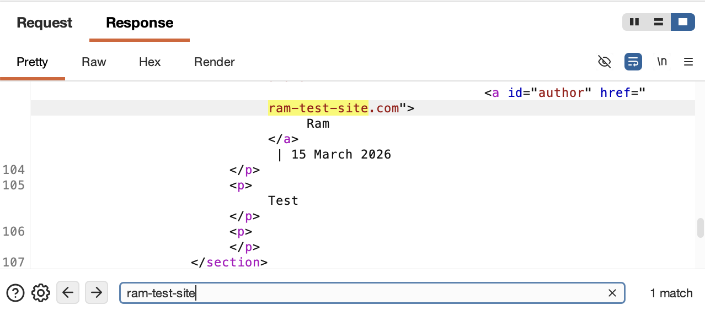
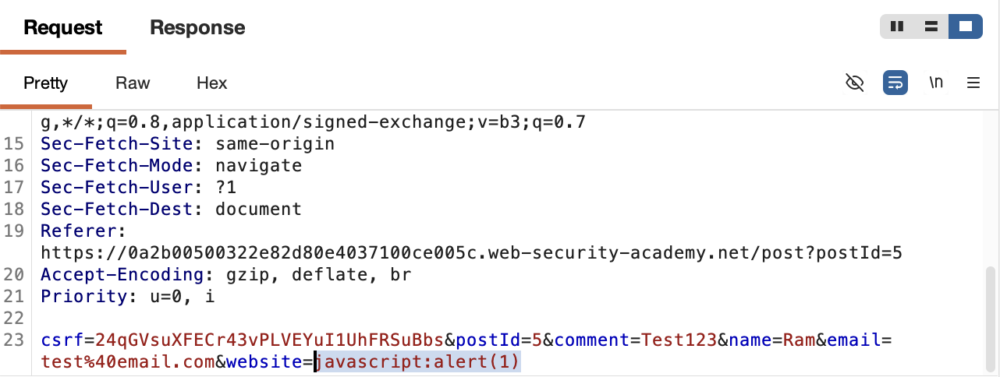
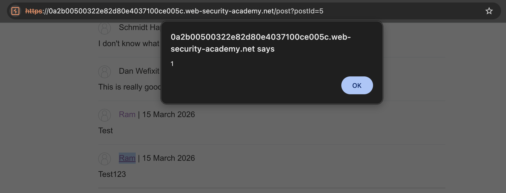
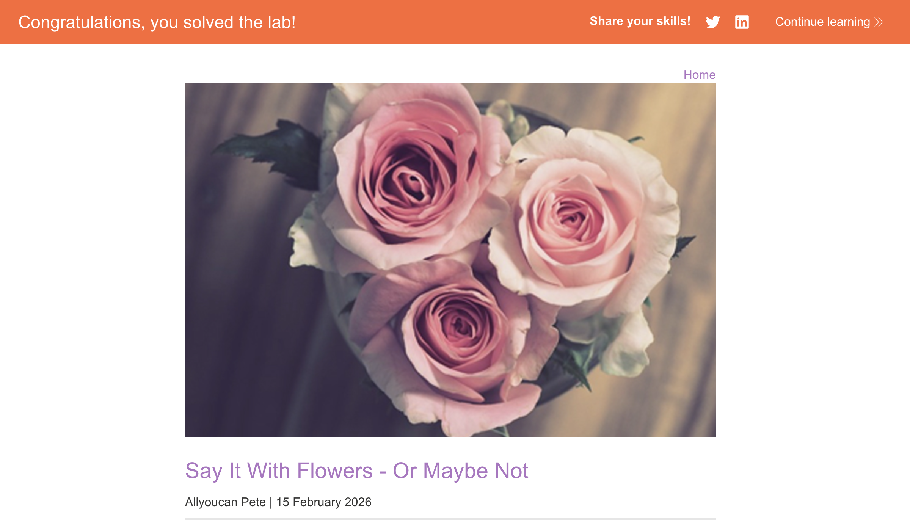

# 🛡️ Lab: Stored XSS into anchor href attribute with double quotes HTML-encoded

> **Category:** `Cross-site Scripting (XSS)`  
> **Difficulty:** `Apprentice`  
> **Status:** `Completed` ✅

---

### 🎯 Objective
The objective of this lab is to exploit a **Stored XSS** vulnerability within an anchor `href` attribute. The attack bypasses double-quote encoding by using the `javascript:` pseudo-protocol directly within the attribute context.

### 🛠️ Exploit Strategy
* **Vulnerability Point:** Website input field (stored and reflected in `<a>` tags).
* **Payload Type:** Stored XSS / Pseudo-protocol Injection.
* **Payload:** `javascript:alert(1)`
* **Technical Logic:** The application prevents attribute breakout by encoding quotes, but it fails to validate the URI scheme. By injecting the `javascript:` protocol, the browser executes the payload when the link is clicked, as the attribute allows executable URIs.

---

### 📑 Technical Walkthrough

#### 1. Identification & Interception
I intercepted the comment submission using **Burp Proxy**. I identified the `website` parameter as the primary vector for reflection within the author's link.

  
  
<i><b>Figure 1:</b> Intercepting the comment submission POST request.</i>

#### 2. Reflection Analysis
Using **Burp Repeater**, I analyzed the GET request for the blog post. I confirmed that the input from the website field is reflected unencoded within the `href` attribute of the anchor tag.

  
  
<i><b>Figure 2:</b> Observing the reflected input in the HTML response via Repeater.</i>

#### 3. Exploitation (Repeater Injection)
I modified the original POST request in Repeater, replacing the test website with the payload `javascript:alert(1)`. This persistently stored the malicious URI in the application's database.

  
  
<i><b>Figure 3:</b> Injecting the JavaScript pseudo-protocol payload using Burp Repeater.</i>

#### 4. Execution & Verification
After refreshing the page, I clicked the author's name. The browser interpreted the link's destination as a command, triggering the `alert(1)` function.

  
  
<i><b>Figure 4:</b> Triggering the alert by interacting with the stored malicious link.</i>

#### 5. Final Confirmation
The successful execution of the stored script satisfied the lab requirements.

  
  
<i><b>Figure 5:</b> Final confirmation of the successful Stored XSS exploit.</i>

---

### 🧠 Key Takeaway
This lab proves that **Output Encoding** is only one layer of defense. Even if quotes are encoded, certain HTML attributes (like `href`) can still execute code if the **Protocol/URI scheme** is not validated.

**Remediation:** Implement a strict whitelist for protocols. Ensure that URLs in the website field must start with `http://` or `https://` and reject any input containing `javascript:`.

---