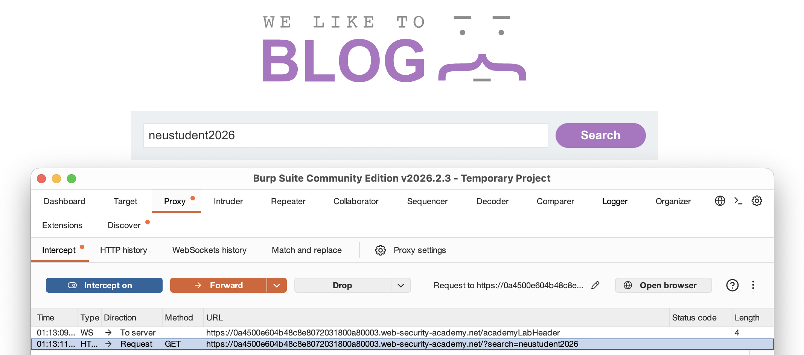
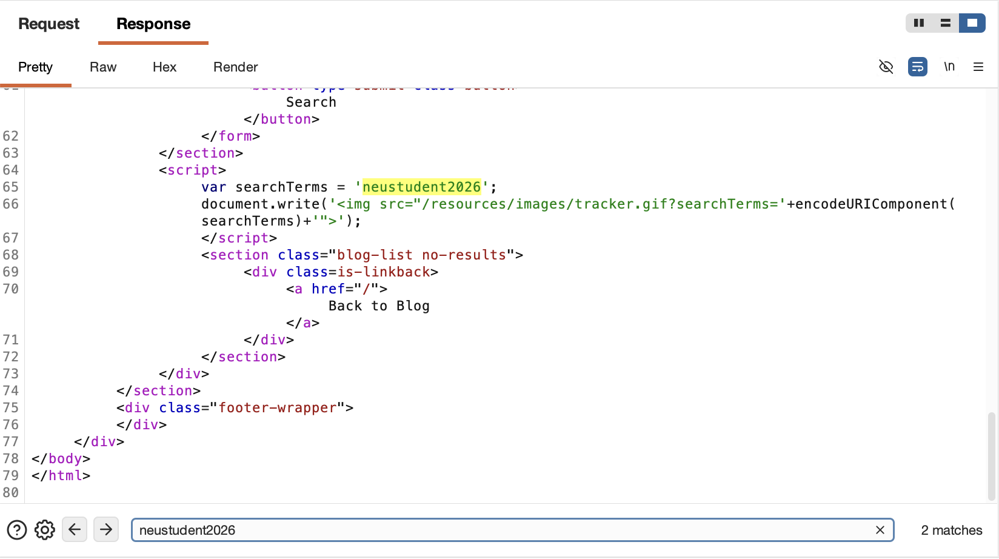
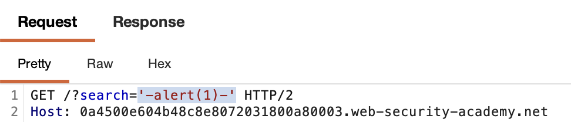
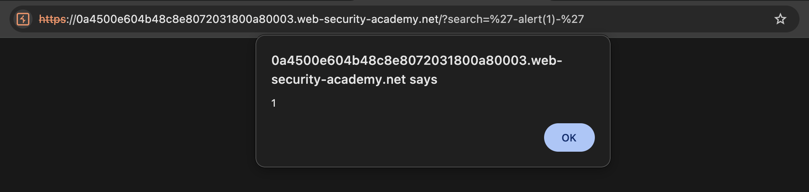

# WEB APPLICATION PENETRATION TEST REPORT: REFLECTED XSS (JS STRING CONTEXT)

## 1. Document Control

| Detail | Value |
| :--- | :--- |
| **Report Date** | 16 March 2026 |
| **Report Version** | 1.0 |
| **Classification** | CONFIDENTIAL |
| **Prepared By** | Ramil V. Deocariza Jr. |

---

## 2. Executive Summary
This report outlines a Reflected Cross-Site Scripting (XSS) vulnerability where user input is unsafely embedded within an executable JavaScript block. The application's reliance on HTML encoding is insufficient to protect against context breakouts in this scenario.

### 2.1 Overall Risk Rating
**Rating: MEDIUM**

### 2.2 Risk Summary
| Critical | High | Medium | Low | Info | Total Findings |
| :---: | :---: | :---: | :---: | :---: | :---: |
| 0 | 0 | 1 | 0 | 0 | 1 |

---

## 3. Detailed Findings

### VULN-001 — Reflected XSS via JavaScript Context Breakout

| Attribute | Detail |
| :--- | :--- |
| **Severity** | Medium |
| **Finding ID** | VULN-001 |
| **Affected Component** | JavaScript variable `searchTerms` |
| **CWE** | CWE-79: Improper Neutralization of Input During Web Page Generation |
| **CVSSv3 Score** | 6.1 (Medium) |
| **OWASP Category**| A03:2021 – Injection |
| **Status** | Open |

#### 3.1 Description
The server reflects user input directly into a JavaScript variable assignment: `var searchTerms = '[USER_INPUT]';`. While angle brackets (`<`, `>`) are HTML-encoded, single quotes (`'`) are not. This allows an attacker to terminate the string literal early and append executable JavaScript commands using mathematical or logical operators.

#### 3.2 Proof of Concept (PoC)

**1. Identification & Interception**
Intercepted the search query to analyze the reflection point.

  
  
<i><b>Figure 1:</b> Intercepting the search query for context analysis.</i>

**2. Reflection Analysis**
Located the reflection point inside a `<script>` block in the HTTP response. Verified that traditional tag injection was blocked by HTML encoding.

  
  
<i><b>Figure 2:</b> Observing the reflection inside a JavaScript variable in the HTTP response.</i>

**3. Exploitation (String Context Breakout)**
Crafted the payload `'-alert(1)-'` to break out of the string literal and evaluate the `alert()` function via the subtraction operator.

  
  
<i><b>Figure 3:</b> Crafting the breakout payload in Burp Repeater.</i>

**4. Execution & Verification**
The JavaScript engine evaluated the expression, executing the injected function.

  
  
<i><b>Figure 4:</b> Browser executing the injected JavaScript code.</i>

  
  
<i><b>Figure 5:</b> Final confirmation of lab completion.</i>

#### 3.3 Business Impact
Allows attackers to execute arbitrary JavaScript within the trust boundaries of the victim's session, leading to potential credential theft or forced interactions.

#### 3.4 Remediation
Input reflected inside JavaScript contexts must be strictly Unicode-escaped or JSON-encoded. Additionally, characters with special meaning in JavaScript (such as quotes, backslashes, and line breaks) must be properly escaped to prevent context breakout.

#### 3.5 References
* **CWE-79:** https://cwe.mitre.org/data/definitions/79.html
* **OWASP XSS Prevention Cheat Sheet:** https://cheatsheetseries.owasp.org/cheatsheets/Cross_Site_Scripting_Prevention_Cheat_Sheet.html