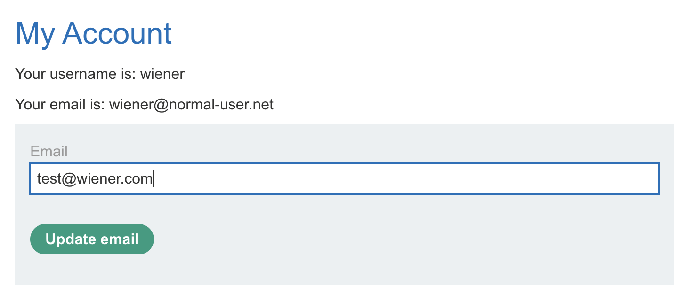
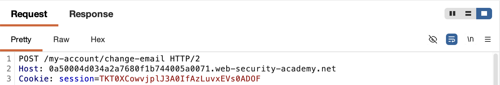
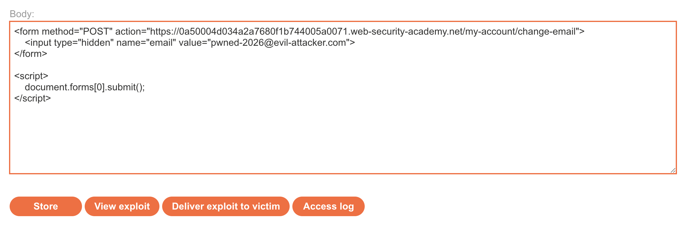
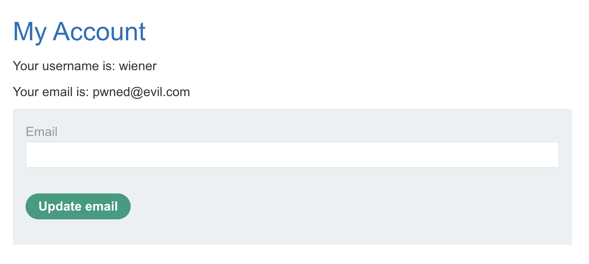
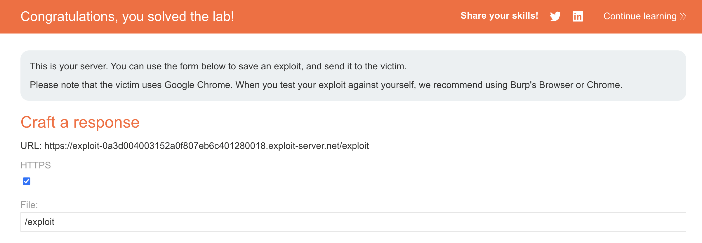

# 🛡️ Lab: CSRF vulnerability with no defenses

> **Category:** `Cross-Site Request Forgery (CSRF)`  
> **Difficulty:** `Apprentice`  
> **Status:** `Completed` ✅

---

### 🎯 Objective
The objective of this lab is to exploit a **CSRF** vulnerability in the email change functionality. By crafting a malicious HTML page that auto-submits a POST request, I can force a victim to change their account email address to one of my choosing.

### 🛠️ Exploit Strategy
* **Vulnerability Point:** `POST /my-account/change-email` endpoint.
* **Payload Type:** Cross-Site Request Forgery (CSRF).
* **Technical Logic:** The application performs a sensitive action (email change) via a POST request but fails to implement any CSRF protections (like tokens or SameSite cookie restrictions). This allows an attacker-controlled site to trigger the request on behalf of a logged-in user.

---

### 📑 Technical Walkthrough

#### 1. Identification & Interception
I logged into the application and performed a legitimate email change. I intercepted the request in **Burp Suite** to analyze how the data is sent to the server.

  
  
<i><b>Figure 1:</b> Locating the email change form in the user dashboard.</i>

#### 2. Request Analysis
Upon inspecting the intercepted POST request, I observed that it only contains a single parameter (`email`) and lacks any unpredictable tokens or headers. This lack of defense makes the endpoint susceptible to CSRF.

  
  
<i><b>Figure 2:</b> Burp Suite showing a request lacking CSRF protection.</i>

#### 3. Crafting the Malicious Exploit
Using the **Exploit Server**, I drafted a hidden HTML form. I included a script to automatically submit the form the moment the victim loads the page, ensuring the attack requires zero user interaction.

  
  
<i><b>Figure 3:</b> Crafting the auto-submitting CSRF payload on the exploit server.</i>

#### 4. Execution & Verification
I verified the exploit by viewing it myself. The script successfully triggered the email change on my own account, confirming that the payload was functional and correctly formatted.

  
  
<i><b>Figure 4:</b> Confirming the email change after executing the CSRF exploit.</i>

#### 5. Final Confirmation
I delivered the exploit to the victim. The lab was solved once the victim's browser processed the malicious request.

  
  
<i><b>Figure 5:</b> Final confirmation of lab completion.</i>

---

### 🧠 Key Takeaway
A sensitive state-changing action (like changing an email or password) must always be protected. Browsers automatically include cookies in requests, so "session presence" is not enough to prove user intent.

**Remediation:** Implement **CSRF Tokens** (unique, secret, and unpredictable values for each session) and set the `SameSite=Lax` or `Strict` attribute on session cookies to prevent them from being sent during cross-site POST requests.

---