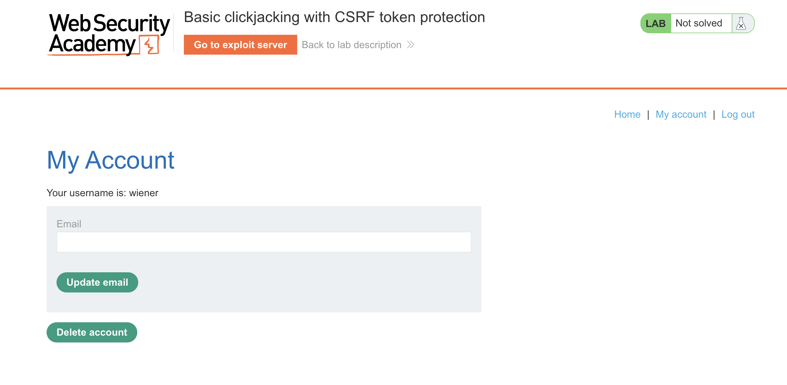
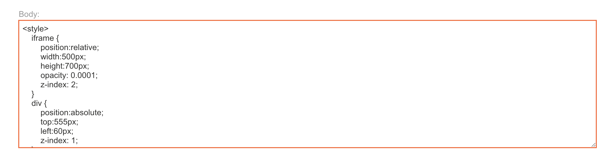
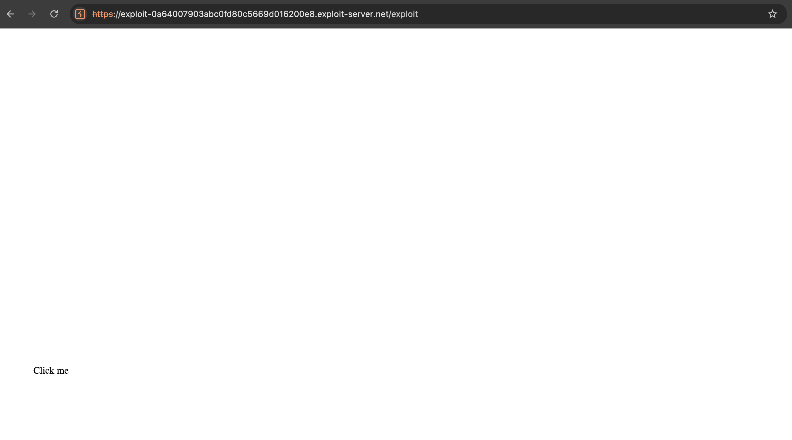
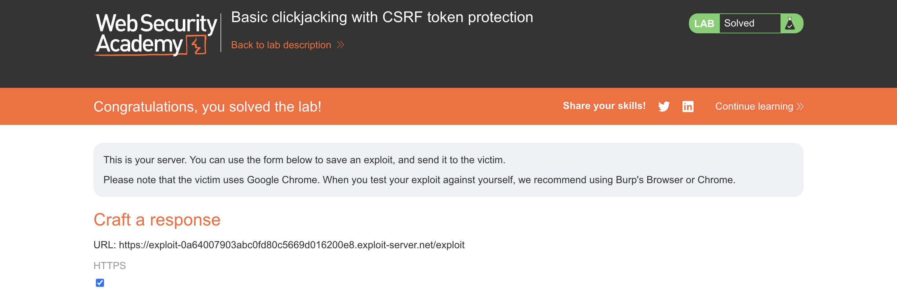

# WEB APPLICATION PENETRATION TEST REPORT: BASIC CLICKJACKING

## 1. Document Control

| Detail | Value |
| :--- | :--- |
| **Report Date** | 20 March 2026 |
| **Report Version** | 1.0 |
| **Classification** | CONFIDENTIAL |
| **Prepared By** | Ramil V. Deocariza Jr. |

---

## 2. Executive Summary
This report details the discovery of a Clickjacking (UI Redressing) vulnerability. The application fails to implement frame-busting defenses, allowing an attacker to overlay a malicious interface on top of the target application, tricking authenticated users into executing unintended, state-changing actions.

### 2.1 Overall Risk Rating
**Rating: HIGH**

### 2.2 Risk Summary
| Critical | High | Medium | Low | Info | Total Findings |
| :---: | :---: | :---: | :---: | :---: | :---: |
| 0 | 1 | 0 | 0 | 0 | 1 |

---

## 3. Detailed Findings

### VULN-001 — Account Deletion via UI Redressing

| Attribute | Detail |
| :--- | :--- |
| **Severity** | High |
| **Finding ID** | VULN-001 |
| **Affected Endpoint** | `/my-account` |
| **CWE** | CWE-1021: Improper Restriction of Rendered UI Layers or Frames |
| **CVSSv3 Score** | 7.1 (High) |
| **OWASP Category**| A01:2021 – Broken Access Control |
| **Status** | Open |

#### 3.1 Description
The `/my-account` endpoint contains a sensitive "Delete account" button. Although the form is protected by anti-CSRF tokens, the application lacks the `X-Frame-Options` or `Content-Security-Policy: frame-ancestors` HTTP headers. An attacker can embed this page within an invisible `<iframe>` on a malicious website, overlaying a deceptive "Click Me" button exactly over the hidden "Delete account" button. 

#### 3.2 Proof of Concept (PoC)

**1. Identification**
Analyzed the HTTP response headers for the `/my-account` endpoint and confirmed the absence of frame-restricting headers.

  
  
<i><b>Figure 1:</b> Identifying the absence of X-Frame-Options in the server response.</i>

**2. Crafting the Malicious Overlay**
Utilized the Exploit Server to craft an HTML payload. Configured an `<iframe>` to load the target account page and set its `opacity` to `0.0001` (invisible). Positioned a harmless-looking decoy button beneath the iframe using CSS absolute positioning.

  
  
<i><b>Figure 2:</b> CSS and HTML configuration of the Clickjacking payload.</i>

**3. Execution & Verification**
Delivered the exploit to the victim. When the victim clicked the visible decoy button, their browser inherently clicked the invisible "Delete account" button layered on top of it.

  
  
<i><b>Figure 3:</b> The invisible iframe intercepting the user's click.</i>

  
  
<i><b>Figure 4:</b> Final confirmation of successful account deletion via Clickjacking.</i>

#### 3.3 Business Impact
Bypasses CSRF protections by weaponizing the user's own authenticated clicks, leading to unauthorized account deletion, financial transfers, or privilege escalation.

#### 3.4 Remediation
Implement the `Content-Security-Policy: frame-ancestors 'self'` header to prevent the application from being framed by external, untrusted domains. For legacy browser support, simultaneously implement the `X-Frame-Options: SAMEORIGIN` header.

#### 3.5 References
* **CWE-1021:** https://cwe.mitre.org/data/definitions/1021.html
* **OWASP Clickjacking Defense:** https://cheatsheetseries.owasp.org/cheatsheets/Clickjacking_Defense_Cheat_Sheet.html