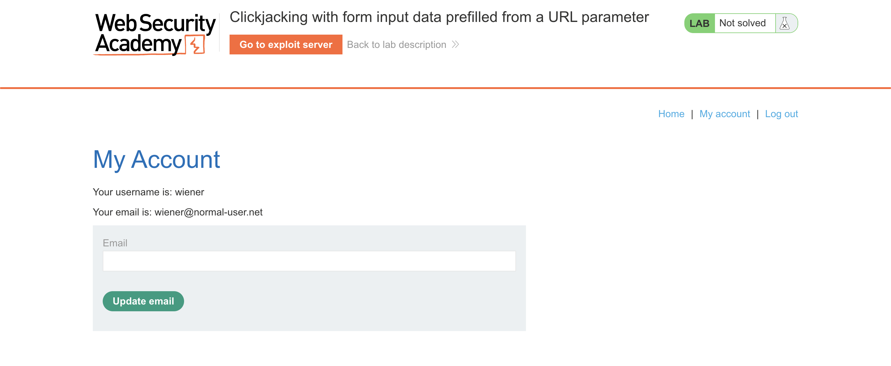
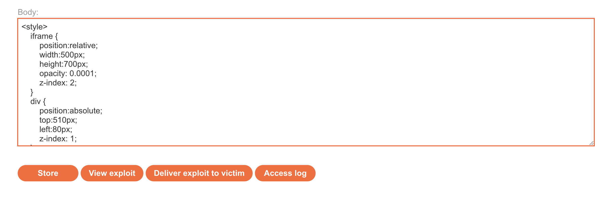
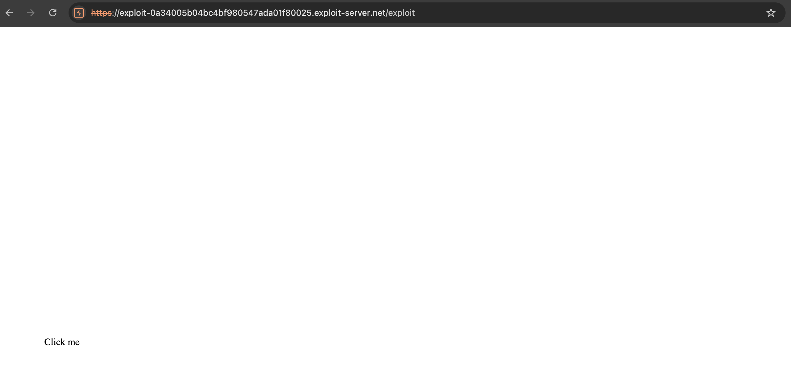
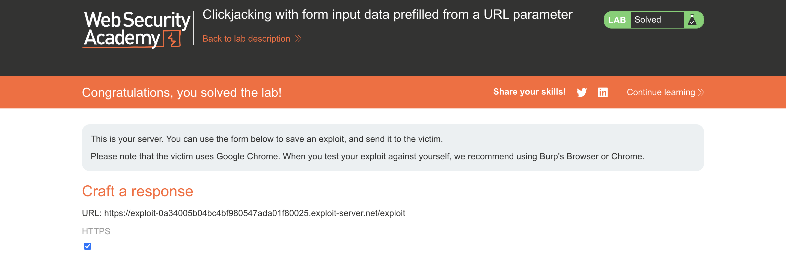

# WEB APPLICATION PENETRATION TEST REPORT: CLICKJACKING (PREFILLED DATA)

## 1. Document Control

| Detail | Value |
| :--- | :--- |
| **Report Date** | 20 March 2026 |
| **Report Version** | 1.0 |
| **Classification** | CONFIDENTIAL |
| **Prepared By** | Ramil V. Deocariza Jr. |

---

## 2. Executive Summary
This assessment identified a High-severity Clickjacking vulnerability. By combining missing frame protections with URL-based parameter prefilling, an attacker can force a victim to unknowingly change their account email address, leading to complete account takeover.

### 2.1 Overall Risk Rating
**Rating: HIGH**

### 2.2 Risk Summary
| Critical | High | Medium | Low | Info | Total Findings |
| :---: | :---: | :---: | :---: | :---: | :---: |
| 0 | 1 | 0 | 0 | 0 | 1 |

---

## 3. Detailed Findings

### VULN-001 — Account Takeover via Prefilled Parameter Clickjacking

| Attribute | Detail |
| :--- | :--- |
| **Severity** | High |
| **Finding ID** | VULN-001 |
| **Affected Endpoint** | `/my-account?email=[parameter]` |
| **CWE** | CWE-1021: Improper Restriction of Rendered UI Layers or Frames |
| **CVSSv3 Score** | 8.1 (High) |
| **OWASP Category**| A01:2021 – Broken Access Control |
| **Status** | Open |

#### 3.1 Description
The application permits the `email` field on the account update page to be pre-populated via a URL query parameter (e.g., `?email=hacker@attacker.com`). Because the application is also vulnerable to Clickjacking (missing `X-Frame-Options`), an attacker can iframe this specific URL. The attacker only needs to trick the user into clicking the "Update email" button, as the malicious email address is already injected into the invisible form.

#### 3.2 Proof of Concept (PoC)

**1. Identification**
Verified that navigating to the `/my-account` endpoint with an email parameter automatically populates the email input field, reducing the attack requirement to a single click.

  
  
<i><b>Figure 1:</b> Identifying the URL parameter responsible for prefilling form data.</i>

**2. Crafting the Malicious Overlay**
Constructed a Clickjacking payload on the Exploit Server. The iframe source was set to the target URL inclusive of the malicious email parameter. A decoy "Click me" button was aligned perfectly beneath the invisible "Update email" button using CSS absolute positioning.

  
  
<i><b>Figure 2:</b> CSS alignment of the decoy button and the prefilled target iframe.</i>

**3. Execution & Verification**
Delivered the payload to the victim. The victim's attempt to click the decoy button inherently triggered the invisible form submission, silently changing the account email to the attacker's controlled address.

  
  
<i><b>Figure 3:</b> The invisible iframe intercepting the click to submit the prefilled data.</i>

  
  
<i><b>Figure 4:</b> Final confirmation of successful email change.</i>

#### 3.3 Business Impact
Allows an attacker to silently change a user's registered email address. The attacker can subsequently trigger a "Forgot Password" flow to the newly registered email, achieving full account takeover without ever knowing the user's original credentials.

#### 3.4 Remediation
1. **Primary:** Implement `Content-Security-Policy: frame-ancestors 'self'` and `X-Frame-Options: SAMEORIGIN` HTTP response headers to prevent framing by unauthorized domains.
2. **Secondary:** Avoid allowing sensitive form fields (such as email or password) to be pre-populated via GET request parameters.

#### 3.5 References
* **CWE-1021:** https://cwe.mitre.org/data/definitions/1021.html
* **OWASP Clickjacking Defense:** https://cheatsheetseries.owasp.org/cheatsheets/Clickjacking_Defense_Cheat_Sheet.html